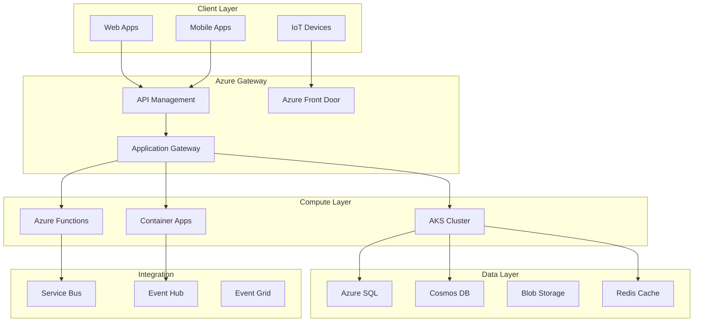

# Microsoft Azure Microservices Architecture

## Overview

Microsoft's journey with microservices spans decades, from internal systems like HotMail to modern Azure services. Microsoft Azure provides one of the most comprehensive cloud platforms for building, deploying, and managing microservices applications, with services ranging from Azure Kubernetes Service (AKS) to Service Fabric to Azure Functions.

Microsoft's microservices approach is unique because they offer multiple deployment models: containers with AKS, serverless with Azure Functions, and stateful services with Service Fabric. This flexibility allows organizations to choose the right approach for each workload. Microsoft's enterprise focus means their microservices offerings emphasize security, compliance, and hybrid cloud scenarios.

Azure's microservices architecture serves millions of customers across industries from startups to enterprise corporations. Key differentiators include deep Windows integration, enterprise-grade identity management through Azure Active Directory, and hybrid cloud capabilities that allow extending on-premises infrastructure to the cloud.

Microsoft's architectural philosophy includes: platform as a service (abstract infrastructure complexity), enterprise-grade security (built-in compliance), hybrid cloud (seamless on-prem/cloud extension), and developer productivity (Visual Studio, VS Code integration).

## Core Architecture

### Azure Microservices Services

| Service | Type | Best For |
|---------|------|----------|
| Azure Kubernetes Service (AKS) | Container Orchestration | Complex container workloads |
| Azure Container Apps | Serverless Containers | Event-driven apps |
| Service Fabric | Stateful Services | Lift-and-shift .NET apps |
| Azure Functions | Serverless Functions | Lightweight operations |
| Azure Container Instances | Container Execution | Burst workloads |

### Architecture Components



## Implementation Example

```yaml
# Azure Kubernetes Service Deployment
apiVersion: apps/v1
kind: Deployment
metadata:
  name: order-service
  namespace: microservices
spec:
  replicas: 3
  selector:
    matchLabels:
      app: order-service
  template:
    metadata:
      labels:
        app: order-service
    spec:
      containers:
      - name: order-service
        image: acr.azure.io/myregistry/order-service:v1.0
        ports:
        - containerPort: 8080
        env:
        - name: ASPNETCORE_ENVIRONMENT
          value: "Production"
        - name: Database__ConnectionString
          valueFrom:
            secretKeyRef:
              name: order-service-secrets
              key: db-connection
        resources:
          requests:
            cpu: 250m
            memory: 512Mi
          limits:
            cpu: 1000m
            memory: 1Gi
        livenessProbe:
          httpGet:
            path: /health
            port: 8080
          initialDelaySeconds: 30
          periodSeconds: 10
        readinessProbe:
          httpGet:
            path: /ready
            port: 8080
          initialDelaySeconds: 5
          periodSeconds: 5
---
# Azure Service Bus Configuration
apiVersion: apps/v1
kind: ConfigMap
metadata:
  name: servicebus-config
  namespace: microservices
data:
  servicebus.connection: "Endpoint=sb://myns.servicebus.windows.net/;SharedAccessKeyName=RootManageSharedAccessKey"
  topic.name: "orders"
  subscription.name: "order-processor"
---
# Azure Key Vault Integration
apiVersion: v1
kind: Secret
metadata:
  name: keyvault-secret
type: Opaque
stringData:
  clientId: "your-client-id"
  clientSecret: "your-client-secret"
  tenantId: "your-tenant-id"
```

```csharp
// Azure Service Fabric Reliable Service
using Microsoft.ServiceFabric.Services.Runtime;
using System.Threading;

[ServiceFabricRuntimeServiceParameter("OrderService", "OrderServiceType")]
public class OrderService : StatelessService
{
    private readonly IReliableStateManager _stateManager;
    
    public OrderService(StatelessServiceContext context) 
        : base(context)
    {
        _stateManager = this.StateManager;
    }
    
    protected override async Task RunAsyncAsync(
        CancellationToken cancellationToken)
    {
        // Process orders
        var ordersQueue = await _stateManager.GetOrAddAsync<IReliableQueue<Order>>(
            "ordersQueue");
        
        while (!cancellationToken.IsCancellationRequested)
        {
            using (var tx = _stateManager.CreateTransaction())
            {
                var order = await ordersQueue.TryDequeueAsync(tx);
                
                if (order.HasValue)
                {
                    await ProcessOrder(order.Value);
                }
                
                await tx.CommitAsync();
            }
            
            await Task.Delay(100, cancellationToken);
        }
    }
    
    private async Task ProcessOrder(Order order)
    {
        // Process the order
        order.Status = OrderStatus.Processed;
        order.ProcessedAt = DateTime.UtcNow;
        
        // Save to database
        await _stateManager.GetOrAddAsync<IReliableDictionary<string, Order>>(
            "ordersTable");
        
        // Send notification
        await ServiceEventSource.Current.ServiceMessage(
            this, $"Processed order {order.OrderId}");
    }
}
```

## Azure Integration Services

```csharp
// Azure Functions with Service Bus Trigger
public class OrderProcessorFunction
{
    [FunctionName("ProcessOrder")]
    [ServiceBusAccount("ServiceBusConnection")]
    public async Task ProcessOrder(
        [ServiceBusTrigger("orders", "order-processor")] 
        Message orderMessage,
        [ServiceBus("order-completed")] 
        IAsyncCollector<Message> outputMessage,
        ILogger log)
    {
        var order = JsonSerializer.Deserialize<Order>(
            Encoding.UTF8.GetString(orderMessage.Body));
        
        log.LogInformation($"Processing order {order.OrderId}");
        
        // Process order
        order.Status = "Completed";
        
        // Send completion message
        var completionMessage = new Message
        {
            Body = Encoding.UTF8.GetBytes(
                JsonSerializer.Serialize(order)),
            ContentType = "application/json"
        };
        
        await outputMessage.AddAsync(completionMessage);
    }
}

// Azure API Management Policy
<policies>
    <inbound>
        <validate-jwt header-name="Authorization">
            <openid-config url="https://login.microsoftonline.com/{tenant}/v2.0/.well-known/openid-config" />
            <audiences>
                <audience>api://order-service</audience>
            </audiences>
            <required-claims>
                <claim name="roles">
                    <value>Order.Read</value>
                </claim>
            </required-claims>
        </validate-jwt>
        <rate-limit-by-key calls="100" period="1 minute" />
    </inbound>
    <backend>
        <forward-request />
    </backend>
    <outbound>
        <set-header name="X-Powered-By" exists-action="override">
            <value>Azure API Management</value>
        </set-header>
    </outbound>
</policies>
```

## Best Practices

1. **Choose the Right Compute Model**: Use AKS for complex orchestration, Azure Functions for event-driven workloads, and Container Apps for serverless containers.

2. **Leverage Azure Managed Services**: Use Azure SQL, Cosmos DB, and Redis Cache to reduce operational overhead.

3. **Implement Enterprise Security**: Use Azure AD for identity, Key Vault for secrets, and RBAC for access control.

4. **Use Infrastructure as Code**: Deploy using ARM templates or Terraform for reproducibility.

5. **Implement Hybrid Scenarios**: Use Azure Arc for consistent management across on-premises and cloud.

---

## Output Statement

```
Microsoft Azure Microservices Metrics:
=====================================
- Global Regions: 60+
- Available Zones: 140+
- Enterprise Customers: Millions

Azure Microservices Services:
- AKS Clusters: Millions deployed
- Azure Functions: Trillions of executions
- Service Fabric: Millions of nodes

Key Differentiators:
- Multiple deployment models (AKS, Functions, Container Apps, Service Fabric)
- Enterprise identity (Azure AD)
- Hybrid cloud (Azure Arc)
- Compliance (90+ certifications)
- Windows integration

Enterprise Usage:
- Industries: Finance, Healthcare, Government
- Compliance: SOC2, HIPAA, FedRAMP, GDPR
- Integration: Office 365, Dynamics 365
```