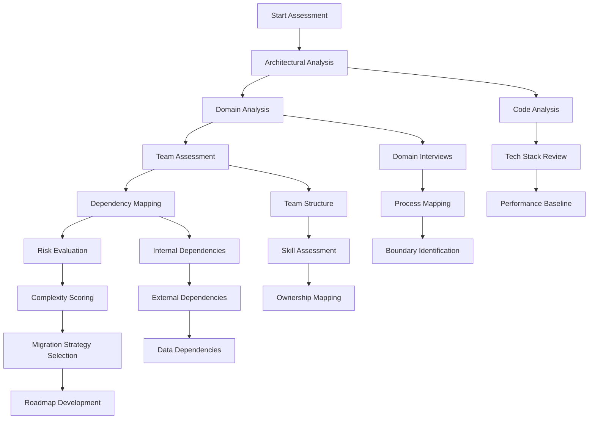

# Monolith to Microservices Assessment Framework

## Overview

The assessment framework provides a systematic approach to evaluate your application's readiness for migration from a monolithic architecture to microservices. This framework helps organizations understand their current state, identify migration complexity, estimate effort, and develop a realistic migration roadmap. A thorough assessment is critical because premature migration can lead to disaster, while delayed migration can result in technical debt accumulation.

The assessment process examines multiple dimensions of your current system: architectural complexity, team structure, business domain clarity, technical dependencies, data relationships, and operational capabilities. Each dimension contributes to understanding the overall migration complexity and risk profile. Organizations that skip this assessment often underestimate the effort required or choose incorrect migration strategies.

This framework was developed based on lessons learned from successful migrations at companies like Netflix, Amazon, and Uber. These organizations invested significant time in assessment before beginning migration work, and this investment paid dividends throughout their transformation journeys. The assessment typically takes 4-8 weeks depending on the size and complexity of the monolith.

## Assessment Dimensions

### 1. Architectural Complexity Assessment

The first dimension examines the technical structure of your current application. Key factors include codebase size (measured in lines of code, number of modules, and dependencies), deployment complexity (how long builds take, deployment frequency, and rollback capabilities), and runtime behavior (performance under load, resource consumption patterns).

Assess your codebase using static analysis tools to measure cyclomatic complexity, coupling between modules, and test coverage. High complexity scores indicate more effort will be required to decompose the system safely. A monolith with 500,000 lines of code and extensive internal dependencies will require much more effort than a modular monolith with clear boundaries.

The architectural assessment should also examine your technology stack. Older technologies may lack modern tooling for containerization and orchestration. Legacy databases may require special handling during migration. Understanding these constraints early helps plan appropriate solutions.

### 2. Domain Analysis Assessment

Domain-driven design provides the foundation for service boundary identification. This assessment examines how well your business domain is understood and whether clear bounded contexts exist within your monolith. Strong domain boundaries make migration significantly easier because services can be extracted with minimal inter-service dependencies.

The assessment includes stakeholder interviews to understand business capabilities, process mapping to identify domain workflows, and data analysis to understand entity relationships. Organizations with well-documented domains and clear ownership boundaries typically experience smoother migrations.

If your monolith lacks clear domain boundaries, this becomes a priority workstream before migration begins. Domain discovery is an investment that pays dividends throughout the migration and beyond.

### 3. Team Structure Assessment

Conway's Law suggests that system architecture often mirrors organizational structure. This assessment examines your current team organization, ownership models, and communication patterns. Teams that own end-to-end features are better positioned for microservices ownership.

The assessment examines how many teams work on the monolith, how coordination happens between teams, and whether clear ownership exists for different application components. Organizations with many teams working on a shared codebase typically struggle with microservices because the communication overhead increases significantly.

This assessment also evaluates team skills and experience. Microservices require different skills than monolith development, including distributed systems knowledge, container orchestration, and operational maturity. Skill gaps should be addressed through training or hiring.

### 4. Dependency Analysis Assessment

Dependencies between application components determine migration order and complexity. This assessment maps all internal dependencies (which modules call which other modules), external dependencies (databases, message queues, third-party services), and data dependencies (shared tables, transactions, consistency requirements).

Create a dependency graph showing how data flows through your system. Modules with many dependencies are difficult to extract and should be migrated later in the process. Modules with few dependencies and clear interfaces are good candidates for early extraction.

Pay special attention to database dependencies. Shared databases are common in monoliths but create tight coupling in microservices. The dependency analysis should identify all tables accessed by each module and the nature of those accesses (read, write, transactional).

## Flow Chart



## Assessment Framework Implementation

```python
#!/usr/bin/env python3
"""
Monolith Assessment Framework
Evaluates migration readiness across multiple dimensions
"""

from dataclasses import dataclass
from typing import List, Dict, Optional
from enum import Enum

class ComplexityLevel(Enum):
    LOW = "low"
    MEDIUM = "medium"
    HIGH = "high"
    VERY_HIGH = "very_high"

@dataclass
class AssessmentResult:
    dimension: str
    score: float  # 0-100
    complexity: ComplexityLevel
    findings: List[str]
    recommendations: List[str]

class MonolithAssessment:
    """Comprehensive assessment for monolith to microservices migration"""
    
    def __init__(self, monolith_name: str):
        self.monolith_name = monolith_name
        self.results: List[AssessmentResult] = []
    
    def assess_architectural_complexity(
        self,
        codebase_size: int,
        module_count: int,
        dependency_count: int,
        test_coverage: float,
        build_time_minutes: float
    ) -> AssessmentResult:
        """
        Assess architectural complexity
        Higher scores indicate more complex systems
        """
        findings = []
        recommendations = []
        
        # Calculate complexity score
        size_score = min(codebase_size / 100000, 1.0) * 25
        module_score = min(module_count / 100, 1.0) * 25
        dependency_score = min(dependency_count / 50, 1.0) * 25
        quality_score = (test_coverage / 100) * 15
        build_score = min(build_time_minutes / 60, 1.0) * 10
        
        total_score = size_score + module_score + dependency_score + quality_score + build_score
        
        # Generate findings
        if test_coverage < 50:
            findings.append(f"Low test coverage: {test_coverage}%")
            recommendations.append("Increase test coverage before migration")
        
        if build_time_minutes > 30:
            findings.append(f"Long build time: {build_time_minutes} minutes")
            recommendations.append("Optimize build process to enable faster iterations")
        
        if dependency_count > 100:
            findings.append(f"High internal coupling: {dependency_count} dependencies")
            recommendations.append("Reduce dependencies to enable independent services")
        
        # Determine complexity level
        if total_score < 25:
            complexity = ComplexityLevel.LOW
        elif total_score < 50:
            complexity = ComplexityLevel.MEDIUM
        elif total_score < 75:
            complexity = ComplexityLevel.HIGH
        else:
            complexity = ComplexityLevel.VERY_HIGH
        
        return AssessmentResult(
            dimension="Architectural Complexity",
            score=total_score,
            complexity=complexity,
            findings=findings,
            recommendations=recommendations
        )
    
    def assess_domain_clarity(
        self,
        bounded_contexts_identified: int,
        domain_experts_available: bool,
        process_documentation_coverage: float,
        entity_relationships_documented: bool
    ) -> AssessmentResult:
        """Assess domain understanding and clarity"""
        
        findings = []
        recommendations = []
        
        # Calculate score
        context_score = min(bounded_contexts_identified / 10, 1.0) * 30
        expert_score = 20 if domain_experts_available else 0
        process_score = (process_documentation_coverage / 100) * 25
        entity_score = 25 if entity_relationships_documented else 0
        
        total_score = context_score + expert_score + process_score + entity_score
        
        if not domain_experts_available:
            findings.append("No domain experts available for consultation")
            recommendations.append("Identify and engage domain experts before migration")
        
        if process_documentation_coverage < 50:
            findings.append(f"Low process documentation: {process_documentation_coverage}%")
            recommendations.append("Document key business processes and workflows")
        
        if total_score < 40:
            complexity = ComplexityLevel.HIGH
        elif total_score < 70:
            complexity = ComplexityLevel.MEDIUM
        else:
            complexity = ComplexityLevel.LOW
        
        return AssessmentResult(
            dimension="Domain Clarity",
            score=total_score,
            complexity=complexity,
            findings=findings,
            recommendations=recommendations
        )
    
    def assess_team_capability(
        self,
        team_count: int,
        teams_with_microservices_experience: int,
        avg_team_size: float,
        cross_team_coordination_overhead_hours: float
    ) -> AssessmentResult:
        """Assess team readiness for microservices"""
        
        # Calculate score
        team_coverage = teams_with_microservices_experience / team_count
        experience_score = team_coverage * 50
        size_score = (avg_team_size / 8) * 25 if 4 <= avg_team_size <= 12 else 25
        coordination_score = max(0, 25 - cross_team_coordination_overhead_hours)
        
        total_score = experience_score + size_score + coordination_score
        
        findings = []
        recommendations = []
        
        if team_coverage < 0.3:
            findings.append(f"Low microservices experience: {team_coverage*100:.0f}%")
            recommendations.append("Provide microservices training before migration")
        
        if cross_team_coordination_overhead_hours > 10:
            findings.append(f"High coordination overhead: {cross_team_coordination_overhead_hours} hours/week")
            recommendations.append("Consider reorganizing teams around business capabilities")
        
        if total_score < 40:
            complexity = ComplexityLevel.HIGH
        elif total_score < 70:
            complexity = ComplexityLevel.MEDIUM
        else:
            complexity = ComplexityLevel.LOW
        
        return AssessmentResult(
            dimension="Team Capability",
            score=total_score,
            complexity=complexity,
            findings=findings,
            recommendations=recommendations
        )
    
    def generate_migration_roadmap(self) -> Dict:
        """Generate migration roadmap based on assessment results"""
        
        # Calculate overall complexity
        avg_score = sum(r.score for r in self.results) / len(self.results)
        
        # Determine migration approach
        if avg_score > 70:
            approach = "incremental"
            timeline_months = 18
            risk_level = "high"
        elif avg_score > 40:
            approach = "strangler-fig"
            timeline_months = 12
            risk_level = "medium"
        else:
            approach = "big-bang"  # Not recommended
            timeline_months = 6
            risk_level = "low"
        
        return {
            "overall_score": avg_score,
            "recommended_approach": approach,
            "estimated_timeline_months": timeline_months,
            "risk_level": risk_level,
            "key_findings": [f for r in self.results for f in r.findings],
            "priority_recommendations": [r for r in self.results for r in r.recommendations]
        }


# Example usage
if __name__ == "__main__":
    assessment = MonolithAssessment("E-Commerce Platform")
    
    # Run assessments
    architectural = assessment.assess_architectural_complexity(
        codebase_size=250000,
        module_count=45,
        dependency_count=120,
        test_coverage=35,
        build_time_minutes=45
    )
    
    domain = assessment.assess_domain_clarity(
        bounded_contexts_identified=8,
        domain_experts_available=True,
        process_documentation_coverage=60,
        entity_relationships_documented=True
    )
    
    team = assessment.assess_team_capability(
        team_count=8,
        teams_with_microservices_experience=2,
        avg_team_size=6,
        cross_team_coordination_overhead_hours=8
    )
    
    assessment.results = [architectural, domain, team]
    
    # Generate roadmap
    roadmap = assessment.generate_migration_roadmap()
    print(f"Migration Roadmap: {roadmap}")
```

## Real-World Example: E-Commerce Platform Assessment

A mid-sized e-commerce platform (100,000 monthly orders, 15-person engineering team) conducted a comprehensive assessment before migration:

**Assessment Results:**
- Architectural Complexity: 62/100 (High) - Large codebase, low test coverage (32%), long builds (35 minutes)
- Domain Clarity: 71/100 (Medium) - 6 bounded contexts identified, moderate documentation
- Team Capability: 45/100 (Medium) - Only 2 of 8 engineers have microservices experience

**Migration Recommendation:**
- Approach: Incremental with strangler fig pattern
- Timeline: 14 months
- Priority: First extract Order Management and Inventory services (clear boundaries, independent)

This organization invested 3 months in domain modeling and test coverage improvements before beginning service extraction. The assessment helped them avoid common pitfalls and estimate realistic timelines.

## Output Statement

```
Assessment Results Summary:
========================
E-Commerce Platform Assessment

Architectural Complexity: 62/100 (HIGH)
- Codebase: 250,000 lines
- Modules: 45
- Dependencies: 120
- Test Coverage: 35%
- Build Time: 45 minutes

Domain Clarity: 71/100 (MEDIUM)
- Bounded Contexts: 8 identified
- Domain Experts: Available
- Process Documentation: 60%
- Entity Relationships: Documented

Team Capability: 45/100 (MEDIUM)
- Teams: 8
- Microservices Experience: 25%
- Team Size: 6 average
- Coordination Overhead: 8 hours/week

Migration Roadmap:
- Recommended Approach: Incremental (Strangler Fig)
- Timeline: 14 months
- Risk Level: MEDIUM
- Priority Services: Order, Inventory, User Profile

Key Recommendations:
1. Increase test coverage to 60% before migration
2. Provide microservices training to engineering team
3. Extract Order and Inventory services first
4. Implement strangler fig pattern for gradual migration
```

## Best Practices

1. **Invest Time in Assessment**: Thorough assessments prevent costly mistakes. Allocate 4-8 weeks for comprehensive evaluation.

2. **Quantify Everything**: Use objective metrics rather than subjective opinions. This enables tracking progress and comparing options.

3. **Include All Stakeholders**: Architecture assessments should include engineering, product, operations, and business stakeholders.

4. **Reassess Periodically**: The monolith and team evolve. Reassess quarterly during migration to adjust strategies.

5. **Document Everything**: Assessment results become institutional knowledge. Document findings, rationale, and recommendations.

6. **Start Small**: Begin with well-understood domains. Learn from early extractions before tackling complex areas.

7. **Plan for Unknowns**: Assessments reveal 70% of risks. Budget 30% contingency for unknown challenges.