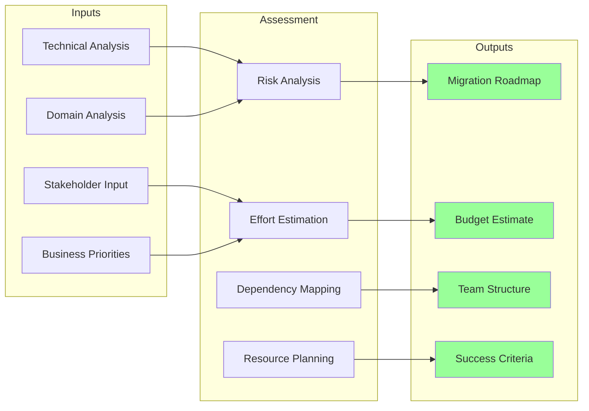

# Assessment Planning for Microservices Migration

## Overview

Assessment planning is the critical first phase of any microservices migration initiative. It involves creating a comprehensive roadmap that evaluates the current state of the monolithic application, defines the target microservices architecture, and identifies the path to get there. A well-crafted assessment plan ensures that organizations understand the scope, complexity, risks, and resources required for successful migration.

The assessment planning phase brings together stakeholders from engineering, operations, product, and business teams to gather requirements, analyze the existing system, identify constraints, and define success criteria. This phase typically takes 4-12 weeks depending on the size and complexity of the monolith, and the output serves as the foundation for all subsequent migration work.

Effective assessment planning goes beyond technical analysis to consider organizational readiness, team capabilities, business priorities, and operational constraints. It identifies dependencies between different aspects of the migration and creates a realistic timeline that accounts for learning, experimentation, and potential setbacks.

## Key Components

### 1. Stakeholder Alignment

Successful migration requires alignment among all stakeholders. This includes executive sponsors who provide funding and strategic direction, product owners who prioritize features and functionality, engineering teams who execute the technical work, operations teams who maintain production systems, and business stakeholders who define requirements and validate outcomes.

The assessment plan should include stakeholder interviews, workshops, and feedback sessions to ensure all perspectives are captured. Regular communication and status updates keep stakeholders informed and engaged throughout the migration process. Change management is critical, as microservices migration often requires significant changes to team structures, processes, and tooling.

### 2. Technical Assessment

The technical assessment analyzes the current architecture, codebase, infrastructure, and operations. Key areas include codebase analysis (size, complexity, dependencies, test coverage), architecture review (monolithic patterns, module boundaries, deployment processes), infrastructure evaluation (servers, databases, networking, tooling), and operational maturity (monitoring, alerting, deployment, incident management).

Static analysis tools can quantify code complexity, identify circular dependencies, and measure test coverage. Architecture reviews examine module boundaries and identify candidates for service extraction. Infrastructure assessment identifies constraints and opportunities for modernization.

### 3. Domain Analysis

Domain analysis applies Domain-Driven Design principles to understand the business domain and identify bounded contexts. This involves working with domain experts to understand business capabilities, processes, and rules. Event storming workshops can quickly identify domain events, commands, and aggregates.

The output of domain analysis is a domain model that defines service boundaries, ownership, and relationships. This model guides service decomposition and helps identify the most natural service boundaries. Domain analysis also identifies shared domains that may require special handling during migration.

### 4. Risk Assessment

Every migration carries risks. The assessment plan should identify and quantify these risks, including technical risks (complexity, dependencies, data integrity), organizational risks (team experience, change resistance), business risks (downtime, feature changes), and timeline risks (scope creep, resource availability).

For each risk, the assessment should define mitigation strategies, contingency plans, and trigger points for escalation. Risk assessment informs decision-making about migration approach, sequencing, and resource allocation.

## Planning Outputs



## Implementation Example

```python
#!/usr/bin/env python3
"""
Migration Assessment Planner
Creates comprehensive assessment plans for microservices migration
"""

from dataclasses import dataclass, field
from typing import Dict, List, Optional
from datetime import datetime, timedelta
from enum import Enum
import json


class RiskLevel(Enum):
    LOW = "low"
    MEDIUM = "medium"
    HIGH = "high"
    CRITICAL = "critical"


class AssessmentType(Enum):
    TECHNICAL = "technical"
    DOMAIN = "domain"
    ORGANIZATIONAL = "organizational"
    OPERATIONAL = "operational"


@dataclass
class AssessmentTask:
    """Represents a single assessment task"""
    task_id: str
    name: str
    description: str
    assessors: List[str]
    duration_hours: int
    dependencies: List[str] = field(default_factory=list)
    status: str = "pending"
    findings: Dict = field(default_factory=dict)


@dataclass
class Risk:
    """Represents an identified risk"""
    risk_id: str
    description: str
    category: str
    probability: float  # 0-1
    impact: float  # 0-1
    level: RiskLevel = RiskLevel.LOW
    mitigation: str = ""
    contingency: str = ""


@dataclass
class AssessmentPlan:
    """Complete assessment plan"""
    plan_id: str
    name: str
    monolith_name: str
    start_date: datetime
    estimated_end_date: datetime
    tasks: List[AssessmentTask] = field(default_factory=list)
    risks: List[Risk] = field(default_factory=list)
    stakeholders: List[str] = field(default_factory=list)
    success_criteria: List[str] = field(default_factory=list)


class AssessmentPlanner:
    """Creates and manages migration assessment plans"""
    
    def __init__(self):
        self.plans: Dict[str, AssessmentPlan] = {}
    
    def create_plan(
        self,
        plan_id: str,
        name: str,
        monolith_name: str,
        start_date: datetime,
        duration_weeks: int
    ) -> AssessmentPlan:
        """Create a new assessment plan"""
        
        plan = AssessmentPlan(
            plan_id=plan_id,
            name=name,
            monolith_name=monolith_name,
            start_date=start_date,
            estimated_end_date=start_date + timedelta(weeks=duration_weeks)
        )
        
        self.plans[plan_id] = plan
        return plan
    
    def add_task(
        self,
        plan_id: str,
        task_id: str,
        name: str,
        description: str,
        assessors: List[str],
        duration_hours: int,
        dependencies: List[str] = None
    ) -> AssessmentTask:
        """Add a task to the assessment plan"""
        
        plan = self.plans.get(plan_id)
        if not plan:
            raise ValueError(f"Plan {plan_id} not found")
        
        task = AssessmentTask(
            task_id=task_id,
            name=name,
            description=description,
            assessors=assessors,
            duration_hours=duration_hours,
            dependencies=dependencies or []
        )
        
        plan.tasks.append(task)
        return task
    
    def add_risk(
        self,
        plan_id: str,
        risk_id: str,
        description: str,
        category: str,
        probability: float,
        impact: float,
        mitigation: str = "",
        contingency: str = ""
    ) -> Risk:
        """Add a risk to the assessment plan"""
        
        plan = self.plans.get(plan_id)
        if not plan:
            raise ValueError(f"Plan {plan_id} not found")
        
        # Calculate risk level
        score = probability * impact
        if score < 0.1:
            level = RiskLevel.LOW
        elif score < 0.3:
            level = RiskLevel.MEDIUM
        elif score < 0.6:
            level = RiskLevel.HIGH
        else:
            level = RiskLevel.CRITICAL
        
        risk = Risk(
            risk_id=risk_id,
            description=description,
            category=category,
            probability=probability,
            impact=impact,
            level=level,
            mitigation=mitigation,
            contingency=contingency
        )
        
        plan.risks.append(risk)
        return risk
    
    def add_stakeholder(
        self,
        plan_id: str,
        stakeholder: str,
        role: str
    ):
        """Add a stakeholder to the plan"""
        
        plan = self.plans.get(plan_id)
        if not plan:
            raise ValueError(f"Plan {plan_id} not found")
        
        plan.stakeholders.append(f"{stakeholder}:{role}")
    
    def add_success_criteria(
        self,
        plan_id: str,
        criteria: str
    ):
        """Add success criteria to the plan"""
        
        plan = self.plans.get(plan_id)
        if not plan:
            raise ValueError(f"Plan {plan_id} not found")
        
        plan.success_criteria.append(criteria)
    
    def generate_roadmap(self, plan_id: str) -> Dict:
        """Generate a migration roadmap based on assessment"""
        
        plan = self.plans.get(plan_id)
        if not plan:
            raise ValueError(f"Plan {plan_id} not found")
        
        # Analyze tasks and create phases
        phases = self._create_phases(plan.tasks)
        
        # Calculate timeline
        total_hours = sum(t.duration_hours for t in plan.tasks)
        
        # Identify critical path
        critical_path = self._identify_critical_path(plan.tasks)
        
        return {
            "plan_id": plan_id,
            "name": plan.name,
            "duration_weeks": (
                plan.estimated_end_date - plan.start_date
            ).days // 7,
            "phases": phases,
            "total_assessment_hours": total_hours,
            "critical_path": critical_path,
            "risk_summary": self._summarize_risks(plan.risks),
            "stakeholders": plan.stakeholders,
            "success_criteria": plan.success_criteria
        }
    
    def _create_phases(self, tasks: List[AssessmentTask]) -> List[Dict]:
        """Group tasks into phases"""
        
        phases = {
            "phase_1": {
                "name": "Foundation",
                "tasks": [],
                "description": "Establish assessment framework and gather baseline data"
            },
            "phase_2": {
                "name": "Analysis",
                "tasks": [],
                "description": "Deep technical and domain analysis"
            },
            "phase_3": {
                "name": "Planning",
                "tasks": [],
                "description": "Create detailed migration plan"
            }
        }
        
        # Categorize tasks into phases based on dependencies
        phase_keywords = {
            "phase_1": ["interview", "document", "inventory", "baseline"],
            "phase_2": ["analyze", "review", "design", "model"],
            "phase_3": ["plan", "estimate", "roadmap", "strategy"]
        }
        
        for task in tasks:
            assigned = False
            for phase_id, keywords in phase_keywords.items():
                if any(kw in task.name.lower() for kw in keywords):
                    phases[phase_id]["tasks"].append(task.task_id)
                    assigned = True
                    break
            
            if not assigned:
                phases["phase_2"]["tasks"].append(task.task_id)
        
        return list(phases.values())
    
    def _identify_critical_path(self, tasks: List[AssessmentTask]) -> List[str]:
        """Identify the critical path through tasks"""
        
        # Simplified critical path identification
        critical = []
        completed = set()
        
        while len(completed) < len(tasks):
            for task in tasks:
                if task.task_id in completed:
                    continue
                
                # Check if all dependencies are completed
                deps_complete = all(
                    d in completed for d in task.dependencies
                )
                
                if deps_complete:
                    critical.append(task.task_id)
                    completed.add(task.task_id)
                    break
        
        return critical
    
    def _summarize_risks(self, risks: List[Risk]) -> Dict:
        """Summarize identified risks"""
        
        summary = {
            "total": len(risks),
            "by_level": {
                "low": 0,
                "medium": 0,
                "high": 0,
                "critical": 0
            },
            "by_category": {}
        }
        
        for risk in risks:
            summary["by_level"][risk.level.value] += 1
            summary["by_category"][risk.category] = \
                summary["by_category"].get(risk.category, 0) + 1
        
        return summary
    
    def export_plan(self, plan_id: str) -> str:
        """Export plan as JSON"""
        
        plan = self.plans.get(plan_id)
        if not plan:
            raise ValueError(f"Plan {plan_id} not found")
        
        # Convert to serializable format
        plan_data = {
            "plan_id": plan.plan_id,
            "name": plan.name,
            "monolith_name": plan.monolith_name,
            "start_date": plan.start_date.isoformat(),
            "estimated_end_date": plan.estimated_end_date.isofortm(),
            "tasks": [
                {
                    "task_id": t.task_id,
                    "name": t.name,
                    "description": t.description,
                    "assessors": t.assessors,
                    "duration_hours": t.duration_hours,
                    "dependencies": t.dependencies,
                    "status": t.status
                }
                for t in plan.tasks
            ],
            "risks": [
                {
                    "risk_id": r.risk_id,
                    "description": r.description,
                    "category": r.category,
                    "probability": r.probability,
                    "impact": r.impact,
                    "level": r.level.value,
                    "mitigation": r.mitigation,
                    "contingency": r.contingency
                }
                for r in plan.risks
            ],
            "stakeholders": plan.stakeholders,
            "success_criteria": plan.success_criteria
        }
        
        return json.dumps(plan_data, indent=2)


# Example usage
if __name__ == "__main__":
    planner = AssessmentPlanner()
    
    # Create assessment plan
    plan = planner.create_plan(
        plan_id="assessment_001",
        name="E-Commerce Platform Migration Assessment",
        monolith_name="Legacy E-Commerce System",
        start_date=datetime(2024, 1, 1),
        duration_weeks=8
    )
    
    # Add assessment tasks
    planner.add_task(
        plan_id="assessment_001",
        task_id="T001",
        name="Stakeholder Interviews",
        description="Interview key stakeholders to understand business priorities",
        assessors=["Architect", "Product Manager"],
        duration_hours=40
    )
    
    planner.add_task(
        plan_id="assessment_001",
        task_id="T002",
        name="Codebase Analysis",
        description="Analyze codebase size, complexity, and dependencies",
        assessors=["Senior Engineers"],
        duration_hours=80,
        dependencies=["T001"]
    )
    
    planner.add_task(
        plan_id="assessment_001",
        task_id="T003",
        name="Domain Modeling",
        description="Conduct domain analysis and identify bounded contexts",
        assessors=["Domain Experts", "Architect"],
        duration_hours=60,
        dependencies=["T001"]
    )
    
    planner.add_task(
        plan_id="assessment_001",
        task_id="T004",
        name="Infrastructure Assessment",
        description="Evaluate current infrastructure and identify constraints",
        assessors=["DevOps Engineer"],
        duration_hours=40
    )
    
    planner.add_task(
        plan_id="assessment_001",
        task_id="T005",
        name="Migration Roadmap",
        description="Create detailed migration roadmap and timeline",
        assessors=["Architect", "Engineering Manager"],
        duration_hours=32,
        dependencies=["T002", "T003", "T004"]
    )
    
    # Add risks
    planner.add_risk(
        plan_id="assessment_001",
        risk_id="R001",
        description="Key team members may leave during migration",
        category="organizational",
        probability=0.4,
        impact=0.7,
        mitigation="Cross-train team members and document knowledge",
        contingency="Hire contractors with relevant experience"
    )
    
    planner.add_risk(
        plan_id="assessment_001",
        risk_id="R002",
        description="Database dependencies may be more complex than initially identified",
        category="technical",
        probability=0.6,
        impact=0.5,
        mitigation="Conduct thorough database analysis",
        contingency="Allocate additional time for data migration"
    )
    
    # Add stakeholders
    planner.add_stakeholder("assessment_001", "CTO", "Executive Sponsor")
    planner.add_stakeholder("assessment_001", "VP Engineering", "Technical Lead")
    planner.add_stakeholder("assessment_001", "Product Director", "Business Lead")
    
    # Add success criteria
    planner.add_success_criteria(
        "assessment_001",
        "Complete assessment within 8 weeks"
    )
    planner.add_success_criteria(
        "assessment_001",
        "Identify at least 10 candidate microservices"
    )
    planner.add_success_criteria(
        "assessment_001",
        "Define migration roadmap with clear phases"
    )
    
    # Generate roadmap
    roadmap = planner.generate_roadmap("assessment_001")
    print(json.dumps(roadmap, indent=2))
```

## Best Practices

1. **Involve All Stakeholders Early**: Start stakeholder engagement at the beginning of the assessment. This ensures buy-in and surfaces concerns early.

2. **Use Quantitative Metrics**: Wherever possible, use objective metrics rather than subjective opinions. This makes progress measurable and enables comparison.

3. **Plan for Unknowns**: Assessments will always uncover surprises. Build contingency into your timeline and budget.

4. **Iterate on the Plan**: The assessment plan is a living document. Update it as you learn more about the system.

5. **Document Everything**: Assessment findings become institutional knowledge. Document thoroughly for future reference.

6. **Communicate Progress**: Keep stakeholders informed about assessment progress, findings, and implications for the migration.

---

## Output Statement

```
Migration Assessment Plan
==========================
Plan ID: assessment_001
Name: E-Commerce Platform Migration Assessment
Duration: 8 weeks
Start Date: 2024-01-01

Tasks: 5
- Stakeholder Interviews (40 hours)
- Codebase Analysis (80 hours) - [depends on T001]
- Domain Modeling (60 hours) - [depends on T001]
- Infrastructure Assessment (40 hours)
- Migration Roadmap (32 hours) - [depends on T002, T003, T004]

Total Assessment Effort: 252 hours

Risks Identified: 2
- HIGH: Key team members may leave during migration
- MEDIUM: Database dependencies may be complex

Phases:
1. Foundation (Week 1-2): Stakeholder engagement, baseline data
2. Analysis (Week 3-6): Technical and domain analysis
3. Planning (Week 7-8): Migration roadmap creation

Success Criteria:
1. Complete assessment within 8 weeks
2. Identify at least 10 candidate microservices
3. Define migration roadmap with clear phases
```
