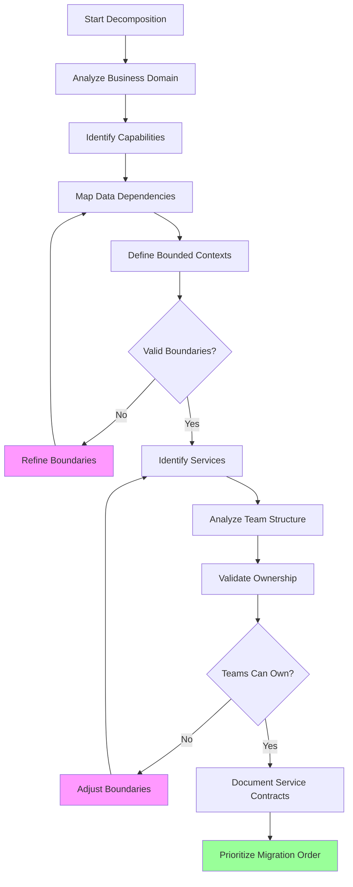

# Service Decomposition Strategies

## Overview

Service decomposition is the process of identifying how to break a monolithic application into microservices. This is one of the most critical decisions in a microservices migration, as service boundaries affect team organization, development velocity, deployment complexity, and system reliability. Getting decomposition right is essential for achieving the benefits of microservices; getting it wrong can create more problems than the monolith had.

Decomposition is not a one-time activity but an ongoing process. As the system evolves, new services may be created, existing services may be split or merged, and boundaries may shift. However, the initial decomposition provides the foundation for the migration and deserves careful consideration.

The goal of decomposition is to create services that are loosely coupled, highly cohesive, and aligned with business capabilities. Each service should have a single, well-defined responsibility that it owns completely. This enables independent development, deployment, and scaling of each service.

## Decomposition Approaches

### 1. Business Capability Decomposition

Business capability decomposition identifies the business capabilities the system provides and creates services around them. This approach aligns services with business functions, making it easier to understand what each service does and how it contributes to business value.

To identify business capabilities, analyze the organization's structure, the product offerings, the customer journey, and the processes that create value. Each capability becomes a candidate for a service. For example, an e-commerce platform might have capabilities like product catalog management, order management, payment processing, shipping, customer management, and recommendation.

Business capability decomposition works well when the business domain is well-understood and stable. It creates intuitive service boundaries that align with how the business thinks about the product.

### 2. Domain-Driven Design Decomposition

Domain-Driven Design (DDD) provides a more rigorous approach to decomposition. It uses concepts like bounded contexts, aggregates, entities, and value objects to create a rich model of the domain. Bounded contexts define explicit boundaries within which certain models apply, and each bounded context typically becomes a microservice.

DDD decomposition involves conducting domain analysis workshops with domain experts, creating a ubiquitous language for the domain, identifying aggregates and their boundaries, and defining the relationships between different parts of the domain. This approach is more time-consuming but produces more robust service boundaries.

Key DDD patterns for decomposition include:
- **Bounded Contexts**: Explicit boundaries around domain models
- **Aggregates**: Clusters of related objects treated as a unit
- **Domain Events**: Significant occurrences that services can react to
- **Anti-Corruption Layers**: Translators that protect services from domain changes in other contexts

### 3. Technical Decomposition

Technical decomposition separates services based on technical concerns rather than business domains. Common technical decompositions include creating separate services for UI, business logic, and data access (similar to the layered architecture pattern), or separating read and write operations (CQRS).

This approach can be useful when different technical requirements exist for different parts of the system. For example, if part of the system requires real-time processing while another part is batch-oriented, separating them into different services allows different scaling strategies.

However, technical decomposition often creates services that are tightly coupled to the monolith's internal structure, making it harder to achieve true independence.

### 4. Subdomain Decomposition

Subdomain decomposition is similar to DDD bounded contexts but focuses more on business subdomains rather than technical modeling. Subdomains are natural divisions of the business domain, often aligned with organizational departments or product lines.

Common subdomains in an enterprise include:
- **Core Subdomains**: The main business differentiators that provide competitive advantage
- **Supporting Subdomains**: Important but not differentiating, often outsourced
- **Generic Subdomains**: Common functionality available off-the-shelf

Core subdomains should receive the most attention in decomposition, as they contain the most valuable business logic.

## Flow Chart



## Implementation Example

```python
#!/usr/bin/env python3
"""
Service Decomposition Analyzer
Analyzes monolith and suggests service boundaries
"""

from dataclasses import dataclass, field
from typing import Dict, List, Set, Optional
from collections import defaultdict
import json


@dataclass
class Module:
    """Represents a module in the monolith"""
    module_id: str
    name: str
    classes: List[str] = field(default_factory=list)
    dependencies: Set[str] = field(default_factory=set)
    database_tables: List[str] = field(default_factory=list)
    api_endpoints: List[str] = field(default_factory=list)
    complexity_score: float = 0.0


@dataclass
class DataEntity:
    """Represents a data entity"""
    entity_id: str
    name: str
    tables: List[str] = field(default_factory=list)
    relationships: List[str] = field(default_factory=list)
    accessed_by: Set[str] = field(default_factory=set)


@dataclass
class BoundedContext:
    """Represents a bounded context"""
    context_id: str
    name: str
    modules: List[str] = field(default_factory=list)
    entities: List[str] = field(default_factory=list)
    dependencies: Set[str] = field(default_factory=set)
    interfaces: List[str] = field(default_factory=list)


@dataclass
class ServiceCandidate:
    """Represents a candidate microservice"""
    service_id: str
    name: str
    bounded_context: str
    modules: List[str] = field(default_factory=list)
    entities: List[str] = field(default_factory=list)
    dependencies: Set[str] = field(default_factory=set)
    estimated_complexity: float = 0.0
    migration_priority: int = 0


class ServiceDecomposer:
    """Analyzes monolith and suggests service decomposition"""
    
    def __init__(self, monolith_name: str):
        self.monolith_name = monolith_name
        self.modules: Dict[str, Module] = {}
        self.entities: Dict[str, DataEntity] = {}
        self.bounded_contexts: Dict[str, BoundedContext] = {}
        self.service_candidates: Dict[str, ServiceCandidate] = {}
        self.dependency_matrix: Dict[str, Set[str]] = defaultdict(set)
    
    def add_module(
        self,
        module_id: str,
        name: str,
        classes: List[str] = None,
        dependencies: List[str] = None,
        database_tables: List[str] = None,
        api_endpoints: List[str] = None
    ) -> Module:
        """Add a module to the analysis"""
        
        module = Module(
            module_id=module_id,
            name=name,
            classes=classes or [],
            dependencies=set(dependencies or []),
            database_tables=database_tables or [],
            api_endpoints=api_endpoints or []
        )
        
        # Calculate complexity based on various factors
        module.complexity_score = self._calculate_module_complexity(module)
        
        self.modules[module_id] = module
        
        # Update dependency matrix
        for dep in module.dependencies:
            self.dependency_matrix[module_id].add(dep)
        
        return module
    
    def _calculate_module_complexity(self, module: Module) -> float:
        """Calculate complexity score for a module"""
        
        # Factors contributing to complexity
        class_count = len(module.classes)
        dependency_count = len(module.dependencies)
        table_count = len(module.database_tables)
        endpoint_count = len(module.api_endpoints)
        
        # Weighted complexity score
        score = (
            class_count * 1.0 +
            dependency_count * 2.0 +
            table_count * 3.0 +
            endpoint_count * 1.5
        )
        
        return score
    
    def add_entity(
        self,
        entity_id: str,
        name: str,
        tables: List[str] = None,
        relationships: List[str] = None,
        accessed_by: List[str] = None
    ) -> DataEntity:
        """Add a data entity to the analysis"""
        
        entity = DataEntity(
            entity_id=entity_id,
            name=name,
            tables=tables or [],
            relationships=relationships or [],
            accessed_by=set(accessed_by or [])
        )
        
        self.entities[entity_id] = entity
        
        # Update module access patterns
        for module_id in entity.accessed_by:
            if module_id in self.modules:
                # Check if entity's tables are accessed by this module
                self.modules[module_id].database_tables.extend(entity.tables)
        
        return entity
    
    def create_bounded_context(
        self,
        context_id: str,
        name: str,
        module_ids: List[str],
        entity_ids: List[str]
    ) -> BoundedContext:
        """Create a bounded context from modules and entities"""
        
        context = BoundedContext(
            context_id=context_id,
            name=name,
            modules=module_ids,
            entities=entity_ids
        )
        
        # Calculate dependencies
        for module_id in context.modules:
            if module_id in self.dependency_matrix:
                context.dependencies.update(self.dependency_matrix[module_id])
        
        # Remove internal dependencies
        context.dependencies -= set(context.modules)
        
        # Identify interfaces (shared entities or APIs)
        for entity_id in context.entities:
            if entity_id in self.entities:
                entity = self.entities[entity_id]
                if len(entity.accessed_by) > 1:
                    context.interfaces.append(f"shared_entity:{entity_id}")
        
        self.bounded_contexts[context_id] = context
        return context
    
    def generate_service_candidates(self) -> List[ServiceCandidate]:
        """Generate candidate microservices based on bounded contexts"""
        
        candidates = []
        
        for context_id, context in self.bounded_contexts.items():
            # Create service candidate from bounded context
            candidate = ServiceCandidate(
                service_id=f"service_{context_id}",
                name=context.name,
                bounded_context=context_id,
                modules=context.modules,
                entities=context.entities,
                dependencies=context.dependencies
            )
            
            # Calculate estimated complexity
            candidate.estimated_complexity = sum(
                self.modules[m].complexity_score
                for m in context.modules
            )
            
            # Determine migration priority
            # Lower complexity and fewer dependencies = higher priority
            candidate.migration_priority = self._calculate_priority(candidate)
            
            self.service_candidates[candidate.service_id] = candidate
            candidates.append(candidate)
        
        # Sort by migration priority (highest first)
        candidates.sort(key=lambda c: c.migration_priority, reverse=True)
        
        return candidates
    
    def _calculate_priority(self, candidate: ServiceCandidate) -> int:
        """Calculate migration priority (higher = more urgent)"""
        
        # Lower complexity is better
        complexity_factor = max(0, 100 - candidate.estimated_complexity / 10)
        
        # Fewer dependencies is better
        dependency_factor = max(0, 50 - len(candidate.dependencies) * 5)
        
        # More entities (business value) is better
        entity_factor = len(candidate.entities) * 2
        
        return int(complexity_factor + dependency_factor + entity_factor)
    
    def analyze_coupling(self) -> Dict:
        """Analyze coupling between service candidates"""
        
        coupling_analysis = {
            "high_coupling": [],
            "medium_coupling": [],
            "low_coupling": []
        }
        
        # Analyze each pair of services
        for service_id_1, service_1 in self.service_candidates.items():
            for service_id_2, service_2 in self.service_candidates.items():
                if service_id_1 >= service_id_2:
                    continue
                
                # Calculate coupling
                coupling = self._calculate_coupling(service_1, service_2)
                
                if coupling > 10:
                    coupling_analysis["high_coupling"].append({
                        "service_1": service_1.name,
                        "service_2": service_2.name,
                        "coupling_score": coupling
                    })
                elif coupling > 5:
                    coupling_analysis["medium_coupling"].append({
                        "service_1": service_1.name,
                        "service_2": service_2.name,
                        "coupling_score": coupling
                    })
                else:
                    coupling_analysis["low_coupling"].append({
                        "service_1": service_1.name,
                        "service_2": service_2.name,
                        "coupling_score": coupling
                    })
        
        return coupling_analysis
    
    def _calculate_coupling(
        self,
        service_1: ServiceCandidate,
        service_2: ServiceCandidate
    ) -> float:
        """Calculate coupling score between two services"""
        
        # Shared dependencies
        shared_deps = service_1.dependencies & service_2.dependencies
        dependency_coupling = len(shared_deps) * 3
        
        # Shared entities
        shared_entities = set(service_1.entities) & set(service_2.entities)
        entity_coupling = len(shared_entities) * 5
        
        return dependency_coupling + entity_coupling
    
    def recommend_refactoring(self) -> List[str]:
        """Recommend refactoring to reduce coupling"""
        
        recommendations = []
        
        # Analyze coupling
        coupling_analysis = self.analyze_coupling()
        
        # High coupling recommendations
        for coupling in coupling_analysis["high_coupling"]:
            recommendations.append(
                f"High coupling detected between {coupling['service_1']} "
                f"and {coupling['service_2']} (score: {coupling['coupling_score']}). "
                f"Consider introducing an anti-corruption layer or "
                f"redefining boundaries."
            )
        
        # Identify potential shared kernels
        if len(self.service_candidates) > 1:
            all_deps = set()
            for service in self.service_candidates.values():
                all_deps |= service.dependencies
            
            if len(all_deps) > len(self.service_candidates) * 2:
                recommendations.append(
                    "High overall system coupling detected. "
                    "Consider identifying a shared kernel or "
                    "rethinking service boundaries."
                )
        
        return recommendations
    
    def export_decomposition_plan(self) -> str:
        """Export the complete decomposition plan"""
        
        plan = {
            "monolith_name": self.monolith_name,
            "modules_analyzed": len(self.modules),
            "entities_analyzed": len(self.entities),
            "bounded_contexts": [
                {
                    "id": bc.context_id,
                    "name": bc.name,
                    "module_count": len(bc.modules),
                    "entity_count": len(bc.entities),
                    "dependencies": list(bc.dependencies)
                }
                for bc in self.bounded_contexts.values()
            ],
            "service_candidates": [
                {
                    "id": s.service_id,
                    "name": s.name,
                    "bounded_context": s.bounded_context,
                    "module_count": len(s.modules),
                    "entity_count": len(s.entities),
                    "estimated_complexity": s.estimated_complexity,
                    "migration_priority": s.migration_priority,
                    "dependencies": list(s.dependencies)
                }
                for s in self.service_candidates.values()
            ],
            "recommendations": self.recommend_refactoring()
        }
        
        return json.dumps(plan, indent=2)


# Example usage
if __name__ == "__main__":
    decomposer = ServiceDecomposer("E-Commerce Platform")
    
    # Add modules (representing monolith modules)
    decomposer.add_module(
        module_id="mod_catalog",
        name="ProductCatalog",
        classes=["ProductService", "CategoryService", "SearchService"],
        dependencies=[],
        database_tables=["products", "categories", "product_images"],
        api_endpoints=["GET /products", "GET /categories"]
    )
    
    decomposer.add_module(
        module_id="mod_orders",
        name="OrderManagement",
        classes=["OrderService", "OrderItemService"],
        dependencies=["mod_catalog", "mod_users"],
        database_tables=["orders", "order_items"],
        api_endpoints=["POST /orders", "GET /orders/{id}"]
    )
    
    decomposer.add_module(
        module_id="mod_users",
        name="UserManagement",
        classes=["UserService", "AuthenticationService"],
        dependencies=[],
        database_tables=["users", "addresses", "sessions"],
        api_endpoints=["POST /auth/login", "GET /users/{id}"]
    )
    
    decomposer.add_module(
        module_id="mod_payments",
        name="PaymentProcessing",
        classes=["PaymentService", "RefundService"],
        dependencies=["mod_orders"],
        database_tables=["payments", "refunds"],
        api_endpoints=["POST /payments", "POST /refunds"]
    )
    
    decomposer.add_module(
        module_id="mod_shipping",
        name="ShippingManagement",
        classes=["ShippingService", "TrackingService"],
        dependencies=["mod_orders"],
        database_tables=["shipments", "tracking_info"],
        api_endpoints=["POST /shipments", "GET /tracking/{id}"]
    )
    
    # Add entities
    decomposer.add_entity(
        entity_id="ent_product",
        name="Product",
        tables=["products"],
        relationships=["has_many:order_items"],
        accessed_by=["mod_catalog", "mod_orders", "mod_recommendations"]
    )
    
    decomposer.add_entity(
        entity_id="ent_order",
        name="Order",
        tables=["orders", "order_items"],
        relationships=["has_many:order_items", "belongs_to:user", "has_many:payments"],
        accessed_by=["mod_orders", "mod_payments", "mod_shipping"]
    )
    
    decomposer.add_entity(
        entity_id="ent_user",
        name="User",
        tables=["users", "addresses"],
        relationships=["has_many:orders", "has_many:addresses"],
        accessed_by=["mod_users", "mod_orders"]
    )
    
    # Create bounded contexts
    decomposer.create_bounded_context(
        context_id="ctx_catalog",
        name="Product Catalog",
        module_ids=["mod_catalog"],
        entity_ids=["ent_product"]
    )
    
    decomposer.create_bounded_context(
        context_id="ctx_orders",
        name="Order Management",
        module_ids=["mod_orders"],
        entity_ids=["ent_order"]
    )
    
    decomposer.create_bounded_context(
        context_id="ctx_users",
        name="User Management",
        module_ids=["mod_users"],
        entity_ids=["ent_user"]
    )
    
    decomposer.create_bounded_context(
        context_id="ctx_checkout",
        name="Checkout",
        module_ids=["mod_payments", "mod_shipping"],
        entity_ids=["ent_order"]
    )
    
    # Generate service candidates
    candidates = decomposer.generate_service_candidates()
    
    print("Service Candidates:")
    print("-" * 50)
    for candidate in candidates:
        print(f"\n{candidate.name}")
        print(f"  Priority: {candidate.migration_priority}")
        print(f"  Complexity: {candidate.estimated_complexity}")
        print(f"  Dependencies: {candidate.dependencies}")
    
    print("\n\nRecommendations:")
    print("-" * 50)
    for rec in decomposer.recommend_refactoring():
        print(f"\n{rec}")
```

## Real-World Example: E-Commerce Platform Decomposition

A large e-commerce platform decomposed their monolith using a combination of business capability and DDD approaches:

**Analysis Phase:**
- Analyzed 2 million lines of code
- Identified 150+ database tables
- Conducted 20+ domain expert interviews
- Mapped 500+ internal dependencies

**Service Boundaries Identified:**
1. **Product Catalog** (Priority: High) - Clear boundaries, minimal dependencies
2. **User Management** (Priority: High) - Independent domain
3. **Order Management** (Priority: Medium) - Complex dependencies
4. **Payment Processing** (Priority: Medium) - Regulatory constraints
5. **Shipping** (Priority: Medium) - External integrations
6. **Recommendations** (Priority: Low) - Analytics domain

**Decomposition Results:**
- 6 initial microservices
- Average service size: 50,000 lines of code
- Average dependency count: 3 per service
- Migration completed in 18 months

## Best Practices

1. **Start with Business Capabilities**: Let business capabilities guide initial decomposition rather than technical layers.

2. **Analyze Data Dependencies**: Data dependencies often reveal the tightest coupling. Address these early.

3. **Consider Team Structure**: Decomposition should align with team ownership. If a team can't own a service, the boundary may be wrong.

4. **Iterate and Refine**: Initial boundaries will evolve. Plan for ongoing refinement.

5. **Document Boundaries**: Clearly document service contracts, including APIs, data ownership, and integration patterns.

6. **Prioritize for Business Value**: Services that deliver immediate business value should be extracted first.

---

## Output Statement

```
Service Decomposition Analysis
=============================
Monolith: E-Commerce Platform

Modules Analyzed: 5
Entities Analyzed: 3
Bounded Contexts: 4

Service Candidates: 4

1. Product Catalog (Priority: 85)
   - Complexity: 45.0
   - Dependencies: []
   - Recommended Migration Order: 1

2. User Management (Priority: 82)
   - Complexity: 38.0
   - Dependencies: []
   - Recommended Migration Order: 2

3. Checkout (Priority: 65)
   - Complexity: 65.0
   - Dependencies: [ctx_orders, ctx_users]
   - Recommended Migration Order: 3

4. Order Management (Priority: 58)
   - Complexity: 72.0
   - Dependencies: [ctx_catalog, ctx_users]
   - Recommended Migration Order: 4

Recommendations:
1. High coupling detected between Checkout and Order Management. 
   Consider introducing an anti-corruption layer.
2. Product Catalog and User Management have minimal dependencies
   and are ideal first candidates for migration.
```
