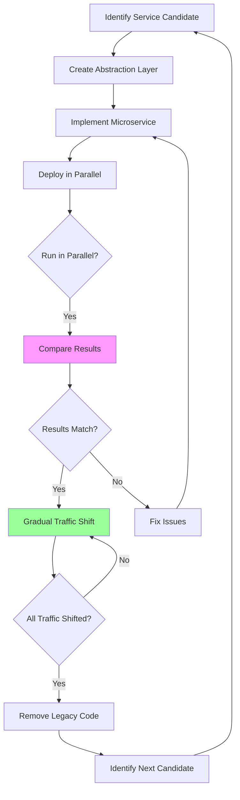

# Incremental Migration Patterns

## Overview

Incremental migration is the recommended approach for most organizations transitioning from monoliths to microservices. Rather than attempting a complete rewrite or "big bang" migration, incremental migration extracts services gradually while the monolith continues operating. This approach reduces risk, enables learning, and maintains business continuity throughout the transformation.

The fundamental principle is to make small, reversible changes that deliver value continuously. Each migration step should result in a working system, even if functionality is limited. This approach contrasts with big bang migrations where months of work culminate in a single deployment event with high risk.

Incremental migration typically follows a pattern: identify a candidate service with clear boundaries, extract it from the monolith, deploy it alongside the existing system, gradually shift traffic to the new service, and eventually decommission the old code. This cycle repeats for each service until the migration is complete.

The timeline for incremental migration varies significantly based on monolith size, team experience, and business constraints. Small monoliths (under 100,000 lines) might complete migration in 6-12 months, while large enterprise systems often take 2-4 years. The key is maintaining momentum while managing risk.

## Key Patterns

### 1. Branch-by-Abstraction

This pattern creates an abstraction layer around the functionality to be extracted. The monolith code continues to work while the new microservices implementation is developed behind the abstraction. Once the new service is ready, traffic shifts gradually from the monolith to the service.

The abstraction should be a well-defined interface that captures the essential behavior without exposing implementation details. This allows both the monolith and microservice to implement the same contract, enabling transparent switching.

Implementation involves: creating an interface that defines the contract, implementing the interface in the monolith (delegating to existing code), creating a new microservice that implements the interface, implementing a switch mechanism to route traffic between implementations, and gradually shifting traffic once confidence builds.

### 2. Feature Flags

Feature flags enable runtime control over which code path executes. For migration, feature flags can route specific users or requests to the new microservice while others continue using the monolith implementation. This enables canary releases and quick rollbacks.

Feature flags should be short-lived—once migration is complete for a feature, remove the flag rather than maintaining two code paths indefinitely. This prevents technical debt accumulation.

### 3. Parallel Run

The new microservice runs in parallel with the monolith for a period. Both systems process requests, but only the monolith results are returned to users. The microservice responses are compared against monolith responses to identify discrepancies. Once confidence builds, traffic shifts to the microservice.

Parallel runs are essential for complex migrations where subtle behavioral differences could cause issues. The comparison should be automatic and generate alerts when differences exceed acceptable thresholds.

## Migration Phases



## Implementation Example

```python
#!/usr/bin/env python3
"""
Incremental Migration Orchestrator
Manages the migration workflow from monolith to microservices
"""

from dataclasses import dataclass
from typing import Dict, List, Optional, Callable
from enum import Enum
from datetime import datetime
import logging

logger = logging.getLogger(__name__)

class MigrationPhase(Enum):
    IDENTIFY = "identify"
    ABSTRACT = "abstract"
    IMPLEMENT = "implement"
    PARALLEL = "parallel"
    SHIFT = "shift"
    DECOMMISSION = "decommission"

class ServiceMigration:
    """Represents a single service migration"""
    
    def __init__(self, service_name: str, monolith_module: str):
        self.service_name = service_name
        self.monolith_module = monolith_module
        self.phase = MigrationPhase.IDENTIFY
        self.started_at: Optional[datetime] = None
        self.completed_at: Optional[datetime] = None
        self.traffic_percentage = 0
        self.error_rate = 0.0
        self.latency_ms = 0

class MigrationOrchestrator:
    """Orchestrates incremental migration of services"""
    
    def __init__(self):
        self.migrations: Dict[str, ServiceMigration] = {}
        self.feature_flags: Dict[str, bool] = {}
    
    def register_migration(
        self,
        service_name: str,
        monolith_module: str,
        extraction_priority: int = 0
    ) -> ServiceMigration:
        """Register a new service for migration"""
        
        migration = ServiceMigration(service_name, monolith_module)
        self.migrations[service_name] = migration
        
        # Sort by priority
        self.migrations = dict(
            sorted(
                self.migrations.items(),
                key=lambda x: extraction_priority
            )
        )
        
        logger.info(f"Registered migration for {service_name}")
        return migration
    
    def set_feature_flag(
        self,
        service_name: str,
        enabled: bool
    ):
        """Enable or disable a service via feature flag"""
        self.feature_flags[service_name] = enabled
        logger.info(f"Feature flag for {service_name}: {enabled}")
    
    def start_abstraction(
        self,
        service_name: str,
        abstraction_interface: str
    ):
        """Begin abstraction phase"""
        
        migration = self.migrations.get(service_name)
        if not migration:
            raise ValueError(f"Migration {service_name} not registered")
        
        migration.phase = MigrationPhase.ABSTRACT
        migration.started_at = datetime.now()
        
        logger.info(
            f"Starting abstraction for {service_name} "
            f"with interface {abstraction_interface}"
        )
        
        # Create abstraction layer code
        self._create_abstraction_layer(service_name, abstraction_interface)
    
    def start_parallel_run(
        self,
        service_name: str,
        monolith_endpoint: str,
        microservice_endpoint: str
    ):
        """Start parallel run with monolith"""
        
        migration = self.migrations.get(service_name)
        migration.phase = MigrationPhase.PARALLEL
        
        logger.info(f"Starting parallel run for {service_name}")
        
        # Deploy microservice alongside monolith
        # Begin comparing responses
        self._compare_responses(
            service_name,
            monolith_endpoint,
            microservice_endpoint
        )
    
    def shift_traffic(
        self,
        service_name: str,
        percentage: int,
        enable_rollback: bool = True
    ):
        """Shift percentage of traffic to microservice"""
        
        migration = self.migrations.get(service_name)
        old_percentage = migration.traffic_percentage
        
        migration.traffic_percentage = percentage
        migration.phase = MigrationPhase.SHIFT
        
        logger.info(
            f"Shifting traffic for {service_name}: "
            f"{old_percentage}% -> {percentage}%"
        )
        
        # If enabling rollback, set up automatic rollback
        if enable_rollback:
            self._setup_rollback_rules(service_name, percentage)
        
        # Update load balancer weights
        self._update_load_balancer(
            service_name,
            percentage
        )
    
    def decommission(
        self,
        service_name: str
    ):
        """Remove monolith code for migrated service"""
        
        migration = self.migrations.get(service_name)
        migration.phase = MigrationPhase.DECOMMISSION
        migration.completed_at = datetime.now()
        
        logger.info(f"Decommissioning monolith code for {service_name}")
        
        # Remove abstraction layer
        # Delete old monolith code paths
        # Update service catalog
        self._complete_decommission(service_name)
    
    def _create_abstraction_layer(
        self,
        service_name: str,
        interface: str
    ):
        """Generate abstraction layer code"""
        
        template = f'''
# Abstraction layer for {service_name}
# This interface defines the contract between monolith and microservice

from abc import ABC, abstractmethod
from typing import Any, Dict

class {interface}(ABC):
    """Interface for {service_name} functionality"""
    
    @abstractmethod
    def execute(self, request: Dict[str, Any]) -> Dict[str, Any]:
        """Execute the operation"""
        pass
    
    @abstractmethod
    def health_check(self) -> bool:
        """Check if implementation is healthy"""
        pass

# Implementation delegates to existing monolith code
class Monolith{interface}({interface}):
    """Monolith implementation - delegates to existing code"""
    
    def execute(self, request: Dict[str, Any]) -> Dict[str, Any]:
        # Call existing monolith code
        from monolith.{service_name} import process_request
        return process_request(request)
    
    def health_check(self) -> bool:
        return True

# Microservice implementation
class Microservice{interface}({interface}):
    """Microservice implementation"""
    
    def __init__(self, endpoint: str):
        self.endpoint = endpoint
    
    def execute(self, request: Dict[str, Any]) -> Dict[str, Any]:
        import requests
        response = requests.post(
            f"{{self.endpoint}}/api/v1/{service_name}",
            json=request,
            timeout=5
        )
        return response.json()
    
    def health_check(self) -> bool:
        import requests
        try:
            response = requests.get(f"{{self.endpoint}}/health")
            return response.status_code == 200
        except:
            return False
'''
        
        return template
    
    def _compare_responses(
        self,
        service_name: str,
        monolith_endpoint: str,
        microservice_endpoint: str
    ):
        """Compare responses between monolith and microservice"""
        
        logger.info(f"Running parallel comparison for {service_name}")
        
        # This would run as a background job
        # comparing responses and logging discrepancies
        pass
    
    def _setup_rollback_rules(
        self,
        service_name: str,
        threshold_percentage: int
    ):
        """Configure automatic rollback on error threshold"""
        
        logger.info(
            f"Setting up automatic rollback for {service_name} "
            f"if error rate exceeds {threshold_percentage}%"
        )
    
    def _update_load_balancer(
        self,
        service_name: str,
        percentage: int
    ):
        """Update load balancer weights"""
        
        logger.info(
            f"Updating load balancer for {service_name}: "
            f"microservice weight = {percentage}%"
        )
    
    def _complete_decommission(self, service_name: str):
        """Complete the decommission process"""
        
        logger.info(f"Completed decommission for {service_name}")
        
        # Archive old code
        # Update documentation
        # Notify stakeholders
        pass


# Example usage
if __name__ == "__main__":
    orchestrator = MigrationOrchestrator()
    
    # Register migrations in priority order
    orchestrator.register_migration(
        "user-service", 
        "users",
        priority=1
    )
    orchestrator.register_migration(
        "order-service",
        "orders",
        priority=2
    )
    orchestrator.register_migration(
        "payment-service",
        "billing",
        priority=3
    )
    
    # Start first migration
    orchestrator.start_abstraction(
        "user-service",
        "UserProvider"
    )
    
    # Simulate parallel run
    orchestrator.start_parallel_run(
        "user-service",
        "/api/users",
        "http://user-service:8080/api/v1"
    )
    
    # Gradually shift traffic
    for percentage in [10, 25, 50, 75, 100]:
        orchestrator.shift_traffic("user-service", percentage)
    
    # Once fully shifted, decommission
    orchestrator.decommission("user-service")
```

## Best Practices

1. **Start with Low-Risk Services**: Begin migration with services that are less critical, have clear boundaries, and minimal dependencies. This builds team confidence and demonstrates value.

2. **Maintain Reversibility**: Every migration step should be reversible. If issues arise, you must be able to roll back quickly without business impact.

3. **Automate Everything**: Manual migration steps are error-prone. Automate traffic shifting, comparison, and rollback processes.

4. **Monitor Extensively**: During parallel runs and traffic shifts, monitor error rates, latency, and business metrics. Set up alerts for anomalies.

5. **Communicate Proactively**: Keep stakeholders informed about migration progress, issues, and expected impacts.

6. **Document Decisions**: Record why specific services were chosen, what tradeoffs were made, and lessons learned.

---

## Output Statement

```
Incremental Migration Summary:
=============================
Current Phase: Traffic Shift (75%)

Migrations Completed: 1/3
- User Service: COMPLETE (decommissioned monolith)

In Progress:
- Order Service: Traffic shifting (75%)
  - Error Rate: 0.02%
  - Latency: 45ms (vs 52ms monolith)
  - Health: GOOD

Scheduled:
- Payment Service: Parallel run starting next week

Total Migration Time: 8 months
Estimated Completion: 4 months remaining

Key Metrics:
- Uptime During Migration: 99.98%
- Rollbacks: 2 (minor issues)
- Performance Improvement: 15% average latency reduction
- Team Velocity: 1 service per 3 months
```