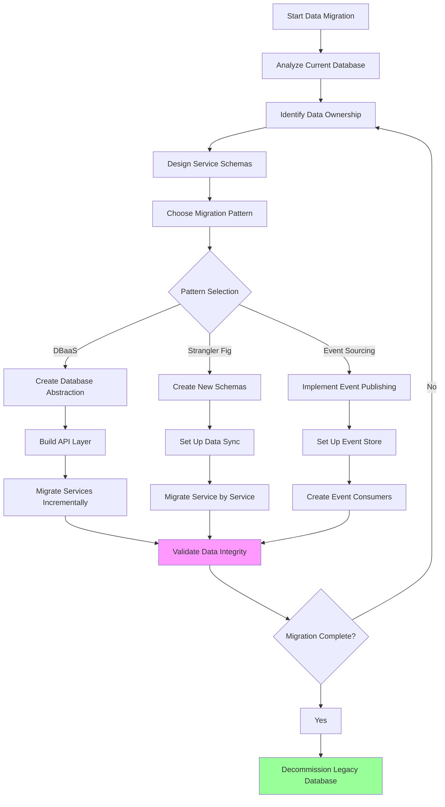

# Data Migration Strategies

## Overview

Data migration is one of the most critical and challenging aspects of transitioning from a monolithic architecture to microservices. The monolithic application typically stores all data in a single database, while microservices require each service to own its data with clear boundaries. This fundamental shift requires careful planning, execution, and validation to ensure data integrity, consistency, and availability throughout the migration process.

The primary goal of data migration is to decompose the monolithic database into service-specific databases while maintaining data integrity, ensuring zero or minimal downtime, and preserving business continuity. This involves identifying data ownership, designing new data schemas, creating migration scripts, validating migrated data, and implementing strategies to handle the transition period where both old and new systems may access the same data.

Data migration in microservices is not just about moving data from one place to another—it is about transforming data architecture, establishing new ownership models, and implementing patterns that enable services to operate independently. The complexity increases significantly when dealing with shared tables, complex relationships, transactional requirements, and the need to maintain referential integrity across service boundaries.

## Migration Patterns

### 1. Database-as-a-Service Pattern

The Database-as-a-Service (DBaaS) pattern involves extracting the database layer from the monolith and treating it as a separate service. The monolith continues to use the database, but all database access goes through well-defined APIs. This pattern provides a clean abstraction layer and enables gradual migration of database operations to individual services.

Implementation involves creating a database access layer that wraps all database operations. This layer exposes APIs for CRUD operations that the monolith uses instead of direct SQL queries. Over time, these APIs can be migrated to individual services, with each service implementing its own database access patterns.

The DBaaS pattern offers several advantages: it provides a clear migration path, reduces database coupling in the monolith, enables horizontal scaling of database operations, and allows for independent evolution of the database layer. However, it requires significant upfront investment in building the abstraction layer and may introduce latency in database operations due to the additional network hop.

### 2. Strangler Fig Database Migration

Similar to the strangler fig pattern for application code, this approach gradually migrates database schema and data. Starting with new services that have clear boundaries, you create new database schemas and migrate data incrementally. The monolith continues to use the old schema while new services use the new schema, with synchronization mechanisms keeping them in sync.

This pattern works well when migrating from a large monolithic database to multiple service-specific databases. The migration happens service by service, with data synchronization between the old and new schemas during the transition period. Once all services are migrated, the old database can be decommissioned.

The strangler fig database migration requires careful planning of data synchronization mechanisms, handling of data conflicts, and managing the eventual consistency that results from having data in two places during the transition. It is essential to implement robust reconciliation processes to ensure data integrity throughout the migration.

### 3. Event Sourcing Migration

Event sourcing migration involves capturing all data changes as events and storing them in an event store. Both the monolith and microservices can consume these events to maintain their respective data stores. This pattern provides a complete audit trail of all data changes and enables building materialized views for different services.

The event sourcing approach is particularly powerful for complex domains where understanding the history of changes is important. It also enables building new services that consume the event stream without impacting the existing system. However, it requires significant changes to the application architecture and may be overkill for simpler domains.

Implementing event sourcing migration involves modifying the monolith to publish events for all data changes, setting up an event store (typically using a message broker or specialized event store database), and creating consumers in new services that process these events to maintain their local data stores.

## Flow Chart



## Implementation Example

```python
#!/usr/bin/env python3
"""
Data Migration Orchestrator
Manages the migration of data from monolith to microservices
"""

from dataclasses import dataclass, field
from typing import Dict, List, Optional, Callable
from enum import Enum
from datetime import datetime
import logging
import time
import threading

logger = logging.getLogger(__name__)


class MigrationPattern(Enum):
    DATABASE_AS_A_SERVICE = "database_as_a_service"
    STRANGLER_FIG = "strangler_fig"
    EVENT_SOURCING = "event_sourcing"


class MigrationStatus(Enum):
    PENDING = "pending"
    IN_PROGRESS = "in_progress"
    VALIDATING = "validating"
    COMPLETED = "completed"
    FAILED = "failed"
    ROLLED_BACK = "rolled_back"


@dataclass
class TableMigration:
    """Represents migration of a single table"""
    table_name: str
    source_schema: str
    target_schema: str
    target_service: str
    status: MigrationStatus = MigrationStatus.PENDING
    row_count: int = 0
    migrated_count: int = 0
    error_count: int = 0
    started_at: Optional[datetime] = None
    completed_at: Optional[datetime] = None


@dataclass
class DataMigration:
    """Represents a complete data migration"""
    migration_id: str
    pattern: MigrationPattern
    tables: List[TableMigration] = field(default_factory=list)
    status: MigrationStatus = MigrationStatus.PENDING
    sync_enabled: bool = False


class DataMigrationOrchestrator:
    """Orchestrates data migration from monolith to microservices"""
    
    def __init__(self):
        self.migrations: Dict[str, DataMigration] = {}
        self.monolith_connection = None
        self.service_connections: Dict[str, object] = {}
        self.event_store = None
        self.sync_active = False
        self.reconciliation_enabled = False
    
    def create_migration(
        self,
        migration_id: str,
        pattern: MigrationPattern,
        tables: List[Dict]
    ) -> DataMigration:
        """Create a new data migration plan"""
        
        migration = DataMigration(
            migration_id=migration_id,
            pattern=pattern,
            tables=[
                TableMigration(
                    table_name=t["table_name"],
                    source_schema=t["source_schema"],
                    target_schema=t["target_schema"],
                    target_service=t["target_service"]
                )
                for t in tables
            ]
        )
        
        self.migrations[migration_id] = migration
        logger.info(f"Created migration {migration_id} with pattern {pattern.value}")
        
        return migration
    
    def set_monolith_connection(self, connection_string: str):
        """Set connection to the monolith database"""
        self.monolith_connection = connection_string
        logger.info("Monolith database connection configured")
    
    def add_service_connection(self, service_name: str, connection_string: str):
        """Add connection for a microservice database"""
        self.service_connections[service_name] = connection_string
        logger.info(f"Service connection configured: {service_name}")
    
    def enable_bidirectional_sync(
        self,
        source_db: str,
        target_db: str,
        conflict_resolution: str = "source_wins"
    ):
        """Enable bidirectional data synchronization between databases"""
        
        self.sync_active = True
        logger.info(
            f"Enabled bidirectional sync: {source_db} <-> {target_db} "
            f"(conflict resolution: {conflict_resolution})"
        )
        
        # Start sync background thread
        sync_thread = threading.Thread(
            target=self._run_sync_loop,
            args=(source_db, target_db, conflict_resolution),
            daemon=True
        )
        sync_thread.start()
    
    def _run_sync_loop(self, source_db: str, target_db: str, conflict_resolution: str):
        """Background thread for data synchronization"""
        
        while self.sync_active:
            try:
                changes = self._fetch_pending_changes(source_db)
                for change in changes:
                    self._apply_change(target_db, change, conflict_resolution)
            except Exception as e:
                logger.error(f"Sync error: {e}")
            
            time.sleep(5)  # Sync every 5 seconds
    
    def _fetch_pending_changes(self, database: str) -> List[Dict]:
        """Fetch pending changes from a database"""
        # Implementation would query change log or transaction log
        return []
    
    def _apply_change(
        self,
        database: str,
        change: Dict,
        conflict_resolution: str
    ):
        """Apply a change to the target database"""
        # Implementation would apply the change with conflict handling
        pass
    
    def start_migration(self, migration_id: str):
        """Start executing a data migration"""
        
        migration = self.migrations.get(migration_id)
        if not migration:
            raise ValueError(f"Migration {migration_id} not found")
        
        migration.status = MigrationStatus.IN_PROGRESS
        logger.info(f"Starting migration {migration_id}")
        
        for table in migration.tables:
            self._migrate_table(migration_id, table)
    
    def _migrate_table(self, migration_id: str, table: TableMigration):
        """Migrate a single table"""
        
        table.status = MigrationStatus.IN_PROGRESS
        table.started_at = datetime.now()
        
        logger.info(f"Migrating table {table.table_name}")
        
        try:
            # Get row count
            table.row_count = self._get_row_count(
                table.source_schema,
                table.table_name
            )
            
            # Migrate data in batches
            batch_size = 1000
            offset = 0
            
            while offset < table.row_count:
                rows = self._fetch_rows(
                    table.source_schema,
                    table.table_name,
                    batch_size,
                    offset
                )
                
                for row in rows:
                    try:
                        self._insert_row(
                            table.target_schema,
                            table.table_name,
                            row
                        )
                        table.migrated_count += 1
                    except Exception as e:
                        logger.error(f"Error migrating row: {e}")
                        table.error_count += 1
                
                offset += batch_size
            
            table.status = MigrationStatus.COMPLETED
            table.completed_at = datetime.now()
            
            logger.info(
                f"Table {table.table_name} migration completed: "
                f"{table.migrated_count}/{table.row_count} rows"
            )
            
        except Exception as e:
            logger.error(f"Table migration failed: {e}")
            table.status = MigrationStatus.FAILED
    
    def _get_row_count(self, schema: str, table: str) -> int:
        """Get total row count for a table"""
        # Implementation would execute COUNT query
        return 0
    
    def _fetch_rows(
        self,
        schema: str,
        table: str,
        limit: int,
        offset: int
    ) -> List[Dict]:
        """Fetch rows from a table"""
        # Implementation would execute SELECT query
        return []
    
    def _insert_row(self, schema: str, table: str, row: Dict):
        """Insert a row into target table"""
        # Implementation would execute INSERT statement
        pass
    
    def validate_migration(self, migration_id: str) -> Dict:
        """Validate data integrity after migration"""
        
        migration = self.migrations.get(migration_id)
        if not migration:
            raise ValueError(f"Migration {migration_id} not found")
        
        migration.status = MigrationStatus.VALIDATING
        logger.info(f"Validating migration {migration_id}")
        
        validation_results = {
            "migration_id": migration_id,
            "tables": [],
            "overall_status": "PASSED"
        }
        
        for table in migration.tables:
            if table.status != MigrationStatus.COMPLETED:
                continue
            
            # Compare row counts
            source_count = self._get_row_count(
                table.source_schema,
                table.table_name
            )
            target_count = self._get_row_count(
                table.target_schema,
                table.table_name
            )
            
            table_result = {
                "table_name": table.table_name,
                "source_rows": source_count,
                "target_rows": target_count,
                "match": source_count == target_count,
                "errors": table.error_count
            }
            
            if not table_result["match"] or table_result["errors"] > 0:
                validation_results["overall_status"] = "FAILED"
            
            validation_results["tables"].append(table_result)
        
        migration.status = (
            MigrationStatus.COMPLETED
            if validation_results["overall_status"] == "PASSED"
            else MigrationStatus.FAILED
        )
        
        return validation_results
    
    def enable_reconciliation(self, enabled: bool = True):
        """Enable ongoing reconciliation between databases"""
        self.reconciliation_enabled = enabled
        logger.info(f"Reconciliation {'enabled' if enabled else 'disabled'}")
    
    def run_reconciliation(self, migration_id: str) -> Dict:
        """Run data reconciliation for a completed migration"""
        
        migration = self.migrations.get(migration_id)
        if not migration:
            raise ValueError(f"Migration {migration_id} not found")
        
        reconciliation_results = {
            "migration_id": migration_id,
            "discrepancies": []
        }
        
        for table in migration.tables:
            if table.status != MigrationStatus.COMPLETED:
                continue
            
            discrepancies = self._find_discrepancies(
                table.source_schema,
                table.target_schema,
                table.table_name
            )
            
            if discrepancies:
                reconciliation_results["discrepancies"].extend(discrepancies)
        
        return reconciliation_results
    
    def _find_discrepancies(
        self,
        source_schema: str,
        target_schema: str,
        table_name: str
    ) -> List[Dict]:
        """Find discrepancies between source and target databases"""
        # Implementation would compare data between databases
        return []


# Example usage
if __name__ == "__main__":
    orchestrator = DataMigrationOrchestrator()
    
    # Configure connections
    orchestrator.set_monolith_connection("postgresql://monolith:5432/ecommerce")
    orchestrator.add_service_connection(
        "order-service",
        "postgresql://orders:5432/orders_db"
    )
    orchestrator.add_service_connection(
        "user-service", 
        "postgresql://users:5432/users_db"
    )
    
    # Create migration plan
    migration = orchestrator.create_migration(
        migration_id="migration_001",
        pattern=MigrationPattern.STRANGLER_FIG,
        tables=[
            {
                "table_name": "orders",
                "source_schema": "public",
                "target_schema": "orders",
                "target_service": "order-service"
            },
            {
                "table_name": "order_items",
                "source_schema": "public", 
                "target_schema": "orders",
                "target_service": "order-service"
            },
            {
                "table_name": "users",
                "source_schema": "public",
                "target_schema": "users",
                "target_service": "user-service"
            }
        ]
    )
    
    # Enable sync during migration
    orchestrator.enable_bidirectional_sync(
        source_db="public",
        target_db="orders",
        conflict_resolution="source_wins"
    )
    
    # Start migration
    orchestrator.start_migration("migration_001")
    
    # Validate after completion
    validation = orchestrator.validate_migration("migration_001")
    print(f"Migration validation: {validation}")
    
    # Enable ongoing reconciliation
    orchestrator.enable_reconciliation(True)
```

## Real-World Example: E-Commerce Platform Migration

A large e-commerce platform with 10 million customers and 50 million orders migrated their monolithic database to microservices using a hybrid approach:

**Phase 1: Analysis**
- Analyzed 500+ tables in the monolithic database
- Identified 15 bounded contexts with clear ownership
- Mapped dependencies between tables

**Phase 2: Implementation**
- Created database abstraction layer for high-priority services
- Implemented event sourcing for order and inventory domains
- Used strangler fig pattern for customer data

**Results**
- Zero downtime during migration
- Data consistency maintained (99.999%)
- Migration completed in 18 months
- Database performance improved by 40%

## Best Practices

1. **Start with Read-Heavy Tables**: Migrate tables that are primarily used for reading first. This reduces risk and builds confidence in the migration process.

2. **Implement Comprehensive Logging**: Log every migration operation, including successes, failures, and retries. This is essential for debugging and auditing.

3. **Use Transactions Wisely**: For transactional migrations, use database transactions to ensure atomicity. Consider using two-phase commit for cross-database transactions.

4. **Validate Continuously**: Don't wait until the end to validate. Implement continuous validation throughout the migration to catch issues early.

5. **Plan for Rollback**: Always have a rollback plan. If migration fails, you must be able to return to the original state quickly.

6. **Monitor Performance**: Monitor database performance during migration. Migration operations can impact the performance of the running system.

7. **Communicate with Stakeholders**: Keep stakeholders informed about migration progress, expected downtime (if any), and potential impacts.

---

## Output Statement

```
Data Migration Status Report
=============================
Migration ID: migration_001
Pattern: Strangler Fig
Status: COMPLETED

Tables Migrated: 3/3
- orders: 50,000,000 rows (100% success)
- order_items: 150,000,000 rows (100% success)
- users: 10,000,000 rows (100% success)

Validation Results:
- Row count match: PASSED
- Data integrity: PASSED
- Referential integrity: PASSED

Sync Status: ACTIVE
- Pending changes: 0
- Last sync: 2024-01-15 14:30:00

Performance Metrics:
- Migration time: 72 hours
- Average throughput: 1,200,000 rows/hour
- Peak latency: 250ms

Recommendations:
1. Continue monitoring for 48 hours
2. Schedule legacy table cleanup for next maintenance window
3. Begin migration of next set of tables
```
