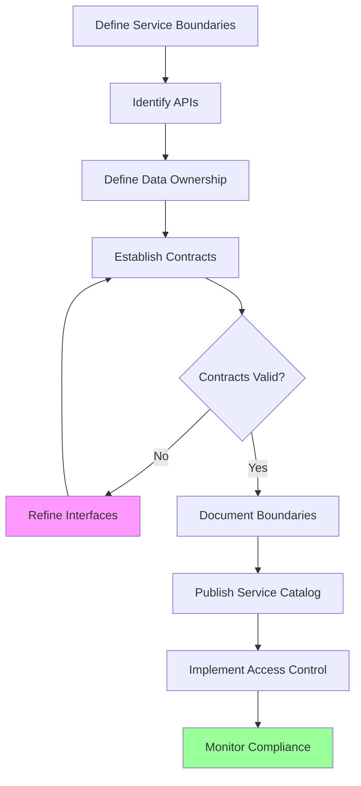

# Service Boundary Definition

## Overview

Service boundary definition is the process of establishing clear interfaces, ownership, and contracts between microservices. Well-defined boundaries are essential for achieving the loose coupling that makes microservices architecture effective. Boundaries define what functionality resides within a service, how other services interact with it, and who is responsible for maintaining it.

Service boundaries should be stable enough to provide consistency and reliability, yet flexible enough to evolve as requirements change. The goal is to create boundaries that minimize coordination between teams while maximizing the autonomy each team has over their service.

Boundary definition involves several aspects: API boundaries (what operations the service exposes), data boundaries (what data the service owns), deployment boundaries (how the service is independently deployable), and operational boundaries (who is responsible for operating the service).

## Key Concepts

### 1. API Boundary

The API boundary defines how other services interact with a service. This includes RESTful endpoints, GraphQL schemas, message queue contracts, and event formats. A well-designed API boundary is stable, versioned, and self-documenting.

Key considerations for API boundaries include:
- **Consistency**: Use consistent patterns across all services
- **Stability**: Minimize breaking changes through versioning
- **Documentation**: Clear documentation of all endpoints and contracts
- **Security**: Proper authentication and authorization

### 2. Data Boundary

The data boundary defines what data a service owns and is responsible for. Each service should have exclusive ownership of its data, meaning no other service should directly access or modify that data. Instead, services interact through APIs.

Data boundary principles include:
- **Ownership**: Clear ownership of each data domain
- **Encapsulation**: Data accessed only through service APIs
- **Consistency**: Eventual consistency across service boundaries
- **Migration**: Clear strategies for data schema evolution

### 3. Operational Boundary

The operational boundary defines who is responsible for deploying, monitoring, and maintaining each service. This typically aligns with team ownership and includes responsibility for availability, performance, and incident response.

Operational boundary considerations:
- **Ownership**: Clear ownership for each service
- **SLAs**: Defined service level agreements
- **Monitoring**: Service-specific monitoring and alerting
- **Incident Response**: Clear escalation paths

## Flow Chart



## Implementation Example

```python
#!/usr/bin/env python3
"""
Service Boundary Manager
Manages and enforces service boundaries in microservices architecture
"""

from dataclasses import dataclass, field
from typing import Dict, List, Set, Optional
from enum import Enum
import json


class BoundaryType(Enum):
    API = "api"
    DATA = "data"
    OPERATIONAL = "operational"


class AccessPattern(Enum):
    READ = "read"
    WRITE = "write"
    ADMIN = "admin"


@dataclass
class APIEndpoint:
    """Represents an API endpoint"""
    path: str
    method: str
    description: str
    rate_limit: int = 100
    timeout_seconds: int = 30
    requires_auth: bool = True


@dataclass
class DataSchema:
    """Represents a data schema owned by a service"""
    schema_id: str
    name: str
    version: str
    fields: List[Dict] = field(default_factory=list)
    access_patterns: List[AccessPattern] = field(default_factory=list)


@dataclass
class ServiceBoundary:
    """Defines a complete service boundary"""
    service_id: str
    service_name: str
    owner_team: str
    api_endpoints: List[APIEndpoint] = field(default_factory=list)
    data_schemas: List[DataSchema] = field(default_factory=list)
    dependencies: Set[str] = field(default_factory=set)
    consumers: Set[str] = field(default_factory=set)
    sla_definition: Dict = field(default_factory=dict)


class ServiceBoundaryManager:
    """Manages service boundaries across the architecture"""
    
    def __init__(self):
        self.boundaries: Dict[str, ServiceBoundary] = {}
        self.service_catalog: Dict[str, Dict] = {}
    
    def register_service(
        self,
        service_id: str,
        service_name: str,
        owner_team: str
    ) -> ServiceBoundary:
        """Register a new service boundary"""
        
        boundary = ServiceBoundary(
            service_id=service_id,
            service_name=service_name,
            owner_team=owner_team
        )
        
        self.boundaries[service_id] = boundary
        return boundary
    
    def add_api_endpoint(
        self,
        service_id: str,
        path: str,
        method: str,
        description: str,
        rate_limit: int = 100,
        timeout_seconds: int = 30,
        requires_auth: bool = True
    ):
        """Add an API endpoint to a service boundary"""
        
        boundary = self.boundaries.get(service_id)
        if not boundary:
            raise ValueError(f"Service {service_id} not found")
        
        endpoint = APIEndpoint(
            path=path,
            method=method,
            description=description,
            rate_limit=rate_limit,
            timeout_seconds=timeout_seconds,
            requires_auth=requires_auth
        )
        
        boundary.api_endpoints.append(endpoint)
    
    def add_data_schema(
        self,
        service_id: str,
        schema_id: str,
        name: str,
        version: str,
        fields: List[Dict],
        access_patterns: List[AccessPattern]
    ):
        """Add a data schema to a service boundary"""
        
        boundary = self.boundaries.get(service_id)
        if not boundary:
            raise ValueError(f"Service {service_id} not found")
        
        schema = DataSchema(
            schema_id=schema_id,
            name=name,
            version=version,
            fields=fields,
            access_patterns=access_patterns
        )
        
        boundary.data_schemas.append(schema)
    
    def add_dependency(
        self,
        service_id: str,
        depends_on: str
    ):
        """Add a service dependency"""
        
        boundary = self.boundaries.get(service_id)
        if not boundary:
            raise ValueError(f"Service {service_id} not found")
        
        boundary.dependencies.add(depends_on)
        
        # Also register the consumer relationship
        if depends_on in self.boundaries:
            self.boundaries[depends_on].consumers.add(service_id)
    
    def define_sla(
        self,
        service_id: str,
        availability: float,
        latency_p50: int,
        latency_p99: int,
        error_rate: float
    ):
        """Define SLA for a service"""
        
        boundary = self.boundaries.get(service_id)
        if not boundary:
            raise ValueError(f"Service {service_id} not found")
        
        boundary.sla_definition = {
            "availability": availability,
            "latency_p50": latency_p50,
            "latency_p99": latency_p99,
            "error_rate": error_rate
        }
    
    def validate_boundary(self, service_id: str) -> Dict:
        """Validate a service boundary definition"""
        
        boundary = self.boundaries.get(service_id)
        if not boundary:
            raise ValueError(f"Service {service_id} not found")
        
        validation_results = {
            "service_id": service_id,
            "valid": True,
            "issues": []
        }
        
        # Check API endpoints
        if not boundary.api_endpoints:
            validation_results["issues"].append({
                "type": "missing_apis",
                "severity": "high",
                "message": "Service has no API endpoints defined"
            })
            validation_results["valid"] = False
        
        # Check data schemas
        if not boundary.data_schemas:
            validation_results["issues"].append({
                "type": "missing_data",
                "severity": "medium",
                "message": "Service has no data schemas defined"
            })
        
        # Check owner
        if not boundary.owner_team:
            validation_results["issues"].append({
                "type": "missing_owner",
                "severity": "high",
                "message": "Service has no owner team defined"
            })
            validation_results["valid"] = False
        
        # Check SLA
        if not boundary.sla_definition:
            validation_results["issues"].append({
                "type": "missing_sla",
                "severity": "medium",
                "message": "Service has no SLA defined"
            })
        
        return validation_results
    
    def check_data_access_violation(
        self,
        requesting_service: str,
        target_service: str,
        schema_id: str
    ) -> bool:
        """Check if a data access would violate boundaries"""
        
        requesting_boundary = self.boundaries.get(requesting_service)
        target_boundary = self.boundaries.get(target_service)
        
        if not requesting_boundary or not target_boundary:
            return False  # Unknown service
        
        # Check if the schema exists in target service
        schema_exists = any(
            s.schema_id == schema_id
            for s in target_boundary.data_schemas
        )
        
        if not schema_exists:
            return False  # Schema doesn't exist
        
        # Check if requesting service is authorized (consumer or same owner)
        is_consumer = target_service in requesting_boundary.dependencies
        is_same_owner = requesting_boundary.owner_team == target_boundary.owner_team
        
        return not (is_consumer or is_same_owner)
    
    def generate_service_catalog(self) -> Dict:
        """Generate a service catalog"""
        
        for service_id, boundary in self.boundaries.items():
            self.service_catalog[service_id] = {
                "service_id": boundary.service_id,
                "service_name": boundary.service_name,
                "owner_team": boundary.owner_team,
                "api_endpoints": [
                    {
                        "path": e.path,
                        "method": e.method,
                        "description": e.description,
                        "rate_limit": e.rate_limit
                    }
                    for e in boundary.api_endpoints
                ],
                "data_schemas": [
                    {
                        "schema_id": s.schema_id,
                        "name": s.name,
                        "version": s.version,
                        "field_count": len(s.fields)
                    }
                    for s in boundary.data_schemas
                ],
                "dependencies": list(boundary.dependencies),
                "consumers": list(boundary.consumers),
                "sla": boundary.sla_definition
            }
        
        return self.service_catalog
    
    def export_boundaries(self) -> str:
        """Export all boundaries as JSON"""
        
        boundaries_data = {
            "boundaries": [
                {
                    "service_id": b.service_id,
                    "service_name": b.service_name,
                    "owner_team": b.owner_team,
                    "api_count": len(b.api_endpoints),
                    "schema_count": len(b.data_schemas),
                    "dependencies": list(b.dependencies),
                    "consumers": list(b.consumers),
                    "sla": b.sla_definition
                }
                for b in self.boundaries.values()
            ]
        }
        
        return json.dumps(boundaries_data, indent=2)


# Example usage
if __name__ == "__main__":
    manager = ServiceBoundaryManager()
    
    # Register services and define boundaries
    user_service = manager.register_service(
        service_id="svc_users",
        service_name="User Service",
        owner_team="Team Alpha"
    )
    
    order_service = manager.register_service(
        service_id="svc_orders",
        service_name="Order Service",
        owner_team="Team Beta"
    )
    
    catalog_service = manager.register_service(
        service_id="svc_catalog",
        service_name="Catalog Service",
        owner_team="Team Gamma"
    )
    
    # Define API endpoints
    manager.add_api_endpoint(
        service_id="svc_users",
        path="/api/v1/users",
        method="GET",
        description="Get all users",
        rate_limit=1000
    )
    
    manager.add_api_endpoint(
        service_id="svc_users",
        path="/api/v1/users/{id}",
        method="GET",
        description="Get user by ID",
        rate_limit=2000
    )
    
    manager.add_api_endpoint(
        service_id="svc_orders",
        path="/api/v1/orders",
        method="POST",
        description="Create new order",
        rate_limit=500
    )
    
    # Define data schemas
    manager.add_data_schema(
        service_id="svc_users",
        schema_id="user_profile",
        name="UserProfile",
        version="1.0",
        fields=[
            {"name": "user_id", "type": "string"},
            {"name": "email", "type": "string"},
            {"name": "name", "type": "string"}
        ],
        access_patterns=[AccessPattern.READ, AccessPattern.WRITE]
    )
    
    manager.add_data_schema(
        service_id="svc_orders",
        schema_id="order_details",
        name="OrderDetails",
        version="1.0",
        fields=[
            {"name": "order_id", "type": "string"},
            {"name": "user_id", "type": "string"},
            {"name": "total", "type": "decimal"}
        ],
        access_patterns=[AccessPattern.READ, AccessPattern.WRITE]
    )
    
    # Define dependencies
    manager.add_dependency("svc_orders", "svc_users")
    manager.add_dependency("svc_orders", "svc_catalog")
    
    # Define SLAs
    manager.define_sla(
        service_id="svc_users",
        availability=99.9,
        latency_p50=50,
        latency_p99=200,
        error_rate=0.01
    )
    
    manager.define_sla(
        service_id="svc_orders",
        availability=99.95,
        latency_p50=100,
        latency_p99=500,
        error_rate=0.005
    )
    
    # Validate boundaries
    print("Boundary Validation:")
    print("-" * 50)
    for service_id in ["svc_users", "svc_orders", "svc_catalog"]:
        validation = manager.validate_boundary(service_id)
        print(f"\n{service_id}:")
        print(f"  Valid: {validation['valid']}")
        for issue in validation['issues']:
            print(f"  - {issue['type']}: {issue['message']}")
    
    # Generate and print service catalog
    catalog = manager.generate_service_catalog()
    print("\n\nService Catalog:")
    print("-" * 50)
    print(json.dumps(catalog, indent=2))
```

## Best Practices

1. **Define Clear Ownership**: Each service should have a single, clearly identified owner team.

2. **Document Everything**: Maintain comprehensive documentation of APIs, data schemas, and SLAs.

3. **Enforce Boundaries**: Implement mechanisms to prevent unauthorized data access across boundaries.

4. **Version APIs**: Always version APIs to enable evolution without breaking consumers.

5. **Monitor Compliance**: Track boundary violations and address them systematically.

6. **Review Periodically**: Regularly review and update boundaries as the system evolves.

---

## Output Statement

```
Service Boundary Report
=======================

Service: User Service (svc_users)
Owner: Team Alpha

APIs:
- GET /api/v1/users (rate limit: 1000/min)
- GET /api/v1/users/{id} (rate limit: 2000/min)

Data Schemas:
- UserProfile v1.0 (3 fields)

Dependencies: None
Consumers: svc_orders

SLA:
- Availability: 99.9%
- Latency P50: 50ms
- Latency P99: 200ms
- Error Rate: 0.01%

Service: Order Service (svc_orders)
Owner: Team Beta

APIs:
- POST /api/v1/orders (rate limit: 500/min)

Data Schemas:
- OrderDetails v1.0 (3 fields)

Dependencies: svc_users, svc_catalog
Consumers: None

SLA:
- Availability: 99.95%
- Latency P50: 100ms
- Latency P99: 500ms
- Error Rate: 0.005%
```
