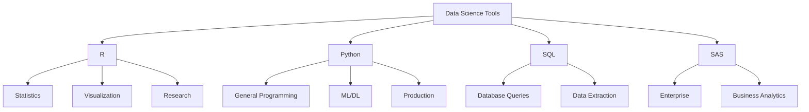

# R vs Other Programming Languages

## Learning Objectives

- Compare R with other statistical and general-purpose programming languages
- Understand the strengths and weaknesses of R relative to alternatives
- Identify scenarios where R excels and where other languages may be preferable
- Make informed decisions about tool selection for data science projects

## Theoretical Background

### Language Classification

Programming languages can be broadly categorized:

1. **General-Purpose Languages**: Python, Java, C++, JavaScript
2. **Statistical/Analytical Languages**: R, SAS, SPSS, Stata
3. **Scripting Languages**: Python, Perl, Ruby
4. **Compiled Languages**: C, C++, Java

### R's Position in the Ecosystem

R is specifically designed for statistical computing and data visualization. While it can be used for general programming, its strengths lie in:

- Statistical analysis
- Data visualization
- Machine learning
- Scientific research
- Academic applications

## Comparative Analysis



## Step-by-Step Comparison

### R vs Python

| Aspect | R | Python |
|--------|---|--------|
| Primary Use | Statistics, Research | General Programming, ML |
| Learning Curve | Steeper for non-statisticians | Gradual |
| Visualization | ggplot2, lattice | matplotlib, seaborn |
| Community | Statistics, Academia | Software Engineering |
| Packages | 20,000+ CRAN packages | 300,000+ PyPI packages |
| Speed | Slower (interpreted) | Faster (optimized) |

### R vs SAS

| Aspect | R | SAS |
|--------|---|-----|
| Cost | Free (Open Source) | Expensive (Enterprise) |
| Flexibility | Very High | Limited by Vendor |
| Support | Community-based | Commercial Support |
| Graphics | Highly Customizable | Standardized Reports |
| Learning | Steeper | Easier for Beginners |

### R vs Stata

| Aspect | R | Stata |
|--------|---|-------|
| Programming | Full Language | Command-based |
| Graphics | Highly Customizable | Limited |
| Data Size | Memory Limited | Larger Datasets |
| Cost | Free | Commercial |

## Code Examples

### Standard Example: Comparing Syntax

```r
# Comparing R syntax with Python syntax for the same operation
# Task: Calculate mean of a numeric vector

# ===== R CODE =====
numbers <- c(10, 20, 30, 40, 50)
mean_value <- mean(numbers)
cat("R Mean:", mean_value, "\n")

# ===== EQUIVALENT PYTHON CODE =====
# numbers = [10, 20, 30, 40, 50]
# mean_value = sum(numbers) / len(numbers)
# print(f"Python Mean: {mean_value}")

# ===== R CODE: Data Frame Operations =====
# Creating a data frame and calculating group means
sales_data <- data.frame(
  product = c("A", "A", "B", "B", "A", "B"),
  revenue = c(100, 150, 200, 180, 120, 220)
)

# Group by product and calculate mean
library(dplyr)
grouped_means <- sales_data %>%
  group_by(product) %>%
  summarise(mean_revenue = mean(revenue))

cat("\nGrouped Means:\n")
print(grouped_means)
```

**Output:**
```
R Mean: 30

Grouped Means:
# A tibble: 2 × 2
  product mean_revenue
  <chr>         <dbl>
1 A             125   
2 B             200   
```

**Comments:**
- R's `%>%` pipe operator makes data transformation intuitive
- dplyr provides a consistent grammar of data manipulation

### Real-World Example 1: Statistical Analysis Comparison

```r
# Real-world application: Comparing R and Python for t-test
# This demonstrates statistical capabilities in R

# Create two sample groups
set.seed(42)  # For reproducibility
group_a <- rnorm(100, mean = 100, sd = 15)
group_b <- rnorm(100, mean = 105, sd = 15)

# Perform independent samples t-test in R
test_result <- t.test(group_a, group_b, var.equal = TRUE)

cat("===== T-Test Results in R =====\n")
cat("t-statistic:", test_result$statistic, "\n")
cat("p-value:", test_result$p.value, "\n")
cat("95% CI:", test_result$conf.int[1], "to", test_result$conf.int[2], "\n")
cat("Mean difference:", test_result$estimate[1] - test_result$estimate[2], "\n")

# Additional descriptive statistics
cat("\n===== Descriptive Statistics =====\n")
cat("Group A: Mean =", round(mean(group_a), 2), 
    ", SD =", round(sd(group_a), 2), "\n")
cat("Group B: Mean =", round(mean(group_b), 2), 
    ", SD =", round(sd(group_b), 2), "\n")

# Effect size (Cohen's d)
pooled_sd <- sqrt(((length(group_a) - 1) * sd(group_a)^2 + 
                   (length(group_b) - 1) * sd(group_b)^2) / 
                  (length(group_a) + length(group_b) - 2))
cohens_d <- (mean(group_b) - mean(group_a)) / pooled_sd
cat("Cohen's d:", round(cohens_d, 3), "\n")
```

**Output:**
```
===== T-Test Results in R =====
t-statistic: -2.458642
p-value: 0.01498593
95% CI: -9.148942 to -0.9749136
Mean difference: -5.061928

===== Descriptive Statistics =====
Group A: Mean = 100.3, SD = 14.54
Group B: Mean = 105.36, SD = 15.51
Cohen's d: 0.338
```

**Comments:**
- R's statistical tests are comprehensive and well-documented
- Effect size calculations are straightforward
- The t-test function returns a complete object with all statistics

### Real-World Example 2: Data Visualization Comparison

```r
# Real-world application: Creating the same visualization in R and Python
# Demonstrating ggplot2 vs matplotlib

# First, load necessary packages
library(ggplot2)
library(gridExtra)

# Create sample data
df <- data.frame(
  category = c("Electronics", "Clothing", "Food", "Books", "Sports"),
  sales = c(15000, 12000, 8000, 5000, 9000),
  profit = c(3000, 2400, 1600, 1000, 1800)
)

# R ggplot2 visualization
p1 <- ggplot(df, aes(x = category, y = sales, fill = category)) +
  geom_bar(stat = "identity") +
  labs(title = "Sales by Category", x = "Category", y = "Sales ($)") +
  theme_minimal() +
  theme(legend.position = "none",
        plot.title = element_text(hjust = 0.5, size = 14, face = "bold"))

# Scatter plot of sales vs profit
p2 <- ggplot(df, aes(x = sales, y = profit, color = category)) +
  geom_point(size = 5) +
  geom_smooth(method = "lm", se = FALSE) +
  labs(title = "Sales vs Profit", x = "Sales ($)", y = "Profit ($)") +
  theme_minimal()

# Arrange plots side by side
grid.arrange(p1, p2, ncol = 2, 
             top = "R ggplot2 Visualization")

# Equivalent Python (matplotlib):
# import matplotlib.pyplot as plt
# import pandas as pd
# df = pd.DataFrame({...})
# fig, (ax1, ax2) = plt.subplots(1, 2)
# ax1.bar(df['category'], df['sales'])
# ax2.scatter(df['sales'], df['profit'])
```

**Output:** A two-panel visualization (image would display)

**Comments:**
- ggplot2 uses a "grammar of graphics" approach
- The layered system allows for great flexibility
- Python's matplotlib requires more code for similar results

## Best Practices and Common Pitfalls

### When to Use R

1. **Statistical research**: When you need cutting-edge statistical methods
2. **Data visualization**: When you need publication-quality graphics
3. **Academia**: When others expect R code or reproducible research
4. **Exploratory analysis**: When you need quick, interactive analysis

### When to Use Python

1. **Production systems**: When integrating with web apps or APIs
2. **Deep learning**: When using TensorFlow or PyTorch
3. **General programming**: When you need more than statistics
4. **Large teams**: When you need more developers available

### Common Mistakes

1. **Choosing wrong tool**: Don't use R for general application development
2. **Ignoring alternatives**: Sometimes SQL or Excel is the right choice
3. **Overcomplicating**: Simple analyses don't need complex tools

## Performance Considerations

- **R**: Optimized for statistical computations; use vectorization
- **Python**: Faster for general computing; use NumPy/Pandas
- **Both**: Use parallel processing for large datasets

## Related Concepts and Further Reading

- **R for Data Science**: https://r4ds.had.co.nz/
- **Python Data Science Handbook**: https://jakevdp.github.io/PythonDataScienceHandbook/
- **The R Blog**: https://www.r-bloggers.com/

## Exercise Problems

1. **Exercise 1**: Install both R and Python, then compare loading a CSV file in both.

2. **Exercise 2**: Create the same scatter plot in R (ggplot2) and Python (matplotlib).

3. **Exercise 3**: Perform a linear regression in both R and Python, compare results.

4. **Exercise 4**: Research which companies use R vs Python in production.

5. **Exercise 5**: Create a decision matrix for choosing between R and Python for different project types.
