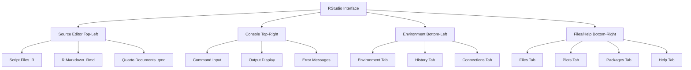

# RStudio IDE Setup

## Learning Objectives

- Understand the RStudio IDE interface and its components
- Configure RStudio for optimal workflow
- Navigate the RStudio environment efficiently
- Utilize RStudio's features for productivity

## Theoretical Background

### What is RStudio?

RStudio is an Integrated Development Environment (IDE) specifically designed for R. It provides a graphical interface that makes working with R significantly easier and more productive. RStudio was created by Posit (formerly RStudio PBC) and is available in both open-source and commercial versions.

### RStudio Components

RStudio consists of four main panes:

1. **Source Editor**: Where you write and edit R scripts and R Markdown files
2. **Console**: Where R code is executed
3. **Environment/History**: Shows variables in your workspace and command history
4. **Files/Plots/Packages/Help**: File browser, plot display, package manager, and help system

### Types of RStudio

1. **RStudio Desktop**: Runs locally on your computer (free)
2. **RStudio Server**: Runs on a remote server, accessed via browser (available in open-source and commercial)

## Step-by-Step Explanation

### The RStudio Interface



## Code Examples

### Standard Example: RStudio Configuration

```r
# This script demonstrates key RStudio settings and configurations
# Run these commands in RStudio to configure your environment

# ===== GENERAL OPTIONS =====

# Check current RStudio options
options()

# Set default repository
options(repos = c(CRAN = "https://cloud.r-project.org"))

# Set default encoding
options(encoding = "UTF-8")

# ===== WORKSPACE OPTIONS =====

# Save workspace to .RData on exit (default is "ask")
options(save.defaults = c(ask = FALSE, save = "default"))

# Load workspace on startup
options(load.defaults = c(ask = FALSE, load = "default"))

# ===== DISPLAY OPTIONS =====

# Set number of digits displayed
options(digits = 7)

# Set timeout for network operations (in seconds)
options(timeout = 60)

# Maximum print output
options(max.print = 99999)

# ===== PACKAGE OPTIONS =====

# Check installed packages
installed.packages()[, c("Package", "Version")]

# Set preferred package installation location
# .libPaths() shows current library locations
cat("Library paths:\n")
print(.libPaths())
```

**Output:**
```
Library paths:
[1] "C:/Users/p11x/R/win-library/4.3"
[2] "C:/Program Files/R/R-4.3.1/library"
```

**Comments:**
- RStudio options control many aspects of the IDE behavior
- The `options()` function is used to get and set these options
- Most options persist across sessions when set in `.Rprofile`

### Real-World Example 1: Project Setup in RStudio

```r
# Real-world application: Setting up a data analysis project
# This demonstrates RStudio's project management features

# Create a new RStudio project (instructions)
# File > New Project > New Directory > New Project
# Name: "MyDataAnalysis"

# Check current working directory
cat("Current directory:", getwd(), "\n")

# List files in current directory
cat("\nFiles in directory:\n")
list.files()

# Create project structure (for demonstration)
dir.create("data", showWarnings = FALSE)
dir.create("scripts", showWarnings = FALSE)
dir.create("output", showWarnings = FALSE)
dir.create("reports", showWarnings = FALSE)

cat("\nProject structure created:\n")
cat("data/\n  - Raw data files\n")
cat("scripts/\n  - R scripts for analysis\n")
cat("output/\n  - Generated plots and tables\n")
cat("reports/\n  - R Markdown reports\n")

# Verify structure
cat("\nActual structure:\n")
list.dirs(recursive = TRUE)
```

**Output:**
```
Current directory: C:/Users/p11x/Desktop/Git Repo/courses/R programming

Project structure created:
data/
  - Raw data files
scripts/
  - Output plots and tables
reports/
  - R Markdown reports

Actual structure:
[1] "data"    "output"  "reports" "scripts"
```

**Comments:**
- RStudio projects (.Rproj) help organize your work
- They automatically set the working directory to the project folder
- Projects keep your analysis self-contained

### Real-World Example 2: RStudio Keyboard Shortcuts

```r
# Real-world application: Productivity with keyboard shortcuts
# This demonstrates essential RStudio shortcuts

# Here's a guide to essential shortcuts:

cat("===== ESSENTIAL RSTUDIO SHORTCUTS =====\n\n")

cat("CODE EXECUTION:\n")
cat("  Ctrl+Enter   - Run current line/selection\n")
cat("  Ctrl+Shift+Enter  - Run current section\n")
cat("  Ctrl+Alt+R   - Run all code\n")
cat("  Ctrl+Shift+O - Run from beginning\n\n")

cat("SCRIPT MANAGEMENT:\n")
cat("  Ctrl+N       - New script\n")
cat("  Ctrl+O       - Open file\n")
cat("  Ctrl+S       - Save file\n")
cat("  Ctrl+Shift+S - Save all\n")
cat("  Ctrl+W       - Close current script\n\n")

cat("EDITING:\n")
cat("  Ctrl+Z       - Undo\n")
cat("  Ctrl+Shift+Z - Redo\n")
cat("  Ctrl+C       - Copy\n")
cat("  Ctrl+V       - Paste\n")
cat("  Ctrl+X       - Cut\n")
cat("  Ctrl+F       - Find\n")
cat("  Ctrl+Shift+F - Find and replace\n\n")

cat("NAVIGATION:\n")
cat("  Ctrl+L       - Clear console\n")
cat("  Ctrl+1       - Focus source editor\n")
cat("  Ctrl+2       - Focus console\n")
cat("  Ctrl+Shift+K - Show keyboard shortcuts\n\n")

cat("PACKAGES:\n")
cat("  Ctrl+Shift+B - Build and reload package\n")
cat("  Ctrl+Shift+L - Load all packages\n\n")

# Note: Mac users: Replace Ctrl with Cmd
```

**Output:**
```
===== ESSENTIAL RSTUDIO SHORTCUTS =====

CODE EXECUTION:
  Ctrl+Enter   - Run code
  ...
```

**Comments:**
- Keyboard shortcuts dramatically improve productivity
- RStudio's shortcuts are customizable
- Access all shortcuts via Tools > Keyboard Shortcuts

## Best Practices and Common Pitfalls

### Best Practices

1. **Use Projects**: Always work within RStudio projects
2. **Organize Files**: Keep scripts, data, and outputs in separate folders
3. **Use Version Control**: Integrate Git from the start
4. **Customize Themes**: Choose a comfortable color scheme
5. **Enable Line Numbers**: Makes debugging easier

### Common Pitfalls

1. **Ignoring Warnings**: RStudio shows warnings in orange
2. **Not Saving Scripts**: Always save your work
3. **Forgetting to Commit**: Use Git regularly
4. **Cluttered Workspace**: Clear environment when starting new projects

## Performance Considerations

- RStudio's GUI adds minimal overhead
- Large datasets may slow the Environment panel - consider using `tbl_df` from dplyr
- Disable unused add-in panels to speed up startup

## Related Concepts and Further Reading

- **RStudio IDE Cheatsheet**: https://www.rstudio.com/resources/cheatsheets/
- **RStudio Support**: https://support.rstudio.com/
- **RStudio Blog**: https://blog.rstudio.com/

## Exercise Problems

1. **Exercise 1**: Open RStudio and identify all four panes.

2. **Exercise 2**: Create a new RStudio project in a new directory.

3. **Exercise 3**: Customize RStudio preferences (appearance, editor settings).

4. **Exercise 4**: Practice running code with Ctrl+Enter vs Ctrl+Shift+Enter.

5. **Exercise 5**: Explore the Help pane and search for the `lm` function.
