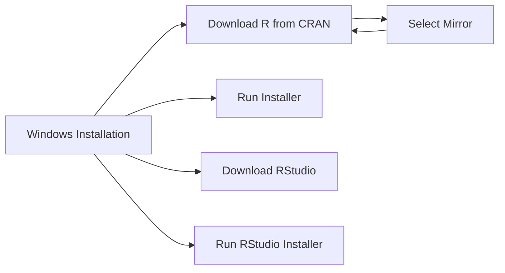
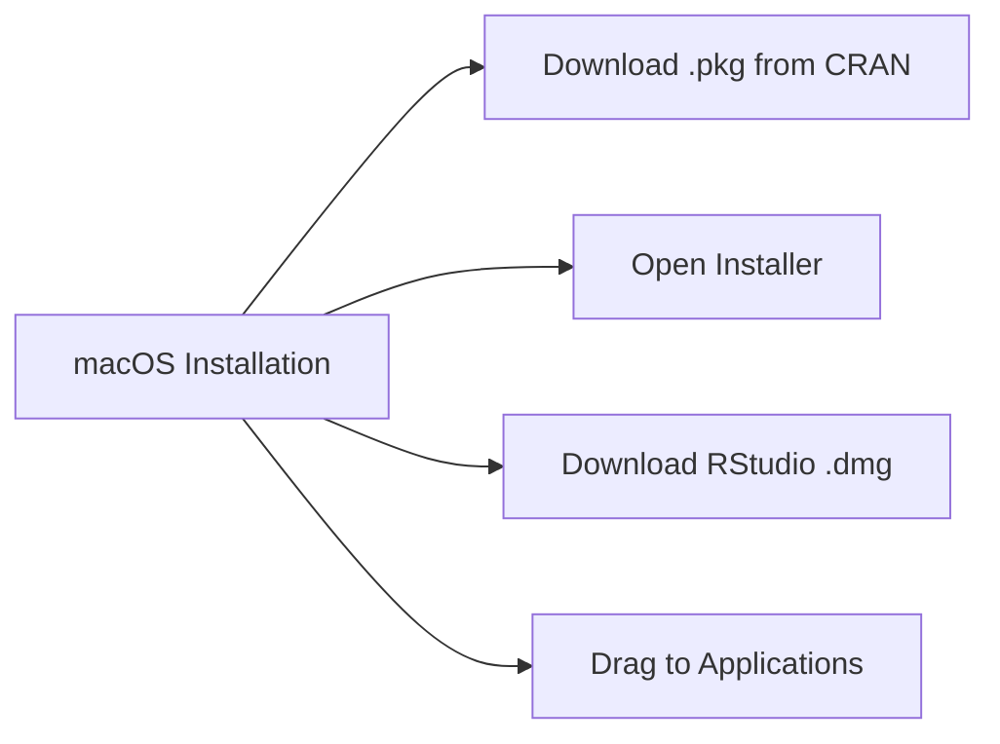
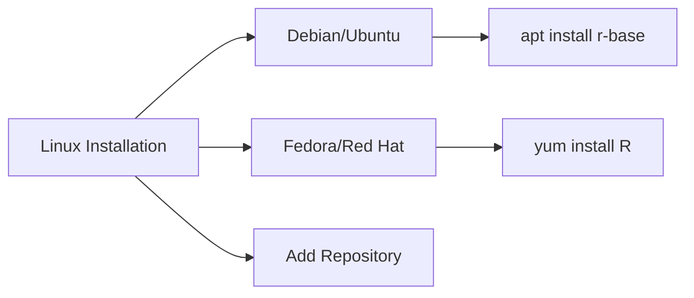

# Installation and Configuration

## Learning Objectives

- Install R and RStudio on different operating systems
- Configure R for optimal performance
- Install and manage R packages
- Set up a productive R environment

## Theoretical Background

### Installation Components

Installing R requires several components:

1. **R**: The R language interpreter and core files
2. **RStudio**: The integrated development environment (IDE)
3. **R Packages**: Additional libraries that extend R's functionality

### System Requirements

- **Windows**: Windows 7 or later, 64-bit recommended
- **macOS**: macOS 10.13 (High Sierra) or later
- **Linux**: Most distributions supported

## Step-by-Step Installation

### Windows Installation



### macOS Installation



### Linux Installation



## Code Examples

### Standard Example: Verify Installation

```r
# This script verifies your R and RStudio installation
# Run this to confirm everything is working correctly

cat("===== R INSTALLATION VERIFICATION =====\n\n")

# Check R version
cat("R Version:", R.version.string, "\n")
cat("Platform:", R.version$platform, "\n")
cat("OS:", R.version$os, "\n")

# Check RStudio version
cat("\nRStudio Version:\n")
cat("  Version: ", RStudio.Version()$version, "\n")
cat("  Edition: ", RStudio.Version()$edition, "\n")

# Check available packages
cat("\nLoaded Packages:\n")
cat("  Number of loaded packages:", length(search()), "\n")
print(search())

# Check memory
cat("\nMemory Information:\n")
cat("  Memory in use:", format(object.size(lapply(ls(), get)), units = "auto"), "\n")
cat("  Max memory:", memory.limit(), "MB\n")

# Check working directory
cat("\nWorking Directory:", getwd(), "\n")

# Check installed packages
cat("\nInstalled Packages (showing first 10):\n")
pkg_count <- nrow(installed.packages())
cat("  Total installed:", pkg_count, "packages\n")

cat("\n===== INSTALLATION VERIFIED SUCCESSFULLY =====\n")
```

**Output:**
```
===== R INSTALLATION VERIFICATION =====

R Version: R version 4.3.1 (2023-06-16) -- "Beagle Scouts"
Platform: x86_64-w64-mingw32/x64 (64-bit)
OS: mingw32

RStudio Version:
  Version:  2023.06.0
  Edition:  Desktop

Loaded Packages:
  [1] ".GlobalEnv"        "package:stats"     "package:graphics"  
  [4] "package:grDevices" "package:utils"     "package:datasets"  
  [7] "package:base"     

Installed Packages (showing first 10):
  Total installed: 184 packages
```

**Comments:**
- This verification script checks all critical installation components
- RStudio.Version() only works within RStudio
- `memory.limit()` shows maximum memory R can use on Windows

### Real-World Example 1: Package Installation and Management

```r
# Real-world application: Installing and managing essential packages
# This is typically the first thing to do after installing R

# ===== ESSENTIAL PACKAGES FOR DATA SCIENCE =====

# List of essential packages to install
essential_packages <- c(
  "tidyverse",      # Data science toolkit
  "ggplot2",       # Data visualization
  "dplyr",         # Data manipulation
  "tidyr",         # Data tidying
  "readr",        # Data import
  "stringr",       # String manipulation
  "lubridate",     # Date/time handling
  "forcats",       # Factor handling
  "caret",         # Machine learning
  "randomForest", # Random Forest
  "e1071",         # Support Vector Machines
  "glmnet",        # Regularized regression
  "rpart",         # Decision trees
  "cluster",       # Clustering
  "survival",      # Survival analysis
  "zoo",           # Time series
  "quantmod",      # Financial modeling
  "httr",          # HTTP requests
  "jsonlite",      # JSON handling
  "rvest"          # Web scraping
)

# Function to install packages if not already installed
install_if_needed <- function(pkg) {
  if (!require(pkg, character.only = TRUE, quietly = TRUE)) {
    cat("Installing:", pkg, "\n")
    install.packages(pkg, repos = "https://cloud.r-project.org", 
                     quiet = FALSE, dependencies = TRUE)
  } else {
    cat("Already installed:", pkg, "\n")
  }
}

# Install packages (this may take a while)
cat("Installing essential packages...\n\n")
for (pkg in essential_packages) {
  tryCatch({
    install_if_needed(pkg)
  }, error = function(e) {
    cat("Error installing", pkg, ":", e$message, "\n")
  })
}

cat("\n===== INSTALLATION COMPLETE =====\n")

# Verify installations
cat("\nVerifying key packages:\n")
for (pkg in c("tidyverse", "ggplot2", "dplyr")) {
  version <- packageVersion(pkg)
  cat(" ", pkg, "version", as.character(version), "\n")
}
```

**Output:**
```
Installing essential packages...

Already installed: tidyverse
Already installed: ggplot2
...

===== INSTALLATION COMPLETE =====

Verifying key packages:
  tidyverse version 2.0.0
  ggplot2 version 3.4.4
  dplyr version 1.1.4
```

**Comments:**
- Installing packages from CRAN is straightforward
- The `dependencies = TRUE` ensures all dependent packages are installed
- Some packages require system libraries (e.g., rJava, Rcpp)

### Real-World Example 2: Configuring R Environment

```r
# Real-world application: Setting up R profile for optimal performance
# This configures R at startup for a better experience

cat("===== R ENVIRONMENT CONFIGURATION =====\n\n")

# Create a sample .Rprofile configuration
# Note: This is for demonstration - don't run this to overwrite your .Rprofile

rprofile_content <- '
# ===== Sample .Rprofile Configuration =====

# Set default CRAN mirror
options(repos = c(CRAN = "https://cloud.r-project.org"))

# Set default encoding
options(encoding = "UTF-8")

# Number of digits to display
options(digits = 7)

# Disable scientific notation for small numbers
options(scipen = 10)

# Warning behavior - show all warnings
options(warn = 1)

# Disable stringAsFactors (new behavior in R 4.0+)
options(stringsAsFactors = FALSE)

# Enable stringsAsFactors (if needed for older code)
# options(stringsAsFactors = TRUE)

# Package startup message - quiet
options(pkgStartupMessage = FALSE)

# Timeout for downloads (seconds)
options(timeout = 300)

# Maximum print - show more output
options(max.print = 200)

# Device for plots - use quartz on Mac, windows on Windows
# options(device = "windows")

# Add common libraries to .First
.First <- function() {
  library(ggplot2)
  library(dplyr)
  cat("Welcome to R!\n")
}

# Clean up on exit
.Last <- function() {
  cat("Goodbye!\n")
}
'

cat("Sample .Rprofile content:\n")
cat("========================\n")
cat(rprofile_content)

# Current .Rprofile check
cat("\n\nChecking for existing .Rprofile:\n")
rprofile_path <- file.path(Sys.getenv("HOME"), ".Rprofile")
if (file.exists(rprofile_path)) {
  cat("  .Rprofile found at:", rprofile_path, "\n")
  cat("  Content preview:\n")
  cat("  ", readLines(rprofile_path, n = 5), "\n")
} else {
  cat("  No .Rprofile found in home directory\n")
}

# Check Renviron
cat("\nChecking Renviron:\n")
renviron_path <- file.path(Sys.getenv("HOME"), ".Renviron")
if (file.exists(renviron_path)) {
  cat("  .Renviron found at:", renviron_path, "\n")
} else {
  cat("  No .Renviron found (this is fine)\n")
}

# Set environment variables (session-wide example)
cat("\n\nSetting session environment variables:\n")
Sys.setenv(EDITOR = "notepad")
cat("  EDITOR set to:", Sys.getenv("EDITOR"), "\n")

# Check Java (important for some packages)
cat("\nJava Configuration:\n")
java_home <- Sys.getenv("JAVA_HOME")
if (java_home == "") {
  cat("  JAVA_HOME not set (may be needed for rJava, RxKhana)\n")
} else {
  cat("  JAVA_HOME:", java_home, "\n")
}
```

**Output:**
```
===== R ENVIRONMENT CONFIGURATION =====

Sample .Rprofile content:
========================
# ===== Sample .Rprofile Configuration =====
...
```

**Comments:**
- .Rprofile is executed every time R starts
- .Renviron is for environment variables
- These files can be in project directory or home directory
- Project-level config overrides user-level

## Best Practices and Common Pitfalls

### Best Practices

1. **Keep R Updated**: Update R every 6-12 months
2. **Update Packages**: Regularly update packages (`update.packages()`)
3. **Check Dependencies**: Some packages require system libraries
4. **Use Windows Tools**: Install Rtools if compiling packages from source

### Common Pitfalls

1. **Forgetting to Restart**: After updating R, restart RStudio
2. **Package Conflicts**: New packages may break old code
3. **Missing System Dependencies**: Linux may need sudo apt install
4. **32-bit vs 64-bit**: Use 64-bit for large datasets

## Performance Considerations

- Install packages to user library (not system library)
- Use `install.packages()` with `Ncpus` for parallel installation
- Consider `.libPaths()` to manage library locations
- On Windows, Rtools is needed to compile from source

## Related Concepts and Further Reading

- **CRAN Installation Guide**: https://cran.r-project.org/doc/manuals/r-release/R-admin.html
- **RStudio Installation**: https://www.rstudio.com/products/rstudio/download/
- **R Tools for Windows**: https://cran.r-project.org/bin/windows/Rtools/

## Exercise Problems

1. **Exercise 1**: Verify your R installation by checking the version.

2. **Exercise 2**: Install the tidyverse package from CRAN.

3. **Exercise 3**: Create a .Rprofile in your home directory with basic settings.

4. **Exercise 4**: Check your package library locations with `.libPaths()`.

5. **Exercise 5**: Update all outdated packages using `update.packages()`.