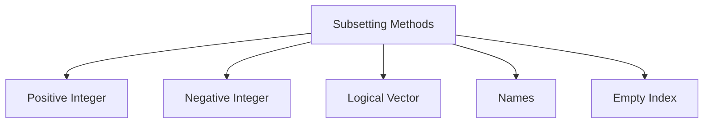

# Subsetting and Indexing in R

## Learning Objectives

- Master all subsetting methods in R
- Understand [, [[, and $ operators
- Apply logical indexing
- Handle edge cases in subsetting

## Theoretical Background

### Subsetting Methods in R

R provides multiple ways to extract data from objects:

1. `[` - Returns same type (or sublist/dataframe)
2. `[[` - Returns element directly
3. `$` - Named element access
4. Logical indexing - Using TRUE/FALSE vectors

### Subsetting Types



## Code Examples

### Standard Example: All Subsetting Methods

```r
# ===== SUBSETTING VECTORS =====

cat("===== VECTOR SUBSETTING =====\n\n")

# Sample vector
x <- c(a = 10, b = 20, c = 30, d = 40, e = 50)
cat("Original vector x:", x, "\n")

# 1. Positive integer indexing
cat("\n1. Positive integers [c(1, 3, 5)]:\n")
cat("  x[c(1, 3, 5)] =", x[c(1, 3, 5)], "\n")

# 2. Negative integer indexing
cat("\n2. Negative integers [-c(1, 2)]:\n")
cat("  x[-c(1, 2)] =", x[-c(1, 2)], "\n")

# 3. Logical indexing
cat("\n3. Logical vector [c(TRUE, FALSE, TRUE, FALSE, TRUE)]:\n")
cat("  x[c(T, F, T, F, T)] =", x[c(TRUE, FALSE, TRUE, FALSE, TRUE)], "\n")

# 4. By name
cat("\n4. By name [c(\"a\", \"c\")]:\n")
cat("  x[c(\"a\", \"c\")] =", x[c("a", "c")], "\n")

# 5. Empty index returns all
cat("\n5. Empty index []:\n")
cat("  x[] =", x[], "\n")

# ===== SUBSETTING MATRICES =====
cat("\n\n===== MATRIX SUBSETTING =====\n\n")

m <- matrix(1:12, nrow = 3, nrow = 4)
dimnames(m) <- list(c("R1", "R2", "R3"), c("C1", "C2", "C3", "C4"))
cat("Matrix m:\n")
print(m)

cat("\nm[1, 2] (row 1, col 2):", m[1, 2], "\n")
cat("m[1, ] (all columns in row 1):", m[1, ], "\n")
cat("m[, 2] (all rows in col 2):", m[, 2], "\n")
cat("m[, c(1, 3)] (col 1 and 3):", m[, c(1, 3)], "\n")
```

**Output:**
```
===== VECTOR SUBSETTING =====

Original vector x: 10 20 30 40 50

1. Positive integers [c(1, 3, 5)]:
  x[c(1, 3, 5)] = 10 30 50
```

### Real-World Example: Data Frame Filtering

```r
# Real-world: Subsetting data frames
cat("===== DATA FRAME SUBSETTING =====\n\n")

# Sample employee data
employees <- data.frame(
  id = 1:6,
  name = c("Alice", "Bob", "Charlie", "Diana", "Edward", "Fiona"),
  department = c("Sales", "Engineering", "Sales", "Engineering", "HR", "HR"),
  salary = c(50000, 75000, 55000, 80000, 45000, 48000),
  years_exp = c(2, 5, 3, 7, 1, 4)
)

print(employees)

# 1. Subset columns
cat("\n1. Select columns by name:\n")
print(employees[, c("name", "salary")])

# 2. Subset rows by index
cat("\n2. First 3 rows:\n")
print(employees[1:3, ])

# 3. Logical subsetting
cat("\n3. High salary (salary > 60000):\n")
high_salary <- employees[employees$salary > 60000, ]
print(high_salary)

# 4. Multiple conditions
cat("\n4. Engineering dept with exp > 5:\n")
eng_senior <- employees[employees$department == "Engineering" & employees$years_exp > 5, ]
print(eng_senior)

# 5. Using subset() function
cat("\n5. Using subset():\n")
young_employees <- subset(employees, years_exp <= 3, select = c("name", "department"))
print(young_employees)
```

**Output:**
```
===== DATA FRAME SUBSETTING =====

  id     name department salary years_exp
1  1    Alice      Sales   50000         2
...
```

## Best Practices and Common Pitfalls

### Best Practices

1. Use names instead of magic numbers
2. Use subset() for clarity
3. Create logical vectors explicitly
4. Use drop = FALSE for matrices

### Common Pitfalls

1. Single-element subset returns vector, not list
2. NA indices return NA
3. Character subsetting is case-sensitive
