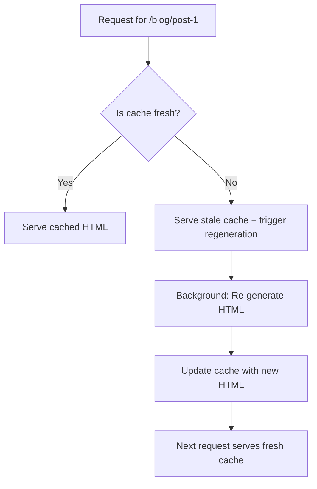

# Static Generation (SSG)

## Overview
Static Generation is a pre-rendering method where HTML is generated at build time and reused on each request. In Next.js, this is achieved using `generateStaticParams` for dynamic routes and the `revalidate` option for Incremental Static Regeneration (ISR). SSG provides the best performance for content that doesn't change frequently, as the HTML is served directly from a CDN without needing to run server code on each request.

## Prerequisites
- Understanding of Server Components
- Familiarity with Next.js App Router
- Basic knowledge of build-time vs runtime rendering

## Core Concepts

### Pure Static Generation
For pages that don't depend on any external data, Next.js automatically pre-renders them at build time:

```tsx
// [File: app/about/page.tsx]
export default function AboutPage() {
  return (
    <div>
      <h1>About Us</h1>
      <p>This page is statically generated at build time.</p>
    </div>
  );
}

// At build time, Next.js:
// 1. Executes this component
// 2. Captures the HTML output
// 3. Saves it as a static file
// 4. Serves this file directly from CDN on every request
```

### Data Fetching at Build Time
For pages that need data, you can fetch it during the build process:

```tsx
// [File: app/blog/page.tsx]
import { getAllPosts } from '@/lib/api';

export default async function BlogPage() {
  // This runs at build time, not on each request
  const posts = await getAllPosts();
  
  return (
    <div>
      <h1>Blog</h1>
      <ul>
        {posts.map(post => (
          <li key={post.id}>{post.title}</li>
        ))}
      </ul>
    </div>
  );
}

// Build process:
// 1. Next.js builds the application
// 2. During build, it executes this async function
// 3. Fetches all posts from the API
// 4. Generates HTML with the posts data
// 5. Saves the HTML as a static file
// 
// On each request:
// 1. Serves the pre-generated HTML
// 2. No API call needed on request
```

### Dynamic Routes with generateStaticParams
For dynamic routes like `/blog/[slug]`, you need to specify which paths to pre-render:

```tsx
// [File: app/blog/[slug]/page.tsx]
import { getPostBySlug, getAllPostSlugs } from '@/lib/api';
import { notFound } from 'next/navigation';

// This function runs at build time to determine which paths to generate
export async function generateStaticParams() {
  const slugs = await getAllPostSlugs();
  
  // Return an array of params objects
  // Each object will be used to generate a page
  return slugs.map(slug => ({
    slug: slug,
  }));
  // Example return value:
  // [
  //   { slug: 'first-post' },
  //   { slug: 'second-post' },
  //   { slug: 'third-post' }
  // ]
}

export default async function PostPage({
  params,
}: {
  params: { slug: string };
}) {
  const post = await getPostBySlug(params.slug);
  
  if (!post) {
    notFound();
  }
  
  return (
    <article>
      <h1>{post.title}</h1>
      <div dangerouslySetInnerHTML={{ __html: post.content }} />
    </article>
  );
}

// Build process:
// 1. Next.js calls generateStaticParams()
// 2. Gets back [{ slug: 'first-post' }, { slug: 'second-post' }, ...]
// 3. For each object, it executes the page component with those params
// 4. Generates and saves HTML for /blog/first-post, /blog/second-post, etc.
// 
// On request for /blog/first-post:
// 1. Serves the pre-generated HTML
// 2. No API call needed
```

### Incremental Static Regeneration (ISR)
ISR allows you to update static content after deployment without rebuilding the entire site:

```tsx
// [File: app/blog/[slug]/page.tsx]
import { getPostBySlug } from '@/lib/api';
import { notFound } from 'next/navigation';

export async function generateStaticParams() {
  const slugs = await getAllPostSlugs();
  return slugs.map(slug => ({ slug: slug }));
}

export default async function PostPage({
  params,
}: {
  params: { slug: string };
}) {
  const post = await getPostBySlug(params.slug);
  
  if (!post) {
    notFound();
  }
  
  return (
    <article>
      <h1>{post.title}</h1>
      <div dangerouslySetInnerHTML={{ __html: post.content }} />
    </article>
  );
}

// Add revalidate to enable ISR
export const revalidate = 3600; // Regenerate every hour (in seconds)

// Alternative: revalidate on a per-route basis
// export const revalidate = false; // Disable ISR (default)
// export const revalidate = 0;     // Regenerate on every request (SSR)
// export const revalidate = 60;    // Regenerate every minute
```

### How ISR Works
1. **First request**: Serves stale cache (if exists) and triggers regeneration in background
2. **Background regeneration**: Next.js re-renders the page in the background
3. **Subsequent requests**: Serve the newly generated HTML
4. **Cache expiration**: After `revalidate` seconds, the cycle repeats



### Client-Side Data Fetching
For data that must be fresh on each request, fetch it client-side:

```tsx
// [File: app/blog/[slug]/page.tsx]
import { getPostBySlug } from '@/lib/api';
import { notFound } from 'next/navigation';
import { useEffect, useState } from 'react';

export async function generateStaticParams() {
  const slugs = await getAllPostSlugs();
  return slugs.map(slug => ({ slug: slug }));
}

export const revalidate = 3600; // Regenerate static HTML every hour

export default async function PostPage({
  params,
}: {
  params: { slug: string };
}) {
  const post = await getPostBySlug(params.slug);
  
  if (!post) {
    notFound();
  }
  
  // For frequently changing data, fetch client-side
  const [comments, setComments] = useState([]);
  
  useEffect(() => {
    fetchComments(params.slug).then(setComments);
  }, [params.slug]);
  
  return (
    <article>
      <h1>{post.title}</h1>
      <div dangerouslySetInnerHTML={{ __html: post.content }} />
      
      {/* Client-only section for fresh data */}
      <section>
        <h2>Comments</h2>
        <CommentsList comments={comments} />
      </section>
    </article>
  );
}
```

## Common Mistakes

### Mistake 1: Forgetting generateStaticParams for Dynamic Routes
```tsx
// ❌ WRONG - Missing generateStaticParams
export default async function PostPage({ params }: { params: { slug: string } }) {
  const post = await getPostBySlug(params.slug);
  return <div>{post.title}</div>;
}

// Results in:
// - Build succeeds
// - But /blog/[slug] returns 404 for all slugs
// - Because no paths were pre-generated

// ✅ CORRECT - Always define generateStaticParams for dynamic routes
export async function generateStaticParams() {
  const slugs = await getAllPostSlugs();
  return slugs.map(slug => ({ slug: slug }));
}
```

### Mistake 2: Using revalidate Incorrectly
```tsx
// ❌ WRONG - revalidate must be a number (seconds) or false
export const revalidate = '3600'; // String instead of number

// ❌ WRONG - Negative numbers don't work
export const revalidate = -1;

// ✅ CORRECT - Use number of seconds or false
export const revalidate = 3600; // Every hour
export const revalidate = false; // Disabled
export const revalidate = 0;     // On every request (SSR)
```

### Mistake 3: Fetching Data That Changes Frequently at Build Time
```tsx
// ❌ WRONG - Stock prices that change every second
export async function generateStaticParams() {
  return [{ id: 'AAPL' }, { id: 'GOOGL' }];
}

export default async function StockPage({ params }: { params: { id: string } }) {
  // This data will be stale within seconds!
  const price = await getStockPrice(params.id);
  
  return <div>{params.id}: ${price}</div>;
}

// ✅ CORRECT - Use ISR with short revalidate or client-side fetching
export const revalidate = 10; // Regenerate every 10 seconds
// OR fetch price client-side with useEffect
```

## Real-World Example

Complete documentation site with SSG and ISR:

```tsx
// [File: app/docs/layout.tsx]
export default function DocsLayout({
  children,
}: {
  children: React.ReactNode;
}) {
  return (
    <section className="docs">
      <nav className="docs-sidebar">
        <DocsNav />
      </nav>
      <main className="docs-content">
        {children}
      </main>
    </section>
  );
}
```

```tsx
// [File: app/docs/page.tsx] - Docs index
import { getAllDocs } from '@/lib/api';

export async function generateStaticParams() {
  // For the index, we don't need params
  return [{}];
}

export default async function DocsPage() {
  const docs = await getAllDocs();
  
  return (
    <div className="docs-index">
      <h1>Documentation</h1>
      <ul>
        {docs.map(doc => (
          <li key={doc.id}>
            <a href={`/docs/${doc.slug}`}>{doc.title}</a>
          </li>
        ))}
      </ul>
    </div>
  );
}

// Rebuild index daily to catch new docs
export const revalidate = 86400; // 24 hours
```

```tsx
// [File: app/docs/[slug]/page.tsx] - Individual doc
import { getDocBySlug } from '@/lib/api';
import { notFound } from 'next/navigation';

export async function generateStaticParams() {
  const slugs = await getAllDocSlugs();
  return slugs.map(slug => ({ slug: slug }));
}

export default async function DocPage({
  params,
}: {
  params: { slug: string };
}) {
  const doc = await getDocBySlug(params.slug);
  
  if (!doc) {
    notFound();
  }
  
  return (
    <article className="doc-page">
      <header>
        <h1>{doc.title}</h1>
        <p className="doc-meta">
          Updated: {new Date(doc.updatedAt).toLocaleDateString()}
        </p>
      </header>
      <article dangerouslySetInnerHTML={{ __html: doc.content }} />
    </article>
  );
}

// Regenerate every 6 hours for documentation
export const revalidate = 21600; // 6 hours
```

```tsx
// [File: app/docs/[slug]/[version]/page.tsx] - Versioned docs
import { getDocBySlugAndVersion } from '@/lib/api';
import { notFound } from 'next/navigation';

export async function generateStaticParams() {
  const docs = await getAllDocsWithVersions();
  
  // Return array of { slug: string, version: string }
  return docs.map(doc => ({
    slug: doc.slug,
    version: doc.version,
  }));
}

export default async function VersionedDocPage({
  params,
}: {
  params: { slug: string; version: string };
}) {
  const doc = await getDocBySlugAndVersion(params.slug, params.version);
  
  if (!doc) {
    notFound();
  }
  
  return (
    <article className="doc-page">
      <header>
        <h1>{doc.title}</h1>
        <p className="doc-meta">
          Version: {doc.version} • Updated: {new Date(doc.updatedAt).toLocaleDateString()}
        </p>
      </header>
      <article dangerouslySetInnerHTML={{ __html: doc.content }} />
    </article>
  );
}

// Regenerate versioned docs weekly (they change less frequently)
export const revalidate = 604800; // 1 week
```

```tsx
// [File: app/components/DocsNav.tsx] - Client Component for navigation
'use client';

import { useState, useEffect } from 'react';
import { Link } from 'next/link';

export default function DocsNav() {
  const [docs, setDocs] = useState([]);
  
  useEffect(() => {
    // Fetch fresh nav data client-side
    getAllDocs().then(setDocs);
  }, []);
  
  return (
    <nav className="docs-nav">
      <h2>Documentation</h2>
      <ul>
        {docs.map(doc => (
          <li key={doc.id}>
            <Link href={`/docs/${doc.slug}`}>
              {doc.title}
            </Link>
          </li>
        ))}
      </ul>
    </nav>
  );
}
```

## Key Takeaways
- Use Static Generation for content that doesn't change frequently
- `generateStaticParams` defines which dynamic routes to pre-render at build time
- ISR (`revalidate`) allows updating static content after deployment
- First ISR request may show stale data while background regeneration happens
- Combine SSG with client-side fetching for frequently changing data
- Build-time data fetching happens once during build, not on each request
- ISR provides a balance between performance and data freshness
- Always handle 404s with `notFound()` for dynamic routes
- Consider your data's update frequency when choosing revalidate intervals

## What's Next
Continue to [Server-Side Rendering (SSR)](03-server-side-rendering-ssr.md) to learn about rendering pages on each request for always-fresh data.