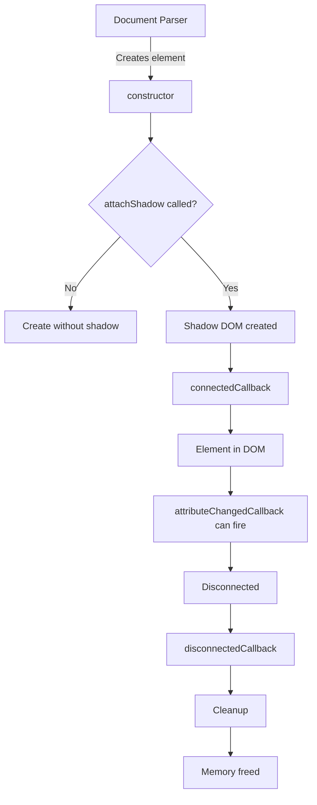
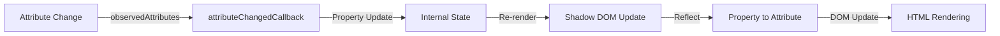

# Introduction to Web Components

## OVERVIEW

Web Components represent a suite of different technologies allowing you to create reusable custom elements with their functionality encapsulated away from the rest of your code. They serve as the foundation for building reusable UI components across any web application, regardless of the framework being used.

This comprehensive guide will take you from understanding the fundamental concepts of Web Components to mastering advanced patterns that enable enterprise-scale applications. By the end of this guide, you will have the knowledge to build robust, reusable custom elements that work seamlessly across frameworks and browsers.

Web Components are not a single API but rather a collection of web platform APIs that work together. These technologies have been standardized through the W3C (World Wide Web Consortium) and are now part of the official web platform, ensuring long-term stability and browser support.

## TECHNICAL SPECIFICATIONS

### Core Technologies

Web Components consists of four main specifications that work together to enable component-based architecture:

1. **Custom Elements API** - Allows web developers to define new types of elements in a document. This API provides a way to create custom elements that extend existing HTML elements or define entirely new ones. The custom elements API is defined through the `CustomElementRegistry` and provides methods like `define()`, `get()`, and `whenDefined()` for managing custom element definitions.

2. **Shadow DOM** - Provides encapsulation for JavaScript and CSS, keeping component styles and behavior separate from the main document. Shadow DOM prevents styles from bleeding into or out of components, which is essential for building reusable elements. It uses the concept of a "shadow tree" that is attached to an element but rendered separately from the document's main DOM tree.

3. **HTML Templates** - The `<template>` element allows you to declare fragments of HTML that are not rendered initially but can be instantiated at runtime. Templates provide a way to define reusable component structures that can be cloned and inserted into the document as needed. This is crucial for performance because templates are not parsed until they are needed.

4. **HTML Imports** (deprecated) - Originally designed for including HTML documents, this feature has been deprecated in favor of ES Modules. While HTML Imports are no longer recommended, you may encounter them in older codebases, so understanding them provides context for migration paths.

### Browser Support Matrix

The Web Components specifications have different levels of support across browsers:

| Feature | Chrome | Firefox | Safari | Edge | Node.js |
|---------|--------|---------|-------|------|---------|
| Custom Elements v1 | 66+ | 63+ | 12.1+ | 79+ | N/A |
| Shadow DOM v1 | 53+ | 63+ | 10+ | 79+ | N/A |
| HTML Templates | Yes | Yes | Yes | Yes | N/A |
| ES Modules | 61+ | 60+ | 11.1+ | 79+ | 12+ |

### Specification Versions

This guide focuses on the latest stable versions of Web Components specifications:
- Custom Elements Level 1 (stable)
- Shadow DOM Level 1 (stable)
- HTML Template Element (stable)

## IMPLEMENTATION DETAILS

### Your First Web Component

Creating a Web Component involves extending the `HTMLElement` class and registering it with the Custom Elements registry. Here's a complete implementation of a simple custom element:

```javascript
// Define the custom element class
class MyElement extends HTMLElement {
  // Constructor is called when the element is created
  constructor() {
    // Always call super() first in the constructor
    super();
    
    // Attach a shadow DOM tree with { mode: 'open' } to allow external access
    // Using 'closed' mode would make shadowRoot return null externally
    this.attachShadow({ mode: 'open' });
  }
  
  // connectedCallback is invoked when the element is added to the DOM
  connectedCallback() {
    this.render();
  }
  
  // Render method creates the component's internal structure
  render() {
    this.shadowRoot.innerHTML = `
      <style>
        :host {
          display: block;
          padding: 16px;
          background-color: #f5f5f5;
          border-radius: 8px;
          font-family: system-ui, -apple-system, sans-serif;
        }
        :host([hidden]) {
          display: none;
        }
        .content {
          color: #333;
        }
      </style>
      <div class="content">
        <slot></slot>
      </div>
    `;
  }
}

// Register the custom element with the browser
// The first argument must contain a hyphen to be valid
customElements.define('my-element', MyElement);
```

### Using the Custom Element

Once registered, you can use the custom element in HTML just like built-in elements:

```html
<!-- Basic usage -->
<my-element>Hello, World!</my-element>

<!-- With attributes -->
<my-element variant="primary">Primary Variant</my-element>

<!-- In JavaScript -->
<script>
  const element = document.createElement('my-element');
  element.textContent = 'Created dynamically';
  document.body.appendChild(element);
</script>
```

### Lifecycle Callbacks

Custom Elements have several lifecycle callbacks that allow you to respond to changes in the element's state:

```javascript
class LifecycleElement extends HTMLElement {
  constructor() {
    super();
    this.attachShadow({ mode: 'open' });
    console.log('Constructor: Element created');
  }
  
  // Called when the element is added to the document
  connectedCallback() {
    console.log('connectedCallback: Element added to DOM');
  }
  
  // Called when the element is removed from the document
  disconnectedCallback() {
    console.log('disconnectedCallback: Element removed from DOM');
  }
  
  // Called when an attribute changes
  attributeChangedCallback(name, oldValue, newValue) {
    console.log(`attributeChangedCallback: ${name} changed from ${oldValue} to ${newValue}`);
  }
  
  // Called when the element is adopted into a new document
  adoptedCallback() {
    console.log('adoptedCallback: Element adopted into new document');
  }
  
  static get observedAttributes() {
    return ['data-value', 'disabled', 'title'];
  }
}
```

### Observed Attributes

To react to attribute changes, you must declare which attributes to observe using the static `observedAttributes` getter:

```javascript
class ResponsiveElement extends HTMLElement {
  static get observedAttributes() {
    // Return array of attribute names to observe
    return ['size', 'variant', 'disabled'];
  }
  
  attributeChangedCallback(name, oldValue, newValue) {
    if (oldValue === newValue) return;
    
    switch (name) {
      case 'size':
        this.handleSizeChange(newValue);
        break;
      case 'variant':
        this.handleVariantChange(newValue);
        break;
      case 'disabled':
        this.handleDisabledChange(newValue !== null);
        break;
    }
  }
  
  handleSizeChange(size) {
    // Handle size attribute changes
  }
  
  handleVariantChange(variant) {
    // Handle variant attribute changes
  }
  
  handleDisabledChange(disabled) {
    // Handle disabled attribute changes
  }
}
```

## BEST PRACTICES

### Naming Conventions

Custom element names must follow specific rules to be valid:

1. **Must contain a hyphen** - This is required by the specification to avoid conflicts with existing HTML elements and to ensure proper parsing. Names like `my-element`, `custom-button`, or `app-header` are valid, while `myelement` or `button` are not.

2. **Must be lowercase** - Only lowercase letters are allowed in custom element names. This follows HTML's case-insensitivity for element names.

3. **Must not be reserved** - You cannot use names that are already defined in the HTML specification or that start with certain prefixes reserved for future use.

4. **Should be descriptive** - Use names that clearly indicate the element's purpose. For example, `<data-table>` is clearer than `<dt>`.

5. **Should use namespace prefixes** - Consider using organizational prefixes like `<company-name-element>` to avoid collisions in shared environments.

### Error Handling

Always implement proper error handling in your components:

```javascript
class SafeElement extends HTMLElement {
  constructor() {
    super();
    this.attachShadow({ mode: 'open' });
  }
  
  connectedCallback() {
    try {
      this.render();
    } catch (error) {
      console.error('Error rendering element:', error);
      this.renderErrorState(error);
    }
  }
  
  render() {
    // Main rendering logic
  }
  
  renderErrorState(error) {
    this.shadowRoot.innerHTML = `
      <div class="error">
        <p>Error loading component</p>
        <details>${error.message}</details>
      </div>
    `;
  }
}
```

### Memory Management

Properly clean up resources when elements are removed:

```javascript
class ResourceElement extends HTMLElement {
  constructor() {
    super();
    this._observer = null;
    this._eventListeners = new Map();
    this._timers = [];
    this.attachShadow({ mode: 'open' });
  }
  
  connectedCallback() {
    this.setupObserver();
    this.setupEventListeners();
    this.setuptimers();
    this.render();
  }
  
  disconnectedCallback() {
    // Clean up all resources to prevent memory leaks
    if (this._observer) {
      this._observer.disconnect();
      this._observer = null;
    }
    
    this._eventListeners.forEach((handler, event) => {
      this.removeEventListener(event, handler);
    });
    this._eventListeners.clear();
    
    this._timers.forEach(timer => clearInterval(timer));
    this._timers = [];
  }
  
  // ... rest of implementation
}
```

## PERFORMANCE CONSIDERATIONS

### Initial Rendering Performance

The initial rendering of Web Components can impact page load performance. Consider these optimization strategies:

1. **Lazy Registration** - Register elements only when needed:
```javascript
// Only define element when it's found in the document
const observer = new IntersectionObserver((entries) => {
  entries.forEach(entry => {
    if (entry.isIntersecting) {
      customElements.define('lazy-element', LazyElement);
      observer.disconnect();
    }
  });
});

observer.observe(document.querySelector('lazy-element'));
```

2. **Template Caching** - Cache templates to avoid re-parsing:
```javascript
const templateCache = new Map();

function getTemplate(id) {
  if (templateCache.has(id)) {
    return templateCache.get(id).content.cloneNode(true);
  }
  
  const template = document.getElementById(id);
  if (!template) throw new Error(`Template ${id} not found`);
  
  templateCache.set(id, template);
  return template.content.cloneNode(true);
}
```

3. **Defer Non-Critical Rendering** - Use requestAnimationFrame:
```javascript
connectedCallback() {
  requestAnimationFrame(() => {
    this.render();
  });
}
```

### Runtime Performance

Runtime performance considerations include:

1. **Minimize Reflows** - Batch DOM operations:
```javascript
updateContent(items) {
  const fragment = document.createDocumentFragment();
  items.forEach(item => {
    const div = document.createElement('div');
    div.textContent = item;
    fragment.appendChild(div);
  });
  this.shadowRoot.appendChild(fragment);
}
```

2. **Use CSS Containment** - Isolate component rendering:
```javascript
get styles() {
  return `
    <style>
      :host {
        contain: content;
      }
    </style>
  `;
}
```

3. **Virtual Scrolling** - For large lists, implement virtual scrolling:
```javascript
class VirtualList extends HTMLElement {
  // Implementation uses IntersectionObserver
  // to render only visible items
}
```

## ACCESSIBILITY GUIDE

### Semantic HTML

Custom elements should use semantic HTML internally for accessibility:

```javascript
class AccessibleButton extends HTMLElement {
  constructor() {
    super();
    this.attachShadow({ mode: 'open' });
  }
  
  connectedCallback() {
    this.render();
    this.role = this.getAttribute('role') || 'button';
  }
  
  render() {
    this.shadowRoot.innerHTML = `
      <style>
        :host {
          display: inline-block;
        }
        button {
          padding: 8px 16px;
          cursor: pointer;
        }
        :host([disabled]) button {
          opacity: 0.5;
          cursor: not-allowed;
        }
      </style>
      <button part="button" role="${this.role}" aria-disabled="${this.disabled}">
        <slot></slot>
      </button>
    `;
  }
}
```

### ARIA Integration

Properly expose accessibility information:

```javascript
class AccessibleDialog extends HTMLElement {
  constructor() {
    super();
    this.attachShadow({ mode: 'open' });
    this._open = false;
  }
  
  static get observedAttributes() {
    return ['open', 'aria-labelledby', 'aria-describedby'];
  }
  
  connectedCallback() {
    this.render();
    this.addEventListener('keydown', this._handleKeydown.bind(this));
  }
  
  attributeChangedCallback(name, oldVal, newVal) {
    if (name === 'open') {
      this._open = newVal !== null;
      this.updateAccessibility();
    }
  }
  
  updateAccessibility() {
    const dialog = this.shadowRoot.querySelector('[role="dialog"]');
    if (dialog) {
      dialog.setAttribute('aria-hidden', !this._open);
      dialog.setAttribute('aria-modal', 'true');
    }
  }
  
  _handleKeydown(event) {
    if (event.key === 'Escape' && this._open) {
      this.close();
    }
  }
  
  close() {
    this.removeAttribute('open');
    this.focus();
  }
}
```

### Keyboard Navigation

Implement proper keyboard support:

```javascript
class KeyboardNavigable extends HTMLElement {
  constructor() {
    super();
    this.attachShadow({ mode: 'open' });
    this._items = [];
    this._focusedIndex = -1;
  }
  
  connectedCallback() {
    this.render();
    this._items = Array.from(this.shadowRoot.querySelectorAll('[tabindex]'));
    
    this.addEventListener('keydown', this._handleKeydown.bind(this));
  }
  
  _handleKeydown(event) {
    switch (event.key) {
      case 'ArrowDown':
        event.preventDefault();
        this._focusNext();
        break;
      case 'ArrowUp':
        event.preventDefault();
        this._focusPrevious();
        break;
      case 'Home':
        event.preventDefault();
        this._focusFirst();
        break;
      case 'End':
        event.preventDefault();
        this._focusLast();
        break;
    }
  }
  
  _focusNext() {
    this._focusedIndex = (this._focusedIndex + 1) % this._items.length;
    this._items[this._focusedIndex].focus();
  }
  
  _focusPrevious() {
    this._focusedIndex = (this._focusedIndex - 1 + this._items.length) % this._items.length;
    this._items[this._focusedIndex].focus();
  }
  
  _focusFirst() {
    this._focusedIndex = 0;
    this._items[0].focus();
  }
  
  _focusLast() {
    this._focusedIndex = this._items.length - 1;
    this._items[this._focusedIndex].focus();
  }
}
```

## CROSS-BROWSER COMPATIBILITY

### Feature Detection

Always detect features before using them:

```javascript
function supportsWebComponents() {
  return (
    customElements.define &&
    HTMLElement.prototype.attachShadow &&
    document.createElement('template').content
  );
}

if (!supportsWebComponents()) {
  // Load polyfills
  import('./webcomponents-loader.js');
}
```

### Polyfill Integration

When polyfills are needed:

```javascript
// webcomponents-loader.js handles polyfill loading
import {
  registerElement,
  polyfillWCDetails,
} from '@webcomponents/webcomponentsjs';

// Alternative: Load polyfills conditionally
async function loadPolyfills() {
  if (!customElements.define) {
    await import('@webcomponents/custom-elements');
  }
  if (!HTMLElement.prototype.attachShadow) {
    await import('@webcomponents/shadydom');
  }
}
```

### Cross-Browser Styles

Handle different browser rendering:

```javascript
const getCrossBrowserStyles = () => `
  <style>
    :host {
      display: block;
      /* Use system fonts for better cross-browser compatibility */
      font-family: -apple-system, BlinkMacSystemFont, "Segoe UI", Roboto, Helvetica, Arial, sans-serif;
    }
    
    /* Normalize box-sizing */
    *, *::before, *::after {
      box-sizing: border-box;
    }
    
    /* Reset button styles */
    button {
      font-family: inherit;
    }
  </style>
`;
```

## COMMON PITFALLS AND SOLUTIONS

### Pitfall 1: Element Not Defined

**Problem**: Custom element is not defined before use in HTML.

**Solution**: Ensure elements are registered before the DOM is parsed:

```javascript
// Define elements in the head or before body content
class MyElement extends HTMLElement { }
customElements.define('my-element', MyElement);
```

### Pitfall 2: Shadow Root Not Attached

**Problem**: Attempting to access shadowRoot before it's attached.

**Solution**: Attach shadow root in constructor:

```javascript
class CorrectElement extends HTMLElement {
  constructor() {
    super();
    this.attachShadow({ mode: 'open' }); // Attach in constructor
  }
  
  connectedCallback() {
    // shadowRoot is now available
    console.log(this.shadowRoot);
  }
}
```

### Pitfall 3: Attributes Not Observed

**Problem**: attributeChangedCallback not firing.

**Solution**: Use observedAttributes:

```javascript
class ObserveElement extends HTMLElement {
  // Must return array of attribute names
  static get observedAttributes() {
    return ['value', 'disabled'];
  }
  
  attributeChangedCallback(name, oldVal, newVal) {
    // Now this will fire
  }
}
```

### Pitfall 4: Memory Leaks

**Problem**: Event listeners and timers not cleaned up.

**Solution**: Always implement disconnectedCallback:

```javascript
class CleanElement extends HTMLElement {
  connectedCallback() {
    this._listener = () => this.handleClick();
    document.addEventListener('click', this._listener);
    this._timer = setInterval(() => this.tick(), 1000);
  }
  
  disconnectedCallback() {
    // Clean up to prevent memory leaks
    document.removeEventListener('click', this._listener);
    clearInterval(this._timer);
  }
}
```

### Pitfall 5: Style Encapsulation Issues

**Problem**: Component styles affecting the page or vice versa.

**Solution**: Use Shadow DOM with proper style containment:

```javascript
class StyledElement extends HTMLElement {
  constructor() {
    super();
    this.attachShadow({ mode: 'open' });
  }
  
  connectedCallback() {
    this.shadowRoot.innerHTML = `
      <style>
        :host {
          display: block;
          /* Explicitly define containment */
          contain: content style;
        }
        /* Use :host to style the component itself */
        :host([hidden]) {
          display: none;
        }
      </style>
      <div class="content">
        <slot></slot>
      </div>
    `;
  }
}
```

## FLOW CHARTS

### Component Lifecycle Flow



### Data Flow Architecture



## EXTERNAL RESOURCES

### Official Specifications

- [WHATWG Custom Elements Specification](https://html.spec.whatwg.org/multipage/custom-elements.html)
- [W3C Shadow DOM Specification](https://www.w3.org/TR/shadow-dom/)
- [MDN Web Components Documentation](https://developer.mozilla.org/en-US/docs/Web/Web_Components)

### Community Resources

- [Web Components Community](https://www.webcomponents.org/)
- [Custom Elements.io](https://customelements.io/)
- [WebComponents.org](https://www.webcomponents.org/introduction)

### Framework Documentation

- [Lit Documentation](https://lit.dev/)
- [Stencil Documentation](https://stenciljs.com/)
- [Fast Element Documentation](https://www.fast.design/)

## NEXT STEPS

After completing this introduction, proceed to:

1. **01_2_HTML-Standards-and-History** - Understanding the history and evolution of HTML standards that led to Web Components
2. **01_3_Browser-Compatibility-Matrix** - Detailed browser compatibility information and polyfill strategies
3. **01_4_JavaScript-Fundamentals-for-Web-Components** - JavaScript concepts essential for building Web Components

### Prerequisite Knowledge

Before continuing, ensure you understand:

- ES6+ JavaScript (classes, promises, async/await)
- DOM manipulation and traversal
- Event handling and bubbling
- Basic CSS selectors and properties
- HTML syntax and semantics

### Recommended Learning Path

For optimal understanding of Web Components, follow this progression:

1. Read through all 01_Basics sections to establish foundation
2. Complete 02_Custom-Elements sections to master element creation
3. Study 03_Templates and 04_Shadow-DOM for encapsulation
4. Explore 05_Data-Binding through 07_Forms for complex interactions
5. Review 08_Interoperability for framework integration
6. Apply 09_Performance and 10_Advanced-Patterns for production readiness

This comprehensive guide will transform you from a Web Components beginner to an expert capable of building enterprise-scale component libraries that work across any framework or platform.