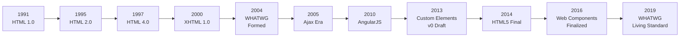

# HTML Standards and History

## OVERVIEW

Understanding the history and evolution of HTML standards is essential for comprehending why Web Components exist and how they fit into the broader web platform. The journey from basic markup language to modern component-based architecture spans over three decades of web development innovation.

This document explores the historical context that led to the development of Web Components, tracing the key milestones in HTML evolution, and examining how standardizing component APIs addresses long-standing challenges in web development.

The web platform has undergone remarkable transformations since Tim Berners-Lee created the first HTML specification in 1990. From simple document markup to a comprehensive application platform, HTML's evolution reflects the growing demands of developers building increasingly complex web experiences.

## TECHNICAL SPECIFICATIONS

### HTML Version Timeline

The HTML standard has evolved through several major versions, each adding capabilities that paved the way for modern Web Components:

**HTML 1.0 (1991)** - The foundational version introduced basic document structure with elements like headers, paragraphs, and links. This primitive feature set demonstrated the potential for cross-platform information sharing but lacked any notion of component architecture or encapsulation.

**HTML 2.0 (1995)** - Introduced form elements, enabling user input collection. Forms established the pattern of collecting and submitting data that remains central to web applications today. The form submission mechanism, though limited, represented an early attempt at component-like behavior.

**HTML 3.0 (1997)** - Though never widely adopted, this version attempted to include features like tables and mathematical equations that required more sophisticated parsing and rendering.

**HTML 4.0 (1997)** - A transformative release that introduced:
- Cascading Style Sheets (CSS) for presentation separation
- Frames for document composition
- Extensive accessibility features
- Document Type Declarations (DTD)

**XHTML 1.0 (2000)** - Reformulated HTML 4.0 as valid XML, introducing strict parsing rules and encouraging well-formed documents. While initially controversial, XHTML established important standards for parsing behavior.

**HTML5 (2014)** - The modern standard that revolutionized web development:
- Semantic elements (`<header>`, `<footer>`, `<article>`, `<section>`)
- Native multimedia support (`<audio>`, `<video>`)
- Canvas API for graphics
- Local storage mechanisms
- Web Workers for background processing
- Microdata and semantic markup
- **Custom Elements API** (proposal stage)
- **Shadow DOM** (proposal stage)

### W3C vs WHATWG History

The governance of HTML standards created significant historical tensions:

**W3C Era (1994-2004)** - The World Wide Web Consortium, led by Tim Berners-Lee, managed HTML development through HTML 4.01 and XHTML 1.x. The W3C emphasized formal specifications and XML compatibility.

**XHTML 2.0 Controversy (2004-2009)** - W3C's XHTML 2.0 proposal diverged from HTML reality. It lacked backward compatibility and ignored browser implementations, leading to criticism and ultimately termination.

**WHATWG Formation (2004)** - Frustrated with W3C direction, Apple, Mozilla, and Opera formed the Web Hypertext Application Technology Working Group (WHATWG). They created the HTML5 specification based on actual browser implementations.

**Convergence (2007)** - W3C adopted WHATWG's HTML5 draft, creating dual governance. This led to confusion about which specification was authoritative.

**HTML Living Standard (2019)** - WHATWG consolidated as the primary steward of the HTML standard, maintaining the "Living Standard" approach that continuously evolves based on implementation experience.

## IMPLEMENTATION DETAILS

### Early Component Attempts

Before native Web Components, developers created reusable elements through various patterns:

**Frames and Iframes (1996)**

```html
<!-- Early component-like isolation -->
<frameset rows="50,*">
  <frame name="header" src="header.html">
  <frame name="content" src="main.html">
</frameset>
```

Frames provided isolation but lacked JavaScript integration and created significant accessibility barriers.

**Object and Param Elements**

```html
<!-- Reusable components via object embedding -->
<object data="widget.swf" type="application/x-shockwave-flash">
  <param name="quality" value="high">
  <param name="flashvars" value="config=settings">
</object>
```

**Ajax and Dynamic Loading (2005)**

```javascript
// Dynamic component loading pattern
function loadWidget(url, container) {
  fetch(url)
    .then(response => response.text())
    .then(html => {
      container.innerHTML = html;
      // Execute any inline scripts
      container.querySelectorAll('script').forEach(script => {
        eval(script.textContent);
      });
    });
}
```

### Component Libraries Era

Multiple libraries attempted to solve the component problem before native APIs:

**Dojo Toolkit (2004)**

```javascript
// Dojo's declarative component definition
dojo.declare("my.Widget", [dijit._Widget, dijit._Templated], {
  templateString: '<div class="widget">${name}</div>',
  postCreate: function() {
    this.nameNode.innerHTML = this.name;
  }
});
```

**jQuery UI (2007)**

```javascript
// jQuery UI component creation
$.widget("ui.progressbar", {
  options: {
    value: 0,
    max: 100
  },
  _create: function() {
    this.element.addClass("ui-progressbar");
    this._refreshValue();
  },
  value: function(value) {
    if (value === undefined) {
      return this.options.value;
    }
    this.options.value = value;
    this._refreshValue();
  }
});
```

**AngularJS Directives (2010)**

```javascript
// AngularJS component-like directives
angular.module('app').directive('myComponent', function() {
  return {
    restrict: 'E',
    template: '<div class="component">{{value}}</div>',
    scope: {
      value: '='
    },
    link: function(scope, element, attrs) {
      scope.$watch('value', function(newVal) {
        element.find('.component').text(newVal);
      });
    }
  };
});
```

### Web Components Standard Evolution

The path to native Web Components involved three major standardization efforts:

**Custom Elements v0 (2013)**

```javascript
// Original Custom Elements API (deprecated)
document.registerElement('my-element', {
  prototype: Object.create(HTMLElement.prototype),
  extends: 'button'
});
```

**Custom Elements v1 (2016)**

```javascript
// Current Custom Elements API
class MyElement extends HTMLElement {
  constructor() {
    super();
  }
  connectedCallback() {
    console.log('Element connected');
  }
}
customElements.define('my-element', MyElement);
```

**Shadow DOM Evolution**

```javascript
// Shadow DOM v0 (deprecated)
var shadow = element.createShadowRoot();
shadow.innerHTML = '<div>Content</div>';

// Shadow DOM v1 (current)
var shadow = element.attachShadow({ mode: 'open' });
shadow.innerHTML = '<div>Content</div>';
```

## CODE EXAMPLES

### Migration from v0 to v1

If you encounter legacy Custom Elements code, here's migration guidance:

```javascript
// OLD: Custom Elements v0 (do not use in new code)
document.registerElement('legacy-element', {
  prototype: Object.create(HTMLButtonElement.prototype, {
    extends: { value: 'button' }
  }),
  extends: 'button'
});

// NEW: Custom Elements v1 migration
class LegacyElement extends HTMLButtonElement {
  constructor() {
    super();
    this.attachShadow({ mode: 'open' });
  }
  
  connectedCallback() {
    // Migration: equivalent functionality
  }
  
  // v0 lifecycle -> v1 lifecycle mapping
  createdCallback() {
    // Move to constructor
  }
  
  attachedCallback() {
    // Move to connectedCallback
  }
  
  detachedCallback() {
    // Move to disconnectedCallback
  }
  
  attributeChangedCallback(attr, oldVal, newVal) {
    // Same in v1 (requires observedAttributes)
  }
}
customElements.define('legacy-element', LegacyElement, { extends: 'button' });
```

### HTML Template Migration Patterns

From server-side includes to modern templates:

```html
<!-- OLD: Server-side include -->
<!--#include virtual="header.html" -->

<!-- NEW: Web Component template -->
<template id="header-template">
  <style>
    :host {
      display: block;
      background: #fff;
    }
  </style>
  <header class="site-header">
    <slot name="logo"></slot>
    <nav class="navigation">
      <slot name="nav"></slot>
    </nav>
  </header>
</template>
```

```javascript
// Template instantiation
class SiteHeader extends HTMLElement {
  constructor() {
    super();
    this.attachShadow({ mode: 'open' });
  }
  
  connectedCallback() {
    const template = document.getElementById('header-template');
    const clone = template.content.cloneNode(true);
    this.shadowRoot.appendChild(clone);
  }
}
customElements.define('site-header', SiteHeader);
```

## BEST PRACTICES

### Standards Compliance

Ensure your components comply with HTML standards:

```javascript
class CompliantElement extends HTMLElement {
  constructor() {
    super(); // REQUIRED: Call super() first
    this.attachShadow({ mode: 'open' }); // Use open mode for debugging
  }
  
  // Use semantic HTML internally
  // Expose proper ARIA roles
  // Maintain accessibility tree
}
```

### Forward Compatibility

Design components that adapt to future standards:

```javascript
class FutureProofElement extends HTMLElement {
  constructor() {
    super();
    if (!this.attachShadow) {
      // Graceful fallback for older browsers
      this.createShadowRoot = () => ({});
    }
  }
  
  // Use feature detection for advanced features
  supportsSlots() {
    return HTMLElement.prototype.attachShadow !== undefined;
  }
}
```

## PERFORMANCE CONSIDERATIONS

### Template Parsing Performance

HTML templates are parsed once and cached:

```javascript
// GOOD: Template parsing happens only once
const template = document.createElement('template');
template.innerHTML = `
  <style>/* Complex styles */</style>
  <div class="content">...</div>
`;

// Templates can be reused multiple times
function createInstance() {
  return template.content.cloneNode(true);
}
```

### DOM Creation Costs

Compare component creation approaches:

```javascript
// APPROACH 1: InnerHTML (re-parses each time)
this.innerHTML = '<div>Content</div>';
// Each write triggers HTML parsing

// APPROACH 2: Template cloning (parsed once)
const template = document.getElementById('my-template');
this.shadowRoot.appendChild(template.content.cloneNode(true));
// HTML parsed once, then cloned efficiently
```

## HISTORY TIMELINE



## EXTERNAL RESOURCES

### Specification Sources

- [WHATWG HTML Living Standard](https://html.spec.whatwg.org/)
- [W3C Web Applications Working Group](https://www.w3.org/webapps/)
- [MDN HTML Reference](https://developer.mozilla.org/en-US/docs/Web/HTML)

### Historical Documents

- [HTML Design Principles](https://www.w3.org/TR/html-design-principles/)
- [HTML5 Differences from HTML4](https://www.w3.org/TR/html5-diff/)

## NEXT STEPS

Proceed to:

1. **01_3_Browser-Compatibility-Matrix** - Understanding browser support and polyfills
2. **01_4_JavaScript-Fundamentals-for-Web-Components** - Required JavaScript knowledge
3. **02_Custom-Elements/02_1_Creating-Your-First-Custom-Element** - Starting custom element development