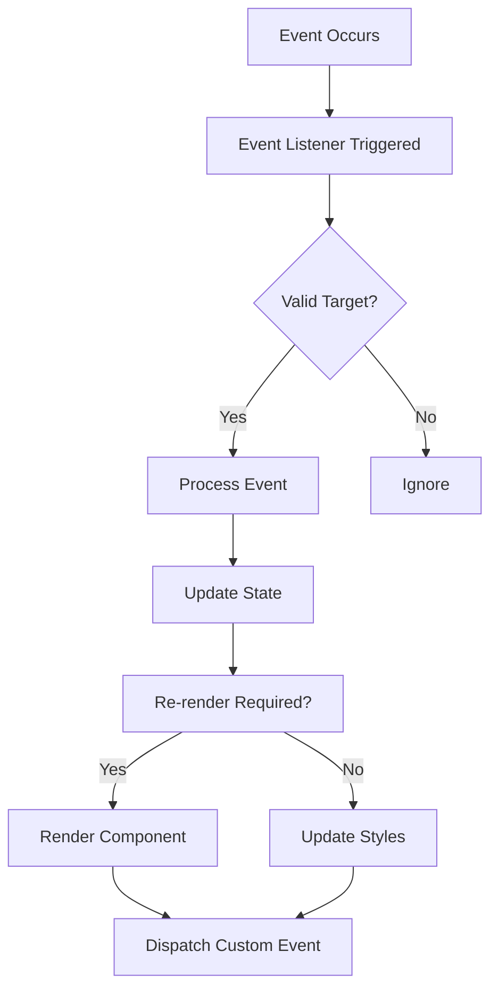
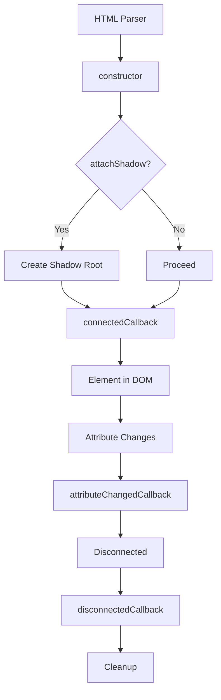

# JavaScript Fundamentals for Web Components

## OVERVIEW

Mastering JavaScript is essential for building robust Web Components. This comprehensive guide covers all JavaScript concepts, patterns, and techniques needed to create professional-grade custom elements. From ES6+ features to advanced asynchronous patterns, understanding these fundamentals will enable you to build sophisticated components that perform well and work reliably across browsers.

JavaScript serves as the core programming language for Web Components. The custom elements API, Shadow DOM, and HTML templates all rely on JavaScript for their functionality. A solid foundation in JavaScript ensures you can implement complex component behaviors, handle data flow properly, and integrate with modern development workflows.

This guide progresses from fundamental concepts to advanced patterns, providing practical examples specific to Web Component development. Each section builds upon previous knowledge, creating a comprehensive foundation for component development.

## TECHNICAL SPECIFICATIONS

### ES6+ Features Required

Web Components development heavily utilizes modern JavaScript features. Here's what's essential:

| Feature | Use Case | Browser Support |
|---------|---------|---------------|
| Classes | Component class definition | All modern browsers |
| Modules | Component organization | All modern browsers |
| Promises/Async | Asynchronous operations | All modern browsers |
| Destructuring | Data extraction | All modern browsers |
| Spread Operator | Array/object operations | All modern browsers |
| Template Literals | Dynamic HTML generation | All modern browsers |
| WeakMap/WeakSet | Private data storage | All modern browsers |
| Proxies | Property interception | All modern browsers |
| Reflect | Meta-programming | All modern browsers |

### Class Syntax Deep Dive

Classes are the foundation of component definition:

```javascript
// Basic Component Class Structure
class ComponentBase extends HTMLElement {
  // Static properties for class-level configuration
  static get observedAttributes() {
    return ['disabled', 'readonly'];
  }
  
  static get formAssociated() {
    return true;
  }
  
  // Instance properties
  constructor() {
    super();
    
    // Private fields (newer syntax)
    this._internals = null;
    this._isConnected = false;
  }
  
  // Lifecycle callbacks
  connectedCallback() {
    this._isConnected = true;
    this._internals = this.attachInternals?.();
  }
  
  disconnectedCallback() {
    this._isConnected = false;
  }
  
  attributeChangedCallback(name, oldValue, newValue) {
    // Handle attribute changes
  }
}
```

### Private Fields and Methods

Private fields provide true encapsulation:

```javascript
class PrivateDataComponent extends HTMLElement {
  // Private instance fields
  #data = new Map();
  #listeners = new Set();
  #rendered = false;
  
  // Private methods
  #render() {
    if (this.#rendered) return;
    // Rendering logic
    this.#rendered = true;
  }
  
  #handleEvent(event) {
    this.#listeners.forEach(listener => listener(event));
  }
  
  // Public API with private access
  setData(key, value) {
    this.#data.set(key, value);
    this.#render();
  }
  
  getData(key) {
    return this.#data.get(key);
  }
  
  // Event subscription
  subscribe(listener) {
    this.#listeners.add(listener);
    return () => this.#listeners.delete(listener);
  }
}
```

## IMPLEMENTATION DETAILS

### Promise Patterns for Components

Asynchronous operations are common in components:

```javascript
class AsyncComponent extends HTMLElement {
  constructor() {
    super();
    this.attachShadow({ mode: 'open' });
    this.#pending = [];
  }
  
  // Queue async operations
  async #queueOperation(operation) {
    if (!this.#isReady) {
      return new Promise(resolve => {
        this.#pending.push({ operation, resolve });
      });
    }
    return operation();
  }
  
  // Process queued operations when connected
  connectedCallback() {
    super.connectedCallback?.();
    this.#processQueue();
  }
  
  async #processQueue() {
    this.#isReady = true;
    const pending = [...this.#pending];
    this.#pending = [];
    
    for (const { operation, resolve } of pending) {
      try {
        resolve(await operation());
      } catch (error) {
        console.error('Async operation failed:', error);
      }
    }
  }
  
  #isReady = false;
  #pending = [];
}
```

### Event Handling Patterns

Proper event handling with cleanup:

```javascript
class EventComponent extends HTMLElement {
  constructor() {
    super();
    this.attachShadow({ mode: 'open' });
    this._eventMap = new Map();
  }
  
  // Add listener with tracking
  addListener(target, event, handler, options) {
    target.addEventListener(event, handler, options);
    
    if (!this._eventMap.has(event)) {
      this._eventMap.set(event, []);
    }
    this._eventMap.get(event).push({ target, handler, options });
  }
  
  // Remove all tracked listeners
  removeAllListeners() {
    for (const [event, listeners] of this._eventMap) {
      for (const { target, handler, options } of listeners) {
        target.removeEventListener(event, handler, options);
      }
    }
    this._eventMap.clear();
  }
  
  // Cleanup on disconnect
  disconnectedCallback() {
    this.removeAllListeners();
    super.disconnectedCallback?.();
  }
}
```

### Proxy-Based Reactivity

Using proxies for reactive properties:

```javascript
class ReactiveComponent extends HTMLElement {
  constructor() {
    super();
    this.attachShadow({ mode: 'open' });
    this.#state = { items: [], loading: false };
    this.#proxy = new Proxy(this.#state, this.#handler);
  }
  
  #handler = {
    get: (target, property) => {
      return target[property];
    },
    set: (target, property, value) => {
      target[property] = value;
      this.#onStateChange(property, value);
    },
    delete: (target, property) => {
      delete target[property];
      this.#onStateChange(property, undefined);
    }
  };
  
  #onStateChange(property, value) {
    this.render();
    this.dispatchEvent(new CustomEvent('state-change', {
      detail: { property, value },
      bubbles: true,
      composed: true
    }));
  }
  
  get state() {
    return this.#proxy;
  }
  
  set state(value) {
    Object.assign(this.#proxy, value);
  }
}
```

## CODE EXAMPLES

### Advanced Class Patterns

Multiple inheritance simulation and mixins:

```javascript
// Mixin pattern for reusable behavior
function ReactiveMixin(Base) {
  return class extends Base {
    #state = {};
    
    setState(updates) {
      const oldState = { ...this.#state };
      Object.assign(this.#state, updates);
      this._onStateChange(this.#state, oldState);
    }
    
    getState() {
      return { ...this.#state };
    }
    
    _onStateChange(newState, oldState) {
      // Override in subclass
    }
  };
}

function FormAssociatedMixin(Base) {
  return class extends Base {
    static get formAssociated() {
      return true;
    }
    
    constructor() {
      super();
      this.#internals = null;
    }
    
    connectedCallback() {
      super.connectedCallback?.();
      this.#internals = this.attachInternals?.();
    }
    
    #internals;
    
    _setFormValue(value) {
      if (this.#internals) {
        this.#internals.setFormValue(value);
      }
    }
    
    _setValidity(validity) {
      if (this.#internals) {
        this.#internals.setValidity(validity);
      }
    }
  };
}

// Combined mixin
class EnhancedComponent extends FormAssociatedMixin(ReactiveMixin(HTMLElement)) {
  _onStateChange(newState, oldState) {
    this.render();
  }
}
```

### WeakMap for Private Data

Private data storage using WeakMap:

```javascript
const privateData = new WeakMap();

class WeakMapComponent extends HTMLElement {
  constructor() {
    super();
    privateData.set(this, {
      data: {},
      listeners: new Map()
    });
  }
  
  getData(key) {
    return privateData.get(this).data[key];
  }
  
  setData(key, value) {
    const data = privateData.get(this).data;
    data[key] = value;
    this.requestUpdate();
  }
}
```

### Symbol-Based API

Using symbols for non-enumerable properties:

```javascript
const privateState = Symbol('private state');

class SymbolComponent extends HTMLElement {
  constructor() {
    super();
    this[privateState] = {
      data: new Map()
    };
  }
  
  set data(value) {
    this[privateState].data.set('value', value);
    this.render();
  }
  
  get data() {
    return this[privateState].data.get('value');
  }
}
```

### Async/Await in Components

Asynchronous component initialization:

```javascript
class AsyncInitComponent extends HTMLElement {
  constructor() {
    super();
    this.attachShadow({ mode: 'open' });
    this.#initialized = false;
  }
  
  async connectedCallback() {
    if (this.#initialized) return;
    
    this.renderLoading();
    
    try {
      await this.#initialize();
      this.#initialized = true;
      this.render();
    } catch (error) {
      this.renderError(error);
    }
  }
  
  async #initialize() {
    // Simulate async initialization
    await new Promise(resolve => setTimeout(resolve, 100));
    
    // Load data if needed
    const data = await this.#fetchData();
    this.#data = data;
  }
  
  async #fetchData() {
    const url = this.getAttribute('data-url');
    if (!url) return [];
    
    const response = await fetch(url);
    return response.json();
  }
  
  #initialized = false;
  #data = [];
  
  render() {
    this.shadowRoot.innerHTML = `<div>Data: ${JSON.stringify(this.#data)}</div>`;
  }
  
  renderLoading() {
    this.shadowRoot.innerHTML = '<div>Loading...</div>';
  }
  
  renderError(error) {
    this.shadowRoot.innerHTML = `<div>Error: ${error.message}</div>`;
  }
}
customElements.define('async-init', AsyncInitComponent);
```

### Error Boundaries

Handling errors gracefully:

```javascript
class ErrorBoundaryComponent extends HTMLElement {
  constructor() {
    super();
    this.attachShadow({ mode: 'open' });
    this.#hasError = false;
    this.#error = null;
  }
  
  // Wrap methods with error handling
  #wrapMethod(method, ...args) {
    try {
      return method.apply(this, args);
    } catch (error) {
      this.#handleError(error);
    }
  }
  
  #handleError(error) {
    this.#hasError = true;
    this.#error = error;
    console.error('Component error:', error);
    this.renderError();
  }
  
  connectedCallback() {
    try {
      super.connectedCallback?.();
      this.render();
    } catch (error) {
      this.#handleError(error);
    }
  }
  
  render() {
    this.shadowRoot.innerHTML = '<div>Content</div>';
  }
  
  renderError() {
    this.shadowRoot.innerHTML = `
      <style>
        :host {
          display: block;
          padding: 16px;
          background: #ffebee;
          border: 1px solid #ef5350;
          border-radius: 4px;
        }
      </style>
      <div role="alert">
        <p>Something went wrong.</p>
        <pre>${this.#error?.message}</pre>
      </div>
    `;
  }
  
  #hasError = false;
  #error = null;
}
```

## BEST PRACTICES

### Memory Management

Proper cleanup patterns:

```javascript
class CleanComponent extends HTMLElement {
  connectedCallback() {
    this.#setup();
  }
  
  disconnectedCallback() {
    this.#cleanup();
  }
  
  #setup() {
    // Set up observers
    this.#observer = new MutationObserver(this.#handleMutation);
    this.#observer.observe(this, { attributes: true, childList: true });
    
    // Set up timers
    this.#timer = setInterval(() => this.#tick(), 1000);
    
    // Set up event listeners
    document.addEventListener('click', this.#handleClick);
  }
  
  #cleanup() {
    // Clean up observers
    if (this.#observer) {
      this.#observer.disconnect();
      this.#observer = null;
    }
    
    // Clean up timers
    if (this.#timer) {
      clearInterval(this.#timer);
      this.#timer = null;
    }
    
    // Clean up event listeners
    document.removeEventListener('click', this.#handleClick);
  }
  
  #observer = null;
  #timer = null;
  #boundHandlers = null;
  
  constructor() {
    super();
    this.#boundHandlers = {
      click: this.#handleClick.bind(this),
      mutation: this.#handleMutation.bind(this)
    };
  }
  
  #handleClick = () => {};
  #handleMutation = () => {};
  #tick = () => {};
}
```

### Module Organization

Proper module structure:

```javascript
// component.js - Main component file
import { BaseComponent } from './base-component.js';
import { template } from './template.js';
import { styles } from './styles.js';

export class MyComponent extends BaseComponent {
  static get is() { return 'my-component'; }
  
  get template() {
    return template;
  }
  
  get styles() {
    return styles;
  }
}

customElements.define(MyComponent.is, MyComponent);

// base-component.js - Shared base
export class BaseComponent extends HTMLElement {
  constructor() {
    super();
    this.attachShadow({ mode: 'open' });
  }
  
  // Common functionality
}
```

## PERFORMANCE CONSIDERATIONS

### Debouncing and Throttling

Efficient event handling:

```javascript
class PerformanceComponent extends HTMLElement {
  #debounceTimer = null;
  #throttleRunning = false;
  
  debounce(method, delay = 300) {
    clearTimeout(this.#debounceTimer);
    this.#debounceTimer = setTimeout(() => method(), delay);
  }
  
  throttle(method, limit = 300) {
    if (this.#throttleRunning) return;
    
    this.#throttleRunning = true;
    method();
    
    setTimeout(() => {
      this.#throttleRunning = false;
    }, limit);
  }
  
  // Use in connectedCallback
  connectedCallback() {
    super.connectedCallback?.();
    
    this.addEventListener('scroll', () => {
      this.throttle(() => this.#handleScroll(), 100);
    }, { passive: true });
    
    this.addEventListener('input', () => {
      this.debounce(() => this.#handleInput(), 300);
    });
  }
  
  #handleScroll() {}
  #handleInput() {}
}
```

### DocumentFragment Usage

Batch DOM operations:

```javascript
class FragmentComponent extends HTMLElement {
  #items = [];
  
  setItems(items) {
    this.#items = items;
    this.render();
  }
  
  render() {
    const fragment = document.createDocumentFragment();
    
    for (const item of this.#items) {
      const element = document.createElement('div');
      element.textContent = item;
      fragment.appendChild(element);
    }
    
    this.shadowRoot.innerHTML = '';
    this.shadowRoot.appendChild(fragment);
  }
}
```

## FLOW CHARTS

### Event Handling Flow



### Lifecycle Callback Flow



## EXTERNAL RESOURCES

### JavaScript References

- [MDN JavaScript Guide](https://developer.mozilla.org/en-US/docs/Web/JavaScript/Guide)
- [JavaScript.info](https://javascript.info/)
- [ES6 Features](https://es6-features.org/)

### Web Component Libraries

- [Lit](https://lit.dev/) - Lightweight component library
- [Hybrids](https://hybrids.dmlvkvch.co/) - Hybrid syntax
- [Stencil](https://stenciljs.com/) - Component generator

## NEXT STEPS

Proceed to:

1. **01_5_DOM-Manipulation-Mastery** - Advanced DOM operations for components
2. **01_6_ES-Modules-Deep-Dive** - Module system for component organization
3. **02_Custom-Elements/02_1_Creating-Your-First-Custom-Element** - Your first custom element