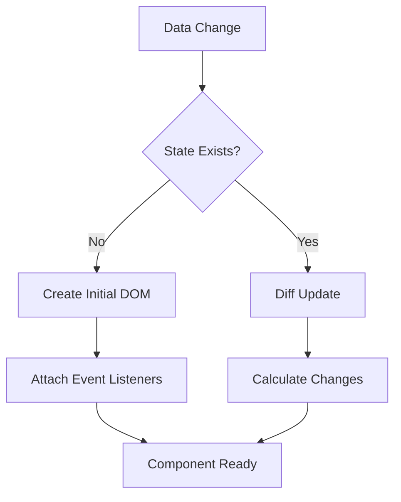
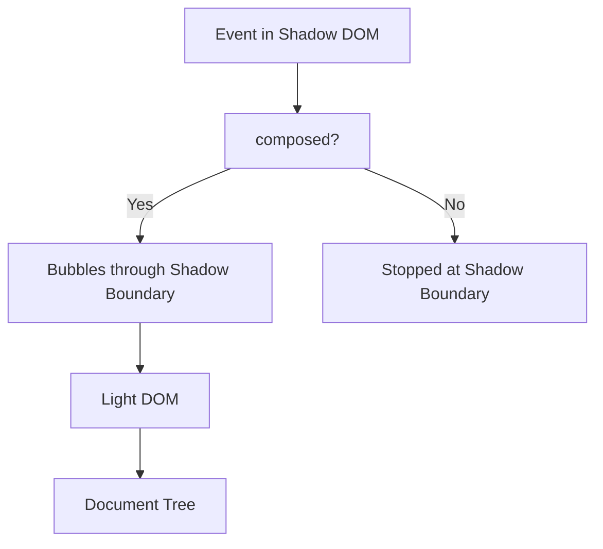

# DOM Manipulation Mastery

## OVERVIEW

DOM manipulation is fundamental to Web Components. Understanding how to efficiently create, modify, and query DOM nodes within custom elements enables you to build responsive, interactive components. This comprehensive guide covers all DOM operations relevant to Web Component development, from basic node creation to advanced mutation observation.

The Document Object Model (DOM) represents the web page as a tree of nodes. Custom elements interact with this tree through specific APIs that respect Shadow DOM boundaries. Mastering these interactions ensures your components perform well, maintain proper encapsulation, and integrate seamlessly with the broader page.

This guide provides detailed coverage of DOM manipulation patterns specifically applicable to Web Components, including Shadow DOM integration, efficient rendering strategies, and proper cleanup procedures.

## TECHNICAL SPECIFICATIONS

### DOM Tree Structure

Understanding the DOM tree is essential:

```
Document
├── <!DOCTYPE html>
├── <html>
│   ├── <head>
│   │   └── Various head elements
│   └── <body>
│       ├── Regular Elements
│       │   └── #shadowRoot (if mode: 'open')
│       │       ├── <template> (cloned)
│       │       └── <slot> (distributed content)
│       └── Custom Elements
│           ├── #shadowRoot
│           │   ├── Style elements
│           │   ├── Script elements
│           │   ├── Rendered content
│           │   └── Slot elements
│           └── Light DOM (distributed content)
```

### Node Types

All node types within the DOM:

| Node Type | Constant | Description |
|-----------|----------|-------------|
| Element | Node.ELEMENT_NODE | HTML/XML elements |
| Text | Node.TEXT_NODE | Text content |
| Comment | Node.COMMENT_NODE | HTML comments |
| Document | Node.DOCUMENT_NODE | The document |
| DocumentFragment | Node.DOCUMENT_FRAGMENT_NODE | Document fragments |
| ProcessingInstruction | Node.PROCESSING_INSTRUCTION_NODE | PI nodes |

### Common DOM Operations

```javascript
// Creating elements
const element = document.createElement('div');
element.className = 'container';
element.id = 'main';
element.setAttribute('data-value', 'test');
element.textContent = 'Hello World';

// Querying elements
const container = document.querySelector('.container');
const allItems = document.querySelectorAll('.item');
const byId = document.getElementById('main');
const children = container.children;
const childNodes = container.childNodes;

// Modifying elements
element.style.padding = '16px';
element.classList.add('active');
element.classList.remove('hidden');
element.classList.toggle('expanded');
element.setAttribute('role', 'button');

// Insertion
container.appendChild(element);
container.insertBefore(newElement, existingElement);
container.insertAdjacentHTML('beforeend', '<div>Content</div>');

// Removal
element.remove();
container.removeChild(child);
```

## IMPLEMENTATION DETAILS

### Within Shadow DOM

Shadow DOM creates isolated DOM trees:

```javascript
class ShadowDOMElement extends HTMLElement {
  constructor() {
    super();
    this.attachShadow({ mode: 'open' });
  }
  
  connectedCallback() {
    this.render();
  }
  
  // All DOM manipulation within shadowRoot
  render() {
    const container = document.createElement('div');
    container.className = 'component';
    container.innerHTML = `
      <style>${this.styles}</style>
      <div class="content">
        <button class="btn">Click Me</button>
      </div>
    `;
    
    this.shadowRoot.appendChild(container);
    
    // Query within shadowRoot
    const btn = this.shadowRoot.querySelector('.btn');
    btn.addEventListener('click', () => this.handleClick());
  }
  
  get styles() {
    return `
      <style>
        :host {
          display: block;
        }
        .btn {
          padding: 8px 16px;
          cursor: pointer;
        }
      </style>
    `;
  }
  
  handleClick() {
    console.log('Button clicked');
  }
}
customElements.define('shadow-element', ShadowDOMElement);
```

### Template Usage

Templates provide efficient DOM creation:

```javascript
class TemplateElement extends HTMLElement {
  constructor() {
    super();
    this.attachShadow({ mode: 'open' });
  }
  
  connectedCallback() {
    this.render();
  }
  
  render() {
    const template = this.getTemplate();
    const clone = template.content.cloneNode(true);
    this.shadowRoot.appendChild(clone);
    this.setupEvents();
  }
  
  getTemplate() {
    const template = document.getElementById('component-template');
    return template;
  }
  
  setupEvents() {
    const btn = this.shadowRoot.querySelector('.btn');
    btn.addEventListener('click', this.handleClick);
  }
  
  handleClick = () => {
    this.dispatchEvent(new CustomEvent('action', {
      bubbles: true,
      composed: true
    }));
  }
}
customElements.define('template-element', TemplateElement);
```

### Dynamic Content Generation

Creating dynamic content efficiently:

```javascript
class DynamicList extends HTMLElement {
  #items = [];
  #rendered = false;
  
  constructor() {
    super();
    this.attachShadow({ mode: 'open' });
  }
  
  static get observedAttributes() {
    return ['items'];
  }
  
  attributeChangedCallback(name, oldValue, newValue) {
    if (name === 'items') {
      this.#items = JSON.parse(newValue || '[]');
      this.render();
    }
  }
  
  connectedCallback() {
    this.render();
  }
  
  set items(value) {
    this.#items = value;
    this.render();
  }
  
  get items() {
    return this.#items;
  }
  
  render() {
    if (this.#rendered) {
      this.updateList();
    } else {
      this.createInitial();
      this.#rendered = true;
    }
  }
  
  createInitial() {
    this.shadowRoot.innerHTML = `
      <style>
        :host {
          display: block;
        }
        ul {
          list-style: none;
          padding: 0;
          margin: 0;
        }
        li {
          padding: 8px;
          border-bottom: 1px solid #eee;
        }
      </style>
      <ul class="list"></ul>
    `;
  }
  
  updateList() {
    const list = this.shadowRoot.querySelector('.list');
    list.innerHTML = '';
    
    const fragment = document.createDocumentFragment();
    
    for (const item of this.#items) {
      const li = document.createElement('li');
      li.textContent = item.label || item;
      if (item.value !== undefined) {
        li.dataset.value = item.value;
      }
      fragment.appendChild(li);
    }
    
    list.appendChild(fragment);
  }
}
customElements.define('dynamic-list', DynamicList);
```

## CODE EXAMPLES

### Efficient Re-rendering

Minimizing DOM operations:

```javascript
class EfficientList extends HTMLElement {
  #items = [];
  #itemElements = new Map();
  #initialized = false;
  
  set items(items) {
    const oldItems = this.#items;
    this.#items = items;
    
    if (!this.#initialized) {
      this.initialize();
    }
    
    this.#diffUpdate(items, oldItems);
  }
  
  get items() {
    return this.#items;
  }
  
  initialize() {
    this.shadowRoot.innerHTML = `
      <ul class="list"></ul>
    `;
    this.#initialized = true;
  }
  
  #diffUpdate(newItems, oldItems) {
    const list = this.shadowRoot.querySelector('.list');
    
    // Track current items
    const newIds = new Set(newItems.map(item => item.id));
    const oldIds = new Map(oldItems.map((item, index) => [item.id, index]));
    
    // Remove deleted items
    for (const [id, element] of this.#itemElements) {
      if (!newIds.has(id)) {
        element.remove();
        this.#itemElements.delete(id);
      }
    }
    
    // Add or update items
    const fragment = document.createDocumentFragment();
    
    newItems.forEach((item, index) => {
      let element = this.#itemElements.get(item.id);
      
      if (!element) {
        element = this.#createItemElement(item);
        this.#itemElements.set(item.id, element);
      } else {
        this.#updateItemElement(element, item);
      }
      
      fragment.appendChild(element);
    });
    
    list.appendChild(fragment);
  }
  
  #createItemElement(item) {
    const li = document.createElement('li');
    li.dataset.id = item.id;
    li.textContent = item.label;
    return li;
  }
  
  #updateItemElement(element, item) {
    element.textContent = item.label;
  }
}
```

### Mutation Observation

Monitoring DOM changes:

```javascript
class ObservableComponent extends HTMLElement {
  #observer = null;
  
  constructor() {
    super();
    this.attachShadow({ mode: 'open' });
  }
  
  connectedCallback() {
    this.setupObserver();
  }
  
  disconnectedCallback() {
    this.#observer?.disconnect();
  }
  
  setupObserver() {
    this.#observer = new MutationObserver(mutations => {
      for (const mutation of mutations) {
        this.handleMutation(mutation);
      }
    });
    
    this.#observer.observe(this, {
      attributes: true,
      childList: true,
      subtree: true,
      characterData: true
    });
  }
  
  handleMutation(mutation) {
    switch (mutation.type) {
      case 'attributes':
        console.log('Attribute changed:', mutation.attributeName);
        break;
      case 'childList':
        console.log('Children changed:', mutation.addedNodes.length, 'added,', 
                    mutation.removedNodes.length, 'removed');
        break;
      case 'characterData':
        console.log('Text content changed');
        break;
    }
  }
}
```

### Query Within Shadow DOM

Proper querying within Shadow boundaries:

```javascript
class QueryElement extends HTMLElement {
  #queryCache = new Map();
  
  constructor() {
    super();
    this.attachShadow({ mode: 'open' });
  }
  
  // Query single element
  $(selector) {
    return this.shadowRoot.querySelector(selector);
  }
  
  // Query all elements
  $$(selector) {
    return this.shadowRoot.querySelectorAll(selector);
  }
  
  // Cached queries
  $cached(selector, factory) {
    if (!this.#queryCache.has(selector)) {
      this.#queryCache.set(selector, factory());
    }
    return this.#queryCache.get(selector);
  }
  
  // Clear cache when needed
  invalidateCache() {
    this.#queryCache.clear();
  }
  
  // Usage example
  connectedCallback() {
    const container = this.$cached(
      '.container',
      () => this.shadowRoot.querySelector('.container')
    );
  }
}
```

### Event Delegation

Efficient event handling via delegation:

```javascript
class DelegateElement extends HTMLElement {
  constructor() {
    super();
    this.attachShadow({ mode: 'open' });
  }
  
  connectedCallback() {
    this.render();
    this.setupDelegation();
  }
  
  render() {
    this.shadowRoot.innerHTML = `
      <style>
        .item { padding: 8px; cursor: pointer; }
        .item:hover { background: #f5f5f5; }
      </style>
      <div class="items">
        ${Array(100).fill(0).map((_, i) => 
          `<div class="item" data-index="${i}">Item ${i}</div>`
        ).join('')}
      </div>
    `;
  }
  
  setupDelegation() {
    // Single listener for all items
    this.shadowRoot.addEventListener('click', this.#handleClick);
  }
  
  #handleClick = (event) => {
    const item = event.target.closest('.item');
    if (!item) return;
    
    const index = item.dataset.index;
    console.log('Clicked item:', index);
    
    this.dispatchEvent(new CustomEvent('item-click', {
      detail: { index },
      bubbles: true,
      composed: true
    }));
  }
  
  // Clean up delegate listener
  disconnectedCallback() {
    this.shadowRoot.removeEventListener('click', this.#handleClick);
  }
}
```

### Form Integration

DOM manipulation for form elements:

```javascript
class FormElement extends HTMLElement {
  static get formAssociated() {
    return true;
  }
  
  #internals = null;
  #elements = {};
  
  constructor() {
    super();
    this.attachShadow({ mode: 'open' });
  }
  
  connectedCallback() {
    this.#internals = this.attachInternals();
    this.render();
  }
  
  render() {
    this.shadowRoot.innerHTML = `
      <style>
        :host {
          display: block;
        }
        input {
          padding: 8px;
          border: 1px solid #ccc;
          border-radius: 4px;
        }
      </style>
      <div class="form-group">
        <label for="input">Label:</label>
        <input type="text" id="input" />
      </div>
    `;
    
    this.#elements.input = this.shadowRoot.getElementById('input');
    this.#elements.input.addEventListener('input', this.#handleInput);
    this.#elements.input.addEventListener('change', this.#handleChange);
  }
  
  #handleInput = (event) => {
    this.#internals.setFormValue(event.target.value);
  }
  
  #handleChange = (event) => {
    this.dispatchEvent(new Event('change', { bubbles: true }));
  }
  
  get value() {
    return this.#elements.input?.value || '';
  }
  
  set value(value) {
    if (this.#elements.input) {
      this.#elements.input.value = value;
      this.#internals.setFormValue(value);
    }
  }
  
  checkValidity() {
    return this.#elements.input?.checkValidity() || false;
  }
  
  get validity() {
    return this.#elements.input?.validity;
  }
}
customElements.define('form-element', FormElement);
```

## BEST PRACTICES

### Performance Optimization

Efficient DOM manipulation:

```javascript
// BAD: Multiple reflows
element.style.width = '100px';
element.style.height = '100px';
element.style.padding = '20px';

// GOOD: Batch styles
element.style.cssText = 'width: 100px; height: 100px; padding: 20px;';

// GOOD: Use CSS classes
element.classList.add('large', 'padded');

// BAD: Multiple appends
for (const item of items) {
  container.appendChild(createElement(item));
}

// GOOD: DocumentFragment
const fragment = document.createDocumentFragment();
for (const item of items) {
  fragment.appendChild(createElement(item));
}
container.appendChild(fragment);
```

### Style Manipulation

Efficient style changes:

```javascript
class StyleComponent extends HTMLElement {
  #computeStyles(element) {
    return window.getComputedStyle(element);
  }
  
  #setStyles(element, styles) {
    Object.assign(element.style, styles);
  }
  
  #toggleClass(element, className) {
    element.classList.toggle(className);
  }
  
  getStyleValue(element, property) {
    return this.#computeStyles(element).getPropertyValue(property);
  }
  
  // CSS Custom Properties
  setCSSVariable(name, value) {
    this.style.setProperty(name, value);
  }
  
  getCSSVariable(name) {
    return this.style.getPropertyValue(name);
  }
}
```

### DOM Cleanup

Proper cleanup on disconnect:

```javascript
class CleanComponent extends HTMLElement {
  #listeners = [];
  #observers = [];
  
  addEventListenerCompat(target, event, handler, options) {
    target.addEventListener(event, handler, options);
    this.#listeners.push({ target, event, handler, options });
  }
  
  setupObserver(target, callback) {
    const observer = new MutationObserver(callback);
    observer.observe(target, { childList: true, subtree: true });
    this.#observers.push(observer);
  }
  
  disconnectedCallback() {
    // Clean up event listeners
    for (const { target, event, handler, options } of this.#listeners) {
      target.removeEventListener(event, handler, options);
    }
    this.#listeners = [];
    
    // Clean up observers
    for (const observer of this.#observers) {
      observer.disconnect();
    }
    this.#observers = [];
  }
}
```

## ACCESSIBILITY

### DOM Accessibility Tree

Ensuring accessibility:

```javascript
class AccessibleComponent extends HTMLElement {
  #elements = {};
  
  render() {
    this.shadowRoot.innerHTML = `
      <button role="button" aria-pressed="false" tabindex="0">
        <slot></slot>
      </button>
    `;
    
    const button = this.shadowRoot.querySelector('button');
    this.#elements.button = button;
    
    button.addEventListener('click', this.#handleClick);
    button.addEventListener('keydown', this.#handleKeydown);
  }
  
  #handleClick = () => {
    this.toggle();
  }
  
  #handleKeydown = (event) => {
    if (event.key === ' ' || event.key === 'Enter') {
      event.preventDefault();
      this.toggle();
    }
  }
  
  toggle() {
    const pressed = this.#elements.button.getAttribute('aria-pressed') === 'true';
    this.#elements.button.setAttribute('aria-pressed', !pressed);
  }
}
```

## FLOW CHARTS

### Rendering Flow



### Event Bubble Flow



## EXTERNAL RESOURCES

- [DOM Standard](https://dom.spec.whatwg.org/)
- [MDN DOM Reference](https://developer.mozilla.org/en-US/docs/Web/API/Document_Object_Model)
- [Shadow DOM Specification](https://www.w3.org/TR/shadow-dom/)

## NEXT STEPS

Proceed to:

1. **01_6_ES-Modules-Deep-Dive** - Module system for components
2. **02_Custom-Elements/02_1_Creating-Your-First-Custom-Element** - First custom element
3. **04_Shadow-DOM/04_1-Shadow-DOM-CRA-Guide** - Shadow DOM integration