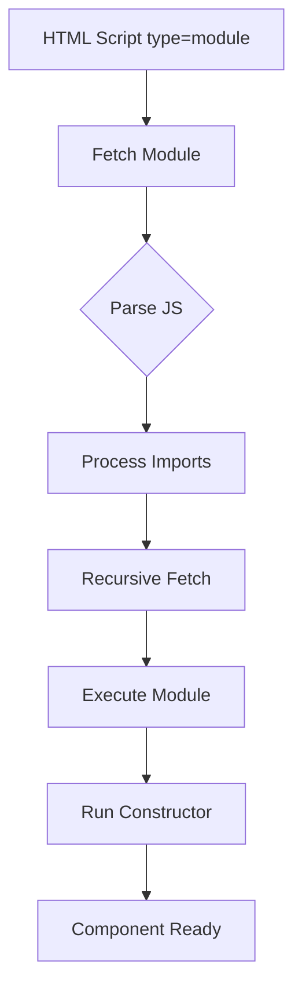
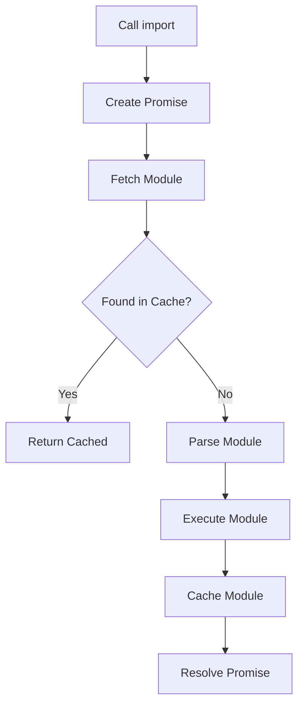

# ES Modules Deep Dive

## OVERVIEW

ES Modules are the standard module system for JavaScript and provide the foundation for organizing, loading, and sharing code in Web Components applications. Understanding ES Modules enables you to create maintainable component architectures, implement lazy loading, and build scalable component libraries that work across browsers and build tools.

The module system provides explicit dependency management, namespace isolation, and tree-shaking optimization capabilities. These features are essential for building production-ready Web Components that remain performant as applications grow in complexity.

This comprehensive guide covers ES Module syntax, loading strategies, dynamic imports, circular dependency handling, and best practices specific to Web Component development.

## TECHNICAL SPECIFICATIONS

### Module Syntax

ES Modules use export and import statements:

```javascript
// Named exports
export const COMPONENT_VERSION = '1.0.0';
export const DEFAULT_STYLES = ':host { display: block; }';

export class ComponentBase extends HTMLElement {}
export function createTemplate(content) {}

// Default export
export default class MyComponent extends HTMLElement {}

// Re-exporting
export { ComponentBase as Base } from './base.js';
export * from './utils.js';
```

### Import Patterns

```javascript
// Named imports
import { ComponentBase, createTemplate } from './base.js';
import { DEFAULT_STYLES as STYLES } from './styles.js';

// Default import
import MyComponent from './component.js';

// Namespace import
import * as Components from './index.js';

// Dynamic import
const module = await import('./component.js');
const Component = module.default;

// Import for side effects only
import './polyfills.js';
```

### Module Resolution

Module specifier resolution follows these patterns:

| Type | Example | Resolution |
|------|---------|------------|
| Relative | `./component.js` | Relative to current file |
| Absolute | `/js/component.js` | From server root |
| Bare | `lit` | Node module (requires resolver) |
| Data URL | `data:text/javascript,...` | Inline code |

## IMPLEMENTATION DETAILS

### Component as Module

Structuring components as ES modules:

```javascript
// my-component.js
import { BaseComponent } from './base-component.js';
import { template } from './template.js';
import { styles } from './styles.js';

export class MyComponent extends BaseComponent {
  static get is() { return 'my-component'; }
  
  static get observedAttributes() {
    return ['disabled', 'variant'];
  }
  
  constructor() {
    super();
    this.attachShadow({ mode: 'open' });
  }
  
  connectedCallback() {
    super.connectedCallback();
    this.render();
  }
  
  render() {
    this.shadowRoot.innerHTML = `
      ${styles}
      ${template}
    `;
  }
  
  // Component-specific methods
  handleClick(event) {
    this.dispatchEvent(new CustomEvent('component-click', {
      detail: { originalEvent: event },
      bubbles: true,
      composed: true
    }));
  }
}

// Define element when module loads
customElements.define(MyComponent.is, MyComponent);

export default MyComponent;
```

### Lazy Loading Components

Dynamic imports for code splitting:

```javascript
class LazyLoader extends HTMLElement {
  #loaded = false;
  #ComponentClass = null;
  
  static get observedAttributes() {
    return ['src'];
  }
  
  async attributeChangedCallback(name, oldValue, newValue) {
    if (name === 'src' && newValue) {
      await this.#loadComponent(newValue);
    }
  }
  
  async #loadComponent(src) {
    if (this.#loaded) return;
    
    try {
      const module = await import(src);
      this.#ComponentClass = module.default || module;
      this.#loaded = true;
      
      if (this.isConnected) {
        this.#render();
      }
    } catch (error) {
      console.error('Failed to load component:', error);
      this.#renderError(error);
    }
  }
  
  #render() {
    if (!this.#ComponentClass) return;
    
    const element = new this.#ComponentClass();
    this.shadowRoot.appendChild(element);
  }
  
  #renderError(error) {
    this.shadowRoot.innerHTML = `<p>Error: ${error.message}</p>`;
  }
}
```

### Module Caching and Reuse

Managing module instances:

```javascript
const moduleCache = new Map();

export function getCachedModule(src) {
  if (moduleCache.has(src)) {
    return moduleCache.get(src);
  }
  
  return import(src).then(module => {
    moduleCache.set(src, module);
    return module;
  });
}

export function clearCache() {
  moduleCache.clear();
}

// Module registry for component definitions
const componentRegistry = new Map();

export function registerComponent(name, moduleSrc) {
  return getCachedModule(moduleSrc).then(module => {
    const ComponentClass = module.default || module;
    if (!customElements.get(name)) {
      customElements.define(name, ComponentClass);
    }
    componentRegistry.set(name, ComponentClass);
    return ComponentClass;
  });
}
```

## CODE EXAMPLES

### Re-exports Pattern

Creating component library index:

```javascript
// components/index.js - Library entry point

// Export all components
export { ButtonComponent } from './button.js';
export { InputComponent } from './input.js';
export { CardComponent } from './card.js';
export { ModalComponent } from './modal.js';

// Re-export with new names
export { ButtonComponent as Button } from './button.js';
export { InputComponent as Input } from './input.js';

// Export utilities
export { createStyleSheet, mergeStyles } from './utils/styles.js';
export { createTemplate } from './utils/template.js';

// Export types (for TypeScript)
export type { ComponentConfig, StyleConfig } from './types.js';
```

### Base Component Pattern

Shared component foundation:

```javascript
// base-component.js
export class BaseComponent extends HTMLElement {
  constructor() {
    super();
    this.attachShadow({ mode: 'open' });
  }
  
  static get is() {
    return this.name.replace(/([A-Z])/g, '-$1').toLowerCase();
  }
  
  static get observedAttributes() {
    return [];
  }
  
  connectedCallback() {
    this.render();
    this.setupEventListeners();
  }
  
  disconnectedCallback() {
    this.cleanupEventListeners();
  }
  
  attributeChangedCallback(name, oldValue, newValue) {
    if (oldValue !== newValue) {
      this.onAttributeChanged(name, oldValue, newValue);
    }
  }
  
  // Override these in subclasses
  render() {}
  setupEventListeners() {}
  cleanupEventListeners() {}
  onAttributeChanged(name, oldValue, newValue) {}
  
  // Utility methods
  $(selector) {
    return this.shadowRoot.querySelector(selector);
  }
  
  $$(selector) {
    return this.shadowRoot.querySelectorAll(selector);
  }
  
  dispatch(name, detail = {}) {
    this.dispatchEvent(new CustomEvent(name, {
      detail,
      bubbles: true,
      composed: true
    }));
  }
}
```

### Module Composition

Building complex components from smaller modules:

```javascript
// complex-component.js
import { BaseComponent } from './base-component.js';
import { template } from './template.js';
import { styles } from './styles.js';
import { formMixin } from './mixins/form-mixin.js';
import { validationMixin } from './mixins/validation-mixin.js';

// Apply multiple mixins
class ComplexComponent extends validationMixin(formMixin(BaseComponent)) {
  static get is() { return 'complex-component'; }
  
  constructor() {
    super();
    this.#initializeState();
  }
  
  #initializeState() {
    this._state = {
      loading: false,
      error: null,
      data: null
    };
  }
  
  render() {
    this.shadowRoot.innerHTML = `
      ${styles}
      ${template}
    `;
  }
  
  // Component-specific functionality
  async loadData(url) {
    this._state.loading = true;
    this.render();
    
    try {
      const response = await fetch(url);
      const data = await response.json();
      this._state.data = data;
      this._state.error = null;
    } catch (error) {
      this._state.error = error.message;
    } finally {
      this._state.loading = false;
      this.render();
    }
  }
}
```

### Dynamic Module Loading

Runtime module loading based on conditions:

```javascript
class DynamicLoader extends HTMLElement {
  static get observedAttributes() {
    return ['component', 'variant'];
  }
  
  #componentMap = new Map();
  
  constructor() {
    super();
    this.attachShadow({ mode: 'open' });
  }
  
  // Register component mappings
  registerComponent(componentName, modulePath, variant = 'default') {
    const key = `${componentName}:${variant}`;
    this.#componentMap.set(key, modulePath);
  }
  
  async attributeChangedCallback(name, oldValue, newValue) {
    if (name === 'component' || name === 'variant') {
      await this.#loadComponent();
    }
  }
  
  async #loadComponent() {
    const component = this.getAttribute('component');
    const variant = this.getAttribute('variant') || 'default';
    
    if (!component) return;
    
    const key = `${component}:${variant}`;
    const modulePath = this.#componentMap.get(key) || `./components/${component}.js`;
    
    try {
      const module = await import(modulePath);
      const ComponentClass = module.default || module;
      
      // Clean up existing
      this.shadowRoot.innerHTML = '';
      
      // Create new instance
      const instance = new ComponentClass();
      this.shadowRoot.appendChild(instance);
    } catch (error) {
      console.error(`Failed to load ${component}:`, error);
    }
  }
}
```

### Circular Dependency Handling

Managing circular references:

```javascript
// a.js
import { bValue } from './b.js';

export const aValue = 'A';

export function getValue() {
  return `A: ${bValue}`;
}

// Export before import to avoid issues
export class ClassA {
  constructor() {
    this.bClass = null;
  }
  
  setB(b) {
    this.bClass = b;
  }
}

// b.js - Using function to defer evaluation
import { aValue } from './a.js';

export const bValue = 'B';

export function getValue() {
  return `B: ${aValue}`;
}

// Better pattern: use getter functions
// a.js
let bModule = null;

export function getBModule() {
  if (!bModule) {
    bModule = import('./b.js');
  }
  return bModule;
}

// Usage in component
async function getDependentData() {
  const b = await getBModule();
  return b.processData();
}
```

## BEST PRACTICES

### Export Organization

Clear export patterns:

```javascript
// GOOD: Explicit named exports
export class ButtonComponent extends HTMLElement {}
export class InputComponent extends HTMLElement {}
export const BUTTON_VARIANTS = ['primary', 'secondary', 'danger'];

// GOOD: Single default export for components
export default class MyComponent extends HTMLElement {}

// BAD: Mixing default and named without clear pattern
export default class Component1 {}
export class Component2 {}  // Confusing without clear convention
```

### Relative Path Conventions

Consistent import paths:

```javascript
// From: components/button/button.js
// To: components/utils/helpers.js

// Good: Clear relative path
import { formatDate } from '../../utils/helpers.js';

// Good: Named index import
import { formatDate } from '../../utils/index.js';

// Avoid: Deep relative paths (use index files)
import { formatDate } from '../../../../utils/helpers.js';
```

### Module Size Optimization

Tree-shaking friendly patterns:

```javascript
// GOOD: Export small, focused modules
// utils/date.js
export function formatDate(date) { return date.toLocaleDateString(); }
export function parseDate(str) { return new Date(str); }

// GOOD: Side-effect-free functions for tree shaking
export const styles = ':host { display: block; }';  // Static, can be tree-shaken

// GOOD: Factory functions instead of heavy classes
export function createComponent(config) {
  return class extends HTMLElement {
    // Lightweight component based on config
  };
}

// BAD: Large monolithic exports
export default class HugeComponent { /* thousands of lines */ }
```

## PERFORMANCE CONSIDERATIONS

### Module Loading Performance

```javascript
// Preload critical modules
<link rel="modulepreload" href="./components/button.js">

// Use import maps for clean dependency management
<script type="importmap">
{
  "imports": {
    "lit": "https://cdn.jsdelivr.net/npm/lit@3/+esm",
    "lit/": "https://cdn.jsdelivr.net/npm/lit@3/",
    "@components/": "./components/"
  }
}
</script>

// Use for efficient module loading
import { Button } from '@components/button.js';
```

### Bundling Strategy

```javascript
// Webpack/Rollup configuration considerations

// Keep components as separate entry points for code splitting
// webpack.config.js
module.exports = {
  entry: {
    'button': './components/button.js',
    'input': './components/input.js',
    'app': './app.js'
  },
  optimization: {
    splitChunks: {
      chunks: 'all',
      cacheGroups: {
        vendor: {
          test: /[\\/]node_modules[\\/]/,
          name: 'vendors',
          chunks: 'all'
        }
      }
    }
  }
};
```

## BROWSER COMPATIBILITY

### ES Modules in Browsers

| Browser | Version | Module Support |
|---------|---------|---------------|
| Chrome | 61+ | Full |
| Firefox | 60+ | Full |
| Safari | 11+ | Full |
| Edge | 16+ | Full |
| IE | N/A | Not supported |

### Fallback Patterns

```javascript
// Dynamic import as feature detection
async function loadModule() {
  if (typeof import === 'undefined') {
    // Load UMD fallback
    return loadScriptFallback();
  }
  return import('./module.js');
}

function loadScriptFallback() {
  return new Promise((resolve, reject) => {
    const script = document.createElement('script');
    script.src = './module.umd.js';
    script.onload = () => resolve(window.Module);
    script.onerror = reject;
    document.head.appendChild(script);
  });
}
```

## FLOW CHARTS

### Module Loading Flow



### Dynamic Import Flow



## EXTERNAL RESOURCES

- [ES Modules Specification](https://tc39.es/ecma262/#sec-modules)
- [MDN ES Modules](https://developer.mozilla.org/en-US/docs/Web/JavaScript/Guide/Modules)
- [Node.js ES Modules](https://nodejs.org/api/esm.html)

## NEXT STEPS

Proceed to:

1. **02_Custom-Elements/02_1_Creating-Your-First-Custom-Element** - Start building elements
2. **02_Custom-Elements/02_2_Lifecycle-Callbacks-Mastery** - Lifecycle deep dive
3. **12_Tooling/12_1_Build-Tool-Integration** - Setting up build tools