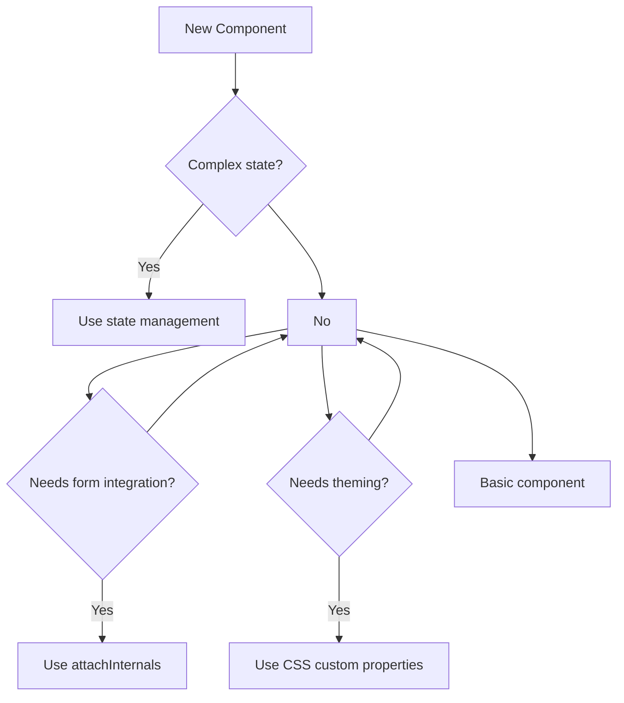

# Web Component Best Practices

## OVERVIEW

This comprehensive guide covers essential best practices for building production-ready Web Components. These guidelines ensure your components are maintainable, performant, accessible, and work seamlessly across frameworks and browsers.

## TECHNICAL SPECIFICATIONS

### Core Principles

| Principle | Description |
|-----------|-------------|
| Single Responsibility | Each component does one thing well |
| Encapsulation | Internal implementation is hidden |
| Interoperability | Works with any framework or vanilla JS |
| Accessibility | Usable by everyone, including assistive technology users |
| Performance | Fast load and interaction times |
| Maintainability | Clear API, documentation, and testability |

### Naming Conventions

```javascript
// Custom element names MUST contain a hyphen
// ✓ Good names
custom-button
app-card
data-grid
product-list-item

// ✗ Bad names
button        // Too generic, no hyphen
myelement     // Missing hyphen
DataGrid      // Case sensitive, must be lowercase

// Component class naming
class MyButton extends HTMLElement {}
class ProductCard extends HTMLElement {}
class UserProfile extends HTMLElement {}

// Prefix with organization/component library name
class AcmeButton extends HTMLElement {}
class AcmeCard extends HTMLElement {}
```

## IMPLEMENTATION DETAILS

### Constructor Best Practices

```javascript
class BestPracticeElement extends HTMLElement {
  constructor() {
    // ALWAYS call super() first
    super();
    
    // Attach shadow DOM for encapsulation
    this.attachShadow({ mode: 'open' });
    
    // Initialize private state
    this._initialized = false;
    this._data = null;
    
    // Bind methods for event handlers
    this._handleClick = this._handleClick.bind(this);
  }
}
```

### Connected Callback Best Practices

```javascript
class ProperConnectedElement extends HTMLElement {
  #rendered = false;
  
  connectedCallback() {
    // Avoid double initialization
    if (this.#rendered) return;
    
    this.render();
    this.attachEventListeners();
    this.setupObservers();
    
    this.#rendered = true;
  }
  
  // Always implement disconnectedCallback for cleanup
  disconnectedCallback() {
    this.cleanupEventListeners();
    this.cleanupObservers();
    this.cleanupTimers();
  }
}
```

### Property and Attribute Synchronization

```javascript
class SyncElement extends HTMLElement {
  static get observedAttributes() {
    return ['value', 'disabled', 'variant'];
  }
  
  // Property getter/setter for complex values
  get value() { return this._value; }
  set value(val) {
    this._value = val;
    // Reflect to attribute for HTML serialization
    this.setAttribute('value', val);
    this.requestUpdate();
  }
  
  // Handle attribute changes
  attributeChangedCallback(name, oldVal, newVal) {
    if (oldVal === newVal) return;
    
    // Sync attribute to property
    if (name === 'value') {
      this._value = newVal;
    }
    
    // Trigger re-render if needed
    this.requestUpdate();
  }
}
```

## CODE EXAMPLES

### Standard Example: Well-Structured Component

```javascript
/**
 * A well-structured custom button component
 * Follows all best practices for production use
 */
class BestButton extends HTMLElement {
  // Static properties for configuration
  static get observedAttributes() {
    return ['variant', 'size', 'disabled', 'loading'];
  }
  
  static get formAssociated() {
    return true;  // Enable form integration
  }
  
  // Private fields for true encapsulation
  #internals = null;
  #shadowRoot = null;
  #cleanupFns = [];
  
  constructor() {
    super();
    
    // Create shadow DOM in open mode for debugging
    this.#shadowRoot = this.attachShadow({ mode: 'open' });
    
    // Initialize state
    this._variant = 'primary';
    this._size = 'medium';
    this._disabled = false;
    this._loading = false;
  }
  
  /**
   * Lifecycle: Called when element is added to DOM
   */
  connectedCallback() {
    this._parseAttributes();
    this._initFormInternals();
    this.render();
    this._bindEvents();
    
    console.log('[BestButton] Connected to DOM');
  }
  
  /**
   * Lifecycle: Called when element is removed from DOM
   * MUST implement for proper cleanup
   */
  disconnectedCallback() {
    // Run all cleanup functions
    this.#cleanupFns.forEach(fn => fn());
    this.#cleanupFns = [];
    
    console.log('[BestButton] Disconnected from DOM');
  }
  
  /**
   * Parse initial attributes
   */
  _parseAttributes() {
    this._variant = this.getAttribute('variant') || 'primary';
    this._size = this.getAttribute('size') || 'medium';
    this._disabled = this.hasAttribute('disabled');
    this._loading = this.hasAttribute('loading');
  }
  
  /**
   * Initialize form integration
   */
  _initFormInternals() {
    if (this.attachInternals) {
      this.#internals = this.attachInternals();
    }
  }
  
  /**
   * Render the component
   */
  render() {
    this.#shadowRoot.innerHTML = `
      <style>${this.styles}</style>
      <button 
        part="button"
        class="button ${this._variant} ${this._size}"
        ?disabled="${this._disabled || this._loading}"
      >
        ${this._loading ? this._loadingSpinner : ''}
        <span class="content"><slot></slot></span>
      </button>
    `;
  }
  
  /**
   * Component styles using CSS custom properties
   */
  get styles() {
    return `
      <style>
        :host {
          display: inline-block;
          --button-bg: #007bff;
          --button-color: white;
          --button-padding: 8px 16px;
        }
        
        .button {
          display: inline-flex;
          align-items: center;
          justify-content: center;
          gap: 8px;
          padding: var(--button-padding);
          border: none;
          border-radius: 4px;
          background: var(--button-bg);
          color: var(--button-color);
          cursor: pointer;
          font-family: inherit;
          font-size: 14px;
          transition: opacity 0.2s, transform 0.1s;
        }
        
        .button:hover:not(:disabled) {
          opacity: 0.9;
        }
        
        .button:active:not(:disabled) {
          transform: scale(0.98);
        }
        
        .button:disabled {
          opacity: 0.5;
          cursor: not-allowed;
        }
        
        .primary { --button-bg: #007bff; }
        .secondary { --button-bg: #6c757d; }
        .success { --button-bg: #28a745; }
        .danger { --button-bg: #dc3545; }
        
        .small { --button-padding: 4px 8px; font-size: 12px; }
        .large { --button-padding: 12px 24px; font-size: 16px; }
      </style>
    `;
  }
  
  /**
   * Get loading spinner HTML
   */
  get _loadingSpinner() {
    return '<span class="spinner">⏳</span>';
  }
  
  /**
   * Bind event handlers
   */
  _bindEvents() {
    const button = this.#shadowRoot.querySelector('button');
    
    const clickHandler = (e) => {
      if (this._disabled || this._loading) return;
      
      // Dispatch custom event for framework integration
      this.dispatchEvent(new CustomEvent('button-click', {
        bubbles: true,
        composed: true,
        detail: { originalEvent: e }
      }));
    };
    
    button.addEventListener('click', clickHandler);
    
    // Store for cleanup
    this.#cleanupFns.push(() => {
      button.removeEventListener('click', clickHandler);
    });
  }
  
  /**
   * Public API
   */
  get variant() { return this._variant; }
  set variant(val) { this.setAttribute('variant', val); }
  
  get size() { return this._size; }
  set size(val) { this.setAttribute('size', val); }
  
  get disabled() { return this._disabled; }
  set disabled(val) {
    if (val) {
      this.setAttribute('disabled', '');
    } else {
      this.removeAttribute('disabled');
    }
  }
  
  // Form integration API
  get form() { return this.#internals?.form; }
  get validity() { return this.#internals?.validity; }
  checkValidity() { return this.#internals?.checkValidity() ?? true; }
}

customElements.define('best-button', BestButton);
```

### Real-World Example: Enterprise Component Library

```javascript
/**
 * Enterprise-ready input component with:
 * - Full form integration
 * - Validation support
 * - Accessibility compliance
 * - Theming support
 * - Internationalization
 */
class EnterpriseInput extends HTMLElement {
  static get formAssociated() { return true; }
  static get observedAttributes() {
    return ['label', 'placeholder', 'type', 'required', 'disabled', 'error', 'hint'];
  }
  
  #internals = null;
  #input = null;
  #label = null;
  #error = null;
  #hint = null;
  
  constructor() {
    super();
    this.attachShadow({ mode: 'open' });
    
    // Private state
    this._value = '';
    this._touched = false;
    this._valid = true;
    this._validator = null;
  }
  
  connectedCallback() {
    this.#internals = this.attachInternals();
    this.render();
    this._bindEvents();
    this._setupValidation();
  }
  
  disconnectedCallback() {
    this._cleanup();
  }
  
  render() {
    const label = this.getAttribute('label') || '';
    const type = this.getAttribute('type') || 'text';
    const placeholder = this.getAttribute('placeholder') || '';
    const required = this.hasAttribute('required');
    const disabled = this.hasAttribute('disabled');
    const error = this.getAttribute('error') || '';
    const hint = this.getAttribute('hint') || '';
    
    this.shadowRoot.innerHTML = `
      <style>
        ${this.styles}
      </style>
      <div class="input-wrapper">
        ${label ? `<label class="label">${label}${required ? ' *' : ''}</label>` : ''}
        <input
          part="input"
          class="input ${error ? 'has-error' : ''}"
          type="${type}"
          placeholder="${placeholder}"
          ?required="${required}"
          ?disabled="${disabled}"
          aria-invalid="${!!error}"
          aria-describedby="${error ? 'error' : hint ? 'hint' : ''}"
        />
        ${hint ? `<div id="hint" class="hint">${hint}</div>` : ''}
        ${error ? `<div id="error" class="error" role="alert">${error}</div>` : ''}
      </div>
    `;
    
    this.#input = this.shadowRoot.querySelector('input');
    this.#label = this.shadowRoot.querySelector('.label');
    this.#error = this.shadowRoot.querySelector('.error');
    this.#hint = this.shadowRoot.querySelector('.hint');
  }
  
  get styles() {
    return `
      :host {
        display: block;
        --input-border: #ccc;
        --input-focus: #007bff;
        --error-color: #dc3545;
        --hint-color: #6c757d;
      }
      
      .input-wrapper {
        display: flex;
        flex-direction: column;
        gap: 4px;
      }
      
      .label {
        font-size: 14px;
        font-weight: 500;
        color: #333;
      }
      
      .input {
        padding: 8px 12px;
        border: 1px solid var(--input-border);
        border-radius: 4px;
        font-size: 14px;
        font-family: inherit;
        transition: border-color 0.2s, box-shadow 0.2s;
      }
      
      .input:focus {
        outline: none;
        border-color: var(--input-focus);
        box-shadow: 0 0 0 2px rgba(0, 123, 255, 0.25);
      }
      
      .input.has-error {
        border-color: var(--error-color);
      }
      
      .input:disabled {
        background: #f5f5f5;
        cursor: not-allowed;
      }
      
      .hint {
        font-size: 12px;
        color: var(--hint-color);
      }
      
      .error {
        font-size: 12px;
        color: var(--error-color);
      }
    `;
  }
  
  _bindEvents() {
    if (!this.#input) return;
    
    const inputHandler = (e) => {
      this._value = e.target.value;
      this.#internals.setFormValue(this._value);
      this._validate();
      this.dispatchEvent(new Event('input', { bubbles: true }));
    };
    
    const blurHandler = () => {
      this._touched = true;
      this._validate();
    };
    
    this.#input.addEventListener('input', inputHandler);
    this.#input.addEventListener('blur', blurHandler);
    
    this._cleanupFns = [
      () => this.#input?.removeEventListener('input', inputHandler),
      () => this.#input?.removeEventListener('blur', blurHandler)
    ];
  }
  
  _setupValidation() {
    // Custom validation can be added via method
  }
  
  _validate() {
    const value = this._value;
    let valid = true;
    let message = '';
    
    // Required check
    if (this.hasAttribute('required') && !value) {
      valid = false;
      message = 'This field is required';
    }
    
    // Custom validator
    if (this._validator && valid) {
      const result = this._validator(value);
      valid = result.valid;
      message = result.message;
    }
    
    this._valid = valid;
    
    // Update internals
    this.#internals.setValidity(
      valid ? {} : { customError: true },
      message,
      this.#input
    );
    
    // Update error display
    if (this._touched || message) {
      this.setAttribute('error', message);
    }
  }
  
  _cleanup() {
    this._cleanupFns?.forEach(fn => fn());
  }
  
  // Public API
  get value() { return this._value; }
  set value(val) {
    this._value = val;
    if (this.#input) this.#input.value = val;
    this.#internals?.setFormValue(val);
  }
  
  get validity() { return this.#internals?.validity; }
  checkValidity() { return this.#internals?.checkValidity() ?? false; }
  reportValidity() { return this.#internals?.reportValidity() ?? false; }
  
  setValidator(fn) {
    this._validator = fn;
  }
}

customElements.define('enterprise-input', EnterpriseInput);
```

## BEST PRACTICES

### Performance Best Practices

```javascript
class PerfOptimizedComponent extends HTMLElement {
  // ✓ Use static templates - parsed once
  static #template = null;
  
  static get template() {
    if (!PerfOptimizedComponent.#template) {
      const t = document.createElement('template');
      t.innerHTML = '<div class="content"><slot></slot></div>';
      PerfOptimizedComponent.#template = t;
    }
    return PerfOptimizedComponent.#template;
  }
  
  // ✓ Use requestAnimationFrame for visual updates
  requestUpdate() {
    if (this._pendingUpdate) return;
    this._pendingUpdate = true;
    requestAnimationFrame(() => {
      this._pendingUpdate = false;
      this.render();
    });
  }
  
  // ✓ Use DocumentFragment for batch DOM operations
  updateList(items) {
    const fragment = document.createDocumentFragment();
    items.forEach(item => {
      const div = document.createElement('div');
      div.textContent = item;
      fragment.appendChild(div);
    });
    this.shadowRoot.appendChild(fragment);
  }
  
  // ✓ Debounce rapid changes
  #debounceTimer = null;
  debounce(fn, delay = 300) {
    clearTimeout(this.#debounceTimer);
    this.#debounceTimer = setTimeout(fn, delay);
  }
}
```

### Accessibility Best Practices

```javascript
class AccessibleComponent extends HTMLElement {
  render() {
    // ✓ Use semantic HTML
    // ✓ Add ARIA attributes
    // ✓ Ensure keyboard navigation
    // ✓ Provide alternative text
    this.shadowRoot.innerHTML = `
      <button 
        role="button"
        aria-pressed="false"
        tabindex="0"
        aria-label="Toggle feature"
      >
        <slot></slot>
      </button>
    `;
  }
  
  // Handle keyboard events
  _handleKeydown(e) {
    if (e.key === 'Enter' || e.key === ' ') {
      e.preventDefault();
      this._toggle();
    }
  }
}
```

### Security Best Practices

```javascript
class SecureComponent extends HTMLElement {
  // ✗ NEVER use innerHTML with user input without sanitization
  setUserContent(content) {
    // ✓ Use textContent for plain text
    const div = document.createElement('div');
    div.textContent = content;
    this.shadowRoot.appendChild(div);
  }
  
  // If HTML is needed, use a sanitizer
  setSafeHTML(html) {
    const sanitized = this._sanitize(html);
    this.shadowRoot.innerHTML = sanitized;
  }
  
  _sanitize(html) {
    // Use DOMPurify or similar library in production
    const div = document.createElement('div');
    div.textContent = html;
    return div.innerHTML;
  }
}
```

## PERFORMANCE CONSIDERATIONS

| Practice | Impact | Recommendation |
|----------|--------|----------------|
| Static templates | High | Always use static template with class property |
| Lazy loading | High | Load heavy components on demand |
| Event delegation | Medium | Use single listener for multiple elements |
| CSS containment | Medium | Use `contain: content` for isolated components |
| requestAnimationFrame | Medium | Batch visual updates |

## ACCESSIBILITY GUIDE

### Checklist

- [ ] All interactive elements are keyboard accessible
- [ ] ARIA attributes correctly describe component state
- [ ] Focus management is handled properly
- [ ] Color contrast meets WCAG 2.1 AA standards
- [ ] Screen reader announcements for dynamic content
- [ ] Form elements have associated labels

### Testing Accessibility

```javascript
// Test with keyboard only
element.focus();
element.dispatchEvent(new KeyboardEvent('keydown', { key: 'Enter' }));

// Test with screen reader
// Use a11y testing tools like axe-core
import { runAxe } from '@axe-core/web-components';

const results = await runAxe(element);
console.log(results.violations);
```

## CROSS-BROWSER COMPATIBILITY

```javascript
class CrossBrowserComponent extends HTMLElement {
  constructor() {
    super();
    
    // Feature detection for Shadow DOM
    if (this.attachShadow) {
      this.attachShadow({ mode: 'open' });
    } else {
      // Fallback for older browsers
      this.createShadowRoot();
    }
  }
  
  // Check for Custom Elements support
  static get observedAttributes() {
    return customElements ? ['value'] : [];
  }
}
```

## FLOW CHARTS

### Component Lifecycle Best Practices

```mermaid
graph TD
    A[Create Element] --> B[constructor]
    B --> C[super() called]
    C --> D[attachShadow]
    D --> E[connectedCallback]
    E --> F{Already initialized?}
    F -->|Yes| G[Skip render]
    F -->No --> H[Parse attributes]
    H --> I[Render]
    I --> J[Bind events]
    J --> K[Element ready]
    K --> L[Attribute changes]
    L --> M[disconnectedCallback]
    M --> N[Cleanup all resources]
```

### Best Practices Decision Flow



## EXTERNAL RESOURCES

- [MDN Web Components Guide](https://developer.mozilla.org/en-US/docs/Web/Web_Components)
- [Web Components.org](https://www.webcomponents.org/)
- [Custom Elements Specification](https://html.spec.whatwg.org/multipage/custom-elements.html)
- [Chrome DevTools: Debug Shadow DOM](https://developer.chrome.com/docs/devtools)
- [WCAG 2.1 Guidelines](https://www.w3.org/WAI/WCAG21/quickref/)

## NEXT STEPS

- Review `02_Custom-Elements/02_2_Lifecycle-Callbacks-Mastery` for detailed lifecycle
- Explore `10_Advanced-Patterns/10_3_Testing-Framework-Integration` for testing
- Check `09_Performance/09_1_Bundle-Size-Optimization` for optimization tips