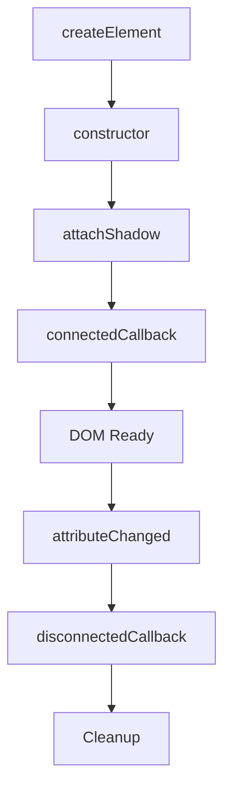
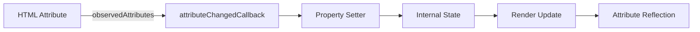

# Creating Your First Custom Element

## OVERVIEW

Creating your first custom element is the gateway to the Web Components ecosystem. This comprehensive guide walks through the complete process of defining, implementing, and using custom elements. By the end, you will have a working understanding of how to build reusable components that integrate seamlessly with HTML and other components.

Custom elements extend the HTML vocabulary by allowing developers to create new tag names with custom behavior. This capability transforms web development from page-centric to component-centric architecture, enabling true component reusability across projects and frameworks.

This guide provides a structured, progressive approach from basic element creation to advanced patterns. Each section builds upon the previous, ensuring solid understanding before moving to more complex topics.

## TECHNICAL SPECIFICATIONS

### Custom Element Requirements

Custom elements have specific requirements for valid registration:

1. **Tag Name Requirements:**
   - Must contain a hyphen (-)
   - Cannot be single words like `button` or `div`
   - Must be lowercase
   - Cannot be reserved names

2. **Valid Examples:**
   - `my-element` ✓
   - `app-button` ✓
   - `custom-input` ✓
   - `myelement` ✗ (no hyphen)
   - `Button` ✗ (uppercase)
   - `div` ✗ (reserved)

### Class Definition Requirements

Custom elements must extend HTMLElement:

```javascript
// Valid base classes
class MyElement extends HTMLElement {}           // Direct extension
class MyButton extends HTMLButtonElement {}     // Button extension
class MyInput extends HTMLInputElement {}       // Input extension
class MyDiv extends HTMLDivElement {}          // Div extension
class MyElement extends HTMLElement {}          // Custom element

// Invalid (will fail or cause issues)
class MyElement {}                             // No extension
class MyElement extends Element {}            // Wrong base (Element is abstract)
class MyElement extends Object {}              // Wrong base
```

## IMPLEMENTATION DETAILS

### Basic Custom Element

The minimal custom element implementation:

```javascript
class BasicElement extends HTMLElement {
  constructor() {
    super();
    // Always call super() first
    
    // Optional: Attach shadow DOM
    this.attachShadow({ mode: 'open' });
  }
  
  connectedCallback() {
    // Called when element is added to DOM
    console.log('Element added to DOM');
  }
  
  disconnectedCallback() {
    // Called when element is removed from DOM
    console.log('Element removed from DOM');
  }
}

// Register the element
customElements.define('basic-element', BasicElement);
```

### Complete Element with Shadow DOM

A more complete implementation:

```javascript
class CompleteElement extends HTMLElement {
  constructor() {
    super();
    this.attachShadow({ mode: 'open' });
    
    // Initialize private state
    this._data = null;
    this._listeners = [];
  }
  
  connectedCallback() {
    // Check if already rendered (can be called multiple times)
    if (!this.shadowRoot.querySelector('.container')) {
      this.render();
      this.attachEventListeners();
    }
  }
  
  disconnectedCallback() {
    this.removeEventListeners();
  }
  
  static get observedAttributes() {
    return ['title', 'variant', 'disabled'];
  }
  
  attributeChangedCallback(name, oldValue, newValue) {
    if (oldValue !== newValue) {
      this.handleAttributeChange(name, oldValue, newValue);
    }
  }
  
  handleAttributeChange(name, oldValue, newValue) {
    switch (name) {
      case 'title':
        this.updateTitle(newValue);
        break;
      case 'variant':
        this.updateVariant(newValue);
        break;
      case 'disabled':
        this.updateDisabled(newValue !== null);
        break;
    }
  }
  
  render() {
    this.shadowRoot.innerHTML = `
      <style>
        :host {
          display: block;
          padding: 16px;
          border-radius: 4px;
        }
        :host([disabled]) {
          opacity: 0.5;
          pointer-events: none;
        }
        .container {
          display: flex;
          flex-direction: column;
          gap: 8px;
        }
        .title {
          font-weight: bold;
          font-size: 1.2em;
        }
        .content {
          color: #666;
        }
      </style>
      <div class="container">
        <div class="title"></div>
        <div class="content">
          <slot></slot>
        </div>
      </div>
    `;
    
    // Initial attribute sync
    this.updateTitle(this.getAttribute('title'));
    this.updateVariant(this.getAttribute('variant'));
    this.updateDisabled(this.hasAttribute('disabled'));
  }
  
  updateTitle(title) {
    const el = this.shadowRoot.querySelector('.title');
    if (el) el.textContent = title || '';
  }
  
  updateVariant(variant) {
    // Handle variant-specific styling
  }
  
  updateDisabled(disabled) {
    // Handle disabled state
  }
  
  attachEventListeners() {
    this.addEventListener('click', this._handleClick);
  }
  
  removeEventListeners() {
    this.removeEventListener('click', this._handleClick);
  }
  
  _handleClick = (event) => {
    if (this.disabled) return;
    this.dispatchEvent(new CustomEvent('element-click', {
      bubbles: true,
      composed: true,
      detail: { originalEvent: event }
    }));
  }
}
customElements.define('complete-element', CompleteElement);
```

### Using the Element in HTML

```html
<!-- Basic usage -->
<complete-element title="My Element">
  This is the element content that will be placed in the slot.
</complete-element>

<!-- With attributes -->
<complete-element 
  title="Primary Variant" 
  variant="primary"
  disabled>
  This element is disabled
</complete-element>

<!-- JavaScript creation -->
<script>
  const element = document.createElement('complete-element');
  element.setAttribute('title', 'Programmatic');
  element.textContent = 'Created via JavaScript';
  document.body.appendChild(element);
</script>
```

## CODE EXAMPLES

### Extending Built-in Elements

Creating customized versions of existing elements:

```javascript
// Extend HTMLButtonElement
class StyledButton extends HTMLButtonElement {
  constructor() {
    super();
    this.attachShadow({ mode: 'open' });
  }
  
  connectedCallback() {
    this.render();
  }
  
  static get observedAttributes() {
    return ['variant', 'size', 'disabled'];
  }
  
  attributeChangedCallback(name, oldValue, newValue) {
    this.render();
  }
  
  render() {
    const variant = this.getAttribute('variant') || 'default';
    const size = this.getAttribute('size') || 'medium';
    const disabled = this.hasAttribute('disabled');
    
    this.shadowRoot.innerHTML = `
      <style>
        :host {
          display: inline-block;
        }
        button {
          padding: ${this._getSizePadding(size)};
          border: none;
          border-radius: 4px;
          font-size: ${this._getSizeFont(size)};
          cursor: ${disabled ? 'not-allowed' : 'pointer'};
          background: ${this._getVariantColor(variant)};
          color: white;
          transition: opacity 0.2s;
        }
        button:hover:not(:disabled) {
          opacity: 0.9;
        }
        button:disabled {
          opacity: 0.5;
        }
      </style>
      <button part="button" ${disabled ? 'disabled' : ''}>
        <slot></slot>
      </button>
    `;
  }
  
  _getSizePadding(size) {
    const sizes = {
      small: '4px 8px',
      medium: '8px 16px',
      large: '12px 24px'
    };
    return sizes[size] || sizes.medium;
  }
  
  _getSizeFont(size) {
    const sizes = { small: '12px', medium: '14px', large: '16px' };
    return sizes[size] || sizes.medium;
  }
  
  _getVariantColor(variant) {
    const variants = {
      default: '#666',
      primary: '#007bff',
      success: '#28a745',
      danger: '#dc3545',
      warning: '#ffc107'
    };
    return variants[variant] || variants.default;
  }
}

// Register with extends to customize built-in element
customElements.define('styled-button', StyledButton, { extends: 'button' });
```

```html
<!-- Usage -->
<button is="styled-button" variant="primary" size="large">
  Click Me
</button>
```

### Element with Properties

Properties for complex data:

```javascript
class DataElement extends HTMLElement {
  constructor() {
    super();
    this.attachShadow({ mode: 'open' });
    this._data = { items: [], loading: false };
  }
  
  // Property getter/setter
  get data() {
    return this._data;
  }
  
  set data(value) {
    this._data = { ...this._data, ...value };
    this.render();
  }
  
  // Array handling
  set items(value) {
    this._data.items = value;
    this.render();
  }
  
  get items() {
    return this._data.items;
  }
  
  connectedCallback() {
    this.render();
  }
  
  render() {
    const { items, loading } = this._data;
    
    this.shadowRoot.innerHTML = `
      <style>
        :host { display: block; }
        ul { list-style: none; padding: 0; }
        li { padding: 8px; border-bottom: 1px solid #eee; }
        .loading { color: #999; font-style: italic; }
      </style>
      ${loading 
        ? '<div class="loading">Loading...</div>'
        : `<ul>${items.map(item => `<li>${item}</li>`).join('')}</ul>`
      }
    `;
  }
}
customElements.define('data-element', DataElement);
```

```javascript
// Usage
const element = document.querySelector('data-element');
element.data = { items: ['Apple', 'Banana', 'Cherry'], loading: false };
element.items = ['New Item'];
```

### Element with Methods

Exposing API methods:

```javascript
class InteractiveElement extends HTMLElement {
  constructor() {
    super();
    this.attachShadow({ mode: 'open' });
    this._count = 0;
  }
  
  connectedCallback() {
    this.render();
  }
  
  render() {
    this.shadowRoot.innerHTML = `
      <style>
        :host { display: block; }
        button { padding: 8px 16px; cursor: pointer; }
        .count { font-size: 2em; margin: 16px 0; }
      </style>
      <button id="decrement">-</button>
      <div class="count">${this._count}</div>
      <button id="increment">+</button>
    `;
    
    this.shadowRoot.getElementById('decrement')
      .addEventListener('click', () => this.decrement());
    this.shadowRoot.getElementById('increment')
      .addEventListener('click', () => this.increment());
  }
  
  // Public API methods
  increment(amount = 1) {
    this._count += amount;
    this.updateDisplay();
    this.dispatchEvent(new CustomEvent('count-changed', {
      detail: { count: this._count },
      bubbles: true,
      composed: true
    }));
  }
  
  decrement(amount = 1) {
    this._count -= amount;
    this.updateDisplay();
    this.dispatchEvent(new CustomEvent('count-changed', {
      detail: { count: this._count },
      bubbles: true,
      composed: true
    }));
  }
  
  reset() {
    this._count = 0;
    this.updateDisplay();
  }
  
  setValue(value) {
    this._count = value;
    this.updateDisplay();
  }
  
  getValue() {
    return this._count;
  }
  
  updateDisplay() {
    const countEl = this.shadowRoot.querySelector('.count');
    if (countEl) countEl.textContent = this._count;
  }
}
customElements.define('interactive-element', InteractiveElement);
```

```javascript
// Usage
const counter = document.querySelector('interactive-element');
counter.increment(5);
console.log(counter.getValue()); // 5
counter.reset();
```

## BEST PRACTICES

### Element Definition Order

Elements must be defined before use:

```javascript
// CORRECT: Define early
<script>
  class MyElement extends HTMLElement {}
  customElements.define('my-element', MyElement);
</script>
<body>
  <my-element>Content</my-element>
</body>

// CORRECT: Use customElements.whenDefined
<script>
  customElements.whenDefined('my-element').then(() => {
    const element = document.querySelector('my-element');
    element.doSomething();
  });
</script>

// INCORRECT: Element used before definition
<body>
  <my-element>Content</my-element>
</body>
<script>
  class MyElement extends HTMLElement {}
  customElements.define('my-element', MyElement);
</script>
```

### Error Handling

```javascript
class SafeElement extends HTMLElement {
  constructor() {
    super();
    this.attachShadow({ mode: 'open' });
  }
  
  connectedCallback() {
    try {
      this.render();
    } catch (error) {
      this.renderError(error);
    }
  }
  
  render() {
    // Main rendering logic
  }
  
  renderError(error) {
    this.shadowRoot.innerHTML = `
      <style>
        :host { display: block; padding: 16px; background: #ffebee; }
      </style>
      <div role="alert">
        <strong>Error:</strong> ${error.message}
      </div>
    `;
  }
}
```

### Idempotent Rendering

Prevent double rendering:

```javascript
class IdempotentElement extends HTMLElement {
  #rendered = false;
  
  constructor() {
    super();
    this.attachShadow({ mode: 'open' });
  }
  
  connectedCallback() {
    if (!this.#rendered) {
      this.render();
      this.#rendered = true;
    }
  }
  
  render() {
    if (this.shadowRoot.querySelector('.root')) return;
    
    const container = document.createElement('div');
    container.className = 'root';
    container.innerHTML = '<slot></slot>';
    this.shadowRoot.appendChild(container);
  }
}
```

## PERFORMANCE CONSIDERATIONS

### Template Caching

```javascript
const templateCache = new Map();

function getTemplate(id) {
  if (templateCache.has(id)) {
    return templateCache.get(id).cloneNode(true);
  }
  
  const template = document.getElementById(id);
  if (!template) throw new Error(`Template #${id} not found`);
  
  templateCache.set(id, template.content.cloneNode(true));
  return templateCache.get(id).cloneNode(true);
}
```

### Lazy Definition

```javascript
async function ensureElementDefined(name, classDef) {
  if (customElements.get(name)) {
    return customElements.whenDefined(name);
  }
  
  return new Promise((resolve, reject) => {
    customElements.define(name, classDef);
    customElements.whenDefined(name).then(resolve).catch(reject);
  });
}
```

## ACCESSIBILITY

### ARIA Integration

```javascript
class AccessibleElement extends HTMLElement {
  constructor() {
    super();
    this.attachShadow({ mode: 'open' });
    this._pressed = false;
  }
  
  connectedCallback() {
    this.render();
    this._role = this.getAttribute('role') || 'button';
    this._tabIndex = this.getAttribute('tabindex') || '0';
  }
  
  render() {
    this.shadowRoot.innerHTML = `
      <style>
        :host { display: inline-block; }
        [role="button"] { 
          padding: 8px 16px; 
          cursor: pointer;
          user-select: none;
        }
      </style>
      <div 
        role="${this._role}" 
        tabindex="${this._tabIndex}"
        aria-pressed="${this._pressed}"
        part="button">
        <slot></slot>
      </div>
    `;
    
    const button = this.shadowRoot.querySelector('[role]');
    button.addEventListener('click', () => this.toggle());
    button.addEventListener('keydown', (e) => {
      if (e.key === 'Enter' || e.key === ' ') {
        e.preventDefault();
        this.toggle();
      }
    });
  }
  
  toggle() {
    this._pressed = !this._pressed;
    this.shadowRoot.querySelector('[role]')
      .setAttribute('aria-pressed', this._pressed);
    this.dispatchEvent(new CustomEvent('toggle', {
      detail: { pressed: this._pressed },
      bubbles: true,
      composed: true
    }));
  }
}
```

## FLOW CHARTS

### Element Lifecycle



### Property/Attribute Flow



## EXTERNAL RESOURCES

- [Custom Elements Spec](https://html.spec.whatwg.org/multipage/custom-elements.html)
- [MDN Custom Elements](https://developer.mozilla.org/en-US/docs/Web/API/CustomElementRegistry)

## NEXT STEPS

Proceed to:

1. **02_Custom-Elements/02_2_Lifecycle-Callbacks-Mastery** - Deep dive into lifecycle
2. **02_Custom-Elements/02_4_Defining-Custom-Elements** - Advanced definition patterns
3. **04_Shadow-DOM/04_1-Shadow-DOM-CRA-Guide** - Shadow DOM integration