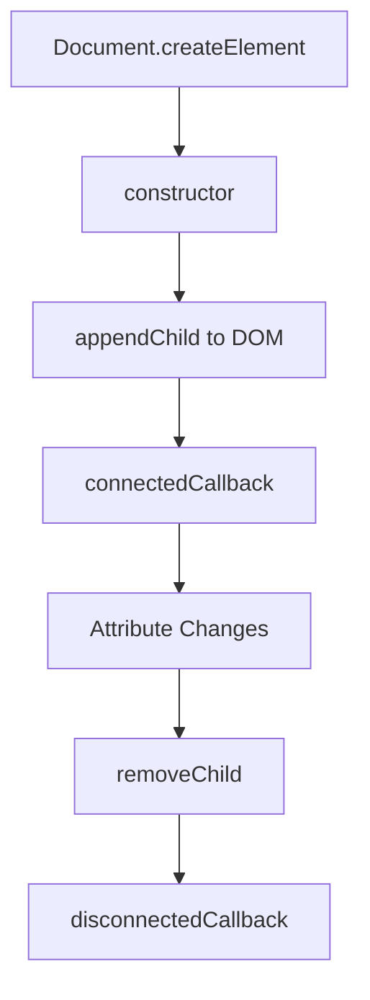
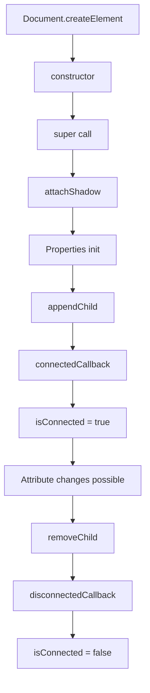
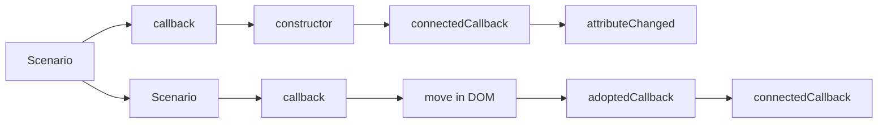

# Lifecycle Callbacks Mastery

## OVERVIEW

Lifecycle callbacks are the foundation of custom element behavior, providing hooks into the element's existence in the DOM. Understanding these callbacks thoroughly enables you to properly initialize elements, respond to attribute changes, manage resources, and perform cleanup operations. This comprehensive guide covers all lifecycle callbacks with practical implementation patterns and real-world examples.

The custom element lifecycle consists of four main callbacks: constructor, connectedCallback, disconnectedCallback, attributeChangedCallback, and adoptedCallback. Each serves a specific purpose in the element's lifecycle and must be used appropriately to create robust, well-behaved components.

Mastering these callbacks is essential for building production-quality components that properly manage state, handle resources, and integrate seamlessly with frameworks and other components.

## TECHNICAL SPECIFICATIONS

### Lifecycle Callback Overview

| Callback | When Called | Common Uses |
|----------|-------------|-------------|
| constructor() | Element created | Initialize state, create shadow DOM |
| connectedCallback() | Added to DOM | Setup, rendering, event listeners |
| disconnectedCallback() | Removed from DOM | Cleanup, resource release |
| attributeChangedCallback() | Attribute changes | Sync state, re-render |
| adoptedCallback() | Moved to new document | Re-initialize if needed |

### Callback Order Diagram



## IMPLEMENTATION DETAILS

### Constructor Implementation

```javascript
class LifecycleElement extends HTMLElement {
  constructor() {
    // MUST call super() first
    super();
    
    // Attach shadow DOM
    this.attachShadow({ mode: 'open' });
    
    // Initialize instance properties
    this._initialized = false;
    this._state = {};
    this._listeners = [];
    
    // Cannot access attributes here - not yet in DOM
    // Cannot call connectedCallback here - will be called automatically
  }
}
```

### Connected Callback

```javascript
class ConnectedElement extends HTMLElement {
  constructor() {
    super();
    this.attachShadow({ mode: 'open' });
    this._setup = false;
  }
  
  connectedCallback() {
    // Called every time element is added to DOM
    // May be called multiple times if element is moved
    
    // Avoid double initialization
    if (this._setup) return;
    
    // Initialize component
    this.render();
    this.attachEventListeners();
    this.setupObservers();
    
    this._setup = true;
  }
  
  render() { /* ... */ }
  attachEventListeners() { /* ... */ }
  setupObservers() { /* ... */ }
}
```

### Disconnected Callback

```javascript
class CleanupElement extends HTMLElement {
  constructor() {
    super();
    this.attachShadow({ mode: 'open' });
    this._observer = null;
    this._timers = [];
    this._boundHandlers = new Map();
  }
  
  connectedCallback() {
    this._setupObservers();
    this._setupTimers();
    this._setupEventListeners();
  }
  
  disconnectedCallback() {
    // CRITICAL: Clean up all resources
    this._cleanupObservers();
    this._cleanupTimers();
    this._cleanupEventListeners();
    
    // Notify other systems
    this.dispatchEvent(new CustomEvent('component-disposed', {
      bubbles: true,
      composed: true
    }));
  }
  
  _setupObservers() {
    this._observer = new MutationObserver(() => this.handleMutations());
    this._observer.observe(this, { childList: true, subtree: true });
  }
  
  _cleanupObservers() {
    if (this._observer) {
      this._observer.disconnect();
      this._observer = null;
    }
  }
  
  _setupTimers() {
    this._timers.push(setInterval(() => this.tick(), 1000));
    this._timers.push(setTimeout(() => this.delayedInit(), 5000));
  }
  
  _cleanupTimers() {
    this._timers.forEach(id => clearInterval(id));
    this._timers.forEach(id => clearTimeout(id));
    this._timers = [];
  }
  
  _setupEventListeners() {
    const handler = () => this.handleClick();
    document.addEventListener('click', handler);
    this._boundHandlers.set('click', handler);
  }
  
  _cleanupEventListeners() {
    this._boundHandlers.forEach((handler, event) => {
      document.removeEventListener(event, handler);
    });
    this._boundHandlers.clear();
  }
  
  tick() {}
  delayedInit() {}
  handleClick() {}
  handleMutations() {}
}
```

### Attribute Changed Callback

```javascript
class AttributeElement extends HTMLElement {
  // MUST declare observed attributes
  static get observedAttributes() {
    return ['value', 'disabled', 'variant', 'data-*'];
  }
  
  constructor() {
    super();
    this.attachShadow({ mode: 'open' });
  }
  
  attributeChangedCallback(name, oldValue, newValue) {
    // Called when any observed attribute changes
    // Called once with null oldValue when element is first parsed
    
    // Ignore if value hasn't actually changed
    if (oldValue === newValue) return;
    
    // Skip initial call before connected
    if (!this.isConnected) return;
    
    switch (name) {
      case 'value':
        this.handleValueChange(newValue);
        break;
      case 'disabled':
        this.handleDisabledChange(newValue !== null);
        break;
      case 'variant':
        this.handleVariantChange(newValue);
        break;
      default:
        if (name.startsWith('data-')) {
          this.handleDataAttribute(name, newValue);
        }
    }
  }
  
  handleValueChange(value) {
    const input = this.shadowRoot.querySelector('input');
    if (input) input.value = value || '';
  }
  
  handleDisabledChange(disabled) {
    const input = this.shadowRoot.querySelector('input');
    if (input) input.disabled = disabled;
  }
  
  handleVariantChange(variant) {
    this.render(); // Re-render with new variant
  }
  
  handleDataAttribute(name, value) {
    console.log(`Data attribute ${name} changed to ${value}`);
  }
}
```

### Adopted Callback

```javascript
class AdoptableElement extends HTMLElement {
  constructor() {
    super();
    this.attachShadow({ mode: 'open' });
  }
  
  connectedCallback() {
    this.render();
  }
  
  adoptedCallback() {
    // Called when element is moved to a different document
    // Example: iframe communication, document.adoptNode()
    
    console.log(`Element adopted to ${document}`);
    
    // May need to reinitialize
    this.render();
  }
}
```

## CODE EXAMPLES

### Complete Lifecycle Implementation

```javascript
class FullLifecycleElement extends HTMLElement {
  // Static properties
  static get observedAttributes() {
    return ['title', 'theme', 'loading'];
  }
  
  static get formAssociated() {
    return true;
  }
  
  // Private fields
  #internals = null;
  #initialized = false;
  #state = { title: '', theme: 'light', loading: false };
  #resources = { observer: null, listeners: [], timers: [] };
  
  // ==================== CONSTRUCTOR ====================
  constructor() {
    super();
    
    // Create shadow DOM
    this.attachShadow({ mode: 'open' });
    
    // Initialize private state
    this.#state = { title: '', theme: 'light', loading: false };
    this.#resources = { observer: null, listeners: [], timers: [] };
    
    console.log('[Lifecycle] Constructor called');
  }
  
  // ==================== CONNECTED ====================
  connectedCallback() {
    console.log('[Lifecycle] connectedCallback called');
    
    // Only initialize once
    if (this.#initialized) {
      console.log('[Lifecycle] Already initialized, skipping');
      return;
    }
    
    try {
      // Parse initial attributes
      this.#parseAttributes();
      
      // Initialize form association
      this.#initFormAssociation();
      
      // Setup resources
      this.#setupObserver();
      this.#setupEventListeners();
      this.#setupTimers();
      
      // Initial render
      this.render();
      
      this.#initialized = true;
      console.log('[Lifecycle] Initialization complete');
      
    } catch (error) {
      console.error('[Lifecycle] Initialization failed:', error);
      this.renderError(error);
    }
  }
  
  // ==================== DISCONNECTED ====================
  disconnectedCallback() {
    console.log('[Lifecycle] disconnectedCallback called');
    
    // Clean up all resources
    this.#cleanupObserver();
    this.#cleanupEventListeners();
    this.#cleanupTimers();
    
    // Release form association
    this.#internals = null;
    
    this.#initialized = false;
    console.log('[Lifecycle] Cleanup complete');
  }
  
  // ==================== ATTRIBUTE CHANGED ====================
  attributeChangedCallback(name, oldValue, newValue) {
    console.log(`[Lifecycle] attributeChanged: ${name} = "${newValue}" (was "${oldValue}")`);
    
    // Skip if not initialized yet
    if (!this.#initialized) return;
    
    // Update state
    this.#state[name] = newValue;
    
    // Handle specific attributes
    switch (name) {
      case 'title':
        this.updateTitle(newValue);
        break;
      case 'theme':
        this.updateTheme(newValue);
        break;
      case 'loading':
        this.updateLoadingState(newValue !== null);
        break;
    }
  }
  
  // ==================== ADOPTED ====================
  adoptedCallback() {
    console.log('[Lifecycle] adoptedCallback called');
    console.log('[Lifecycle] New document:', document);
    
    // Reinitialize in new document context
    if (this.#initialized) {
      this.render();
    }
  }
  
  // ==================== PRIVATE METHODS ====================
  
  #parseAttributes() {
    this.#state = {
      title: this.getAttribute('title') || '',
      theme: this.getAttribute('theme') || 'light',
      loading: this.hasAttribute('loading')
    };
  }
  
  #initFormAssociation() {
    if (this.attachInternals) {
      this.#internals = this.attachInternals();
    }
  }
  
  #setupObserver() {
    this.#resources.observer = new MutationObserver((mutations) => {
      this.handleMutations(mutations);
    });
    this.#resources.observer.observe(this, {
      attributes: true,
      childList: true,
      subtree: true
    });
  }
  
  #cleanupObserver() {
    if (this.#resources.observer) {
      this.#resources.observer.disconnect();
      this.#resources.observer = null;
    }
  }
  
  #setupEventListeners() {
    const clickHandler = (e) => this.handleClick(e);
    document.addEventListener('click', clickHandler);
    this.#resources.listeners.push({ target: document, event: 'click', handler: clickHandler });
  }
  
  #cleanupEventListeners() {
    this.#resources.listeners.forEach(({ target, event, handler }) => {
      target.removeEventListener(event, handler);
    });
    this.#resources.listeners = [];
  }
  
  #setupTimers() {
    const intervalId = setInterval(() => this.periodicTask(), 5000);
    this.#resources.timers.push(intervalId);
  }
  
  #cleanupTimers() {
    this.#resources.timers.forEach(clearInterval);
    this.#resources.timers = [];
  }
  
  // ==================== RENDER ====================
  
  render() {
    this.shadowRoot.innerHTML = `
      <style>
        :host {
          display: block;
          padding: 16px;
        }
        :host([theme="dark"]) {
          background: #222;
          color: #fff;
        }
      </style>
      <div class="container">
        <h1>${this.#state.title}</h1>
        <div class="content">
          <slot></slot>
        </div>
        ${this.#state.loading ? '<div class="loader">Loading...</div>' : ''}
      </div>
    `;
  }
  
  renderError(error) {
    this.shadowRoot.innerHTML = `
      <div class="error">Error: ${error.message}</div>
    `;
  }
  
  // ==================== EVENT HANDLERS ====================
  
  handleClick(event) {
    console.log('Click handled');
  }
  
  handleMutations(mutations) {
    console.log('Mutations detected:', mutations.length);
  }
  
  periodicTask() {
    console.log('Periodic task executed');
  }
  
  // ==================== UPDATE METHODS ====================
  
  updateTitle(title) {
    const h1 = this.shadowRoot.querySelector('h1');
    if (h1) h1.textContent = title;
  }
  
  updateTheme(theme) {
    // Theme-specific updates
  }
  
  updateLoadingState(loading) {
    this.render();
  }
}
customElements.define('full-lifecycle', FullLifecycleElement);
```

### Conditional Initialization

```javascript
class ConditionalElement extends HTMLElement {
  #setup = false;
  
  connectedCallback() {
    if (!this.#setup) {
      this.setup();
    }
    
    this.onConnect();
  }
  
  setup() {
    console.log('One-time setup');
    this.attachShadow({ mode: 'open' });
    this.render();
    this.#setup = true;
  }
  
  onConnect() {
    console.log('Called on every connect');
  }
}
```

### Error Boundary Pattern

```javascript
class ErrorBoundaryElement extends HTMLElement {
  #error = null;
  
  connectedCallback() {
    try {
      super.connectedCallback?.();
      this.render();
    } catch (error) {
      this.#handleError(error);
    }
  }
  
  #handleError(error) {
    this.#error = error;
    console.error('Element error:', error);
    this.renderError();
  }
  
  render() {
    if (this.#error) return;
    this.shadowRoot.innerHTML = '<slot></slot>';
  }
  
  renderError() {
    this.shadowRoot.innerHTML = `
      <div class="error-boundary">
        <p>Component failed to render</p>
        <pre>${this.#error.message}</pre>
      </div>
    `;
  }
}
```

### State Preservation

Preserving state across connections:

```javascript
class PreservingElement extends HTMLElement {
  #state = {
    count: 0,
    data: null
  };
  #connected = false;
  
  connectedCallback() {
    console.log('Reconnected, restoring state:', this.#state);
    this.#connected = true;
    this.render();
  }
  
  disconnectedCallback() {
    console.log('Disconnected, saving state');
    this.#connected = false;
    this.persistState();
  }
  
  persistState() {
    // Save to storage if needed
    sessionStorage.setItem(this.id, JSON.stringify(this.#state));
  }
  
  increment() {
    this.#state.count++;
    if (this.#connected) this.render();
  }
  
  render() {
    this.shadowRoot.innerHTML = `<div>Count: ${this.#state.count}</div>`;
  }
}
```

## BEST PRACTICES

### Common Mistakes

```javascript
// BAD: Not calling super()
class BadElement extends HTMLElement {
  constructor() {
    // Missing super() - will throw
    this.attachShadow({ mode: 'open' });
  }
}

// GOOD: Always call super()
class GoodElement extends HTMLElement {
  constructor() {
    super();
    this.attachShadow({ mode: 'open' });
  }
}

// BAD: Double initialization
class DoubleInit extends HTMLElement {
  connectedCallback() {
    this.render(); // Called every time added
  }
}

// GOOD: Check initialization state
class ProperInit extends HTMLElement {
  #initialized = false;
  
  connectedCallback() {
    if (!this.#initialized) {
      this.render();
      this.#initialized = true;
    }
  }
}

// BAD: Not cleaning up
class LeakingElement extends HTMLElement {
  connectedCallback() {
    document.addEventListener('click', this.handler);
    this.timer = setInterval(() => {}, 1000);
  }
  // Missing disconnectedCallback - leaks!
}

// GOOD: Cleanup on disconnect
class CleanElement extends HTMLElement {
  connectedCallback() {
    document.addEventListener('click', this.handler);
    this.timer = setInterval(() => {}, 1000);
  }
  
  disconnectedCallback() {
    document.removeEventListener('click', this.handler);
    clearInterval(this.timer);
  }
}
```

### Idempotent Operations

```javascript
class IdempotentElement extends HTMLElement {
  #rendered = false;
  
  connectedCallback() {
    if (this.#rendered) return;
    
    this.render();
    this.#rendered = true;
  }
  
  // Or allow re-render but use diffing
  render() {
    // Check if content changed
    // Only update DOM if necessary
  }
}
```

## PERFORMANCE CONSIDERATIONS

### Lazy Initialization

```javascript
class LazyElement extends HTMLElement {
  #ready = false;
  
  connectedCallback() {
    if (!this.#ready) {
      requestAnimationFrame(() => {
        this.setup();
        this.#ready = true;
      });
    }
  }
  
  setup() {
    this.attachShadow({ mode: 'open' });
    this.render();
  }
}
```

### Debouncing Attributes

```javascript
class DebouncedElement extends HTMLElement {
  #debounceTimer = null;
  
  static get observedAttributes() {
    return ['value'];
  }
  
  attributeChangedCallback(name, oldValue, newValue) {
    clearTimeout(this.#debounceTimer);
    this.#debounceTimer = setTimeout(() => {
      this.handleValueChange(newValue);
    }, 100);
  }
  
  handleValueChange(value) {}
}
```

## FLOW CHARTS

### Lifecycle Execution Order



### Callback Invocation Scenarios



## EXTERNAL RESOURCES

- [MDN Using Custom Elements](https://developer.mozilla.org/en-US/docs/Web/Web_Components/Using_custom_elements)
- [WHATWG Custom Elements](https://html.spec.whatwg.org/multipage/custom-elements.html)

## NEXT STEPS

Proceed to:

1. **02_Custom-Elements/02_3_Inheritance-and-Composition-Patterns** - Advanced patterns
2. **02_Custom-Elements/02_5_Shadow-DOM-Integration** - Shadow DOM
3. **02_Custom-Elements/02_6_Advanced-Custom-Element-Architectures** - Architecture patterns