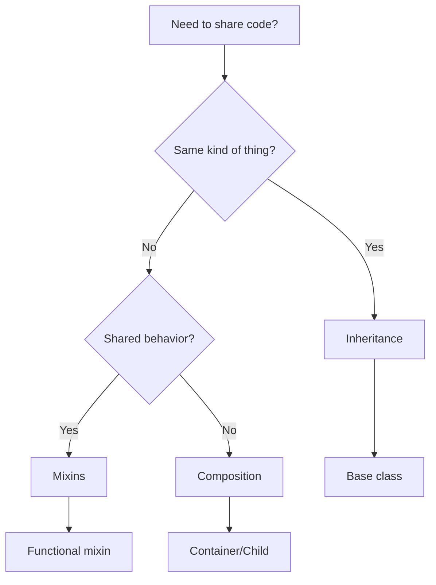
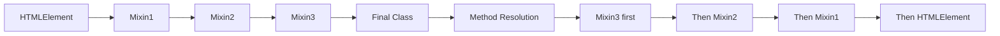

# Inheritance and Composition Patterns

## OVERVIEW

Building maintainable Web Components requires understanding when to use inheritance versus composition. This comprehensive guide explores various patterns for structuring component code, from simple inheritance hierarchies to complex composition strategies. Learn how to create reusable base components, apply mixins for cross-cutting concerns, and compose complex components from smaller pieces.

The choice between inheritance and composition significantly impacts code maintainability, testability, and flexibility. While inheritance provides a clear hierarchy, composition offers greater flexibility and reduces coupling. Understanding both patterns enables you to make informed architectural decisions for your component library.

This guide covers inheritance patterns, mixins, composition, and advanced patterns like the render props pattern and higher-order components.

## TECHNICAL SPECIFICATIONS

### Inheritance vs Composition

| Aspect | Inheritance | Composition |
|--------|-------------|-------------|
| Coupling | Tight | Loose |
| Flexibility | Less | More |
| Testing | Harder | Easier |
| Reuse | Via superclass | Via dependencies |
| State | Shared via super | Separate per instance |

### Base Component Architecture

```javascript
// Base Component Class
class BaseComponent extends HTMLElement {
  static get is() { return 'base-component'; }
  
  static get observedAttributes() { return []; }
  
  constructor() {
    super();
    this.attachShadow({ mode: 'open' });
  }
  
  connectedCallback() {
    this.render();
    this.setupListeners();
  }
  
  disconnectedCallback() {
    this.cleanupListeners();
  }
  
  render() {}
  setupListeners() {}
  cleanupListeners() {}
}
```

## IMPLEMENTATION DETAILS

### Simple Inheritance

Extending a base component:

```javascript
// base-component.js
export class BaseComponent extends HTMLElement {
  constructor() {
    super();
    this.attachShadow({ mode: 'open' });
  }
  
  connectedCallback() {
    this.render();
  }
  
  render() {
    this.shadowRoot.innerHTML = '<div class="base">Base Component</div>';
  }
  
  $(selector) {
    return this.shadowRoot.querySelector(selector);
  }
  
  dispatch(name, detail = {}) {
    this.dispatchEvent(new CustomEvent(name, {
      detail,
      bubbles: true,
      composed: true
    }));
  }
}

// derived-component.js
import { BaseComponent } from './base-component.js';

export class DerivedComponent extends BaseComponent {
  static get is() { return 'derived-component'; }
  
  static get observedAttributes() {
    return ['title', ...super.observedAttributes];
  }
  
  render() {
    const title = this.getAttribute('title') || '';
    this.shadowRoot.innerHTML = `
      <style>
        :host { display: block; }
        .title { font-weight: bold; }
      </style>
      <div class="derived">
        <div class="title">${title}</div>
        <slot></slot>
      </div>
    `;
  }
}
customElements.define('derived-component', DerivedComponent);
```

### Mixin Pattern

Reusable behavior composition:

```javascript
// reactive-mixin.js
export function ReactiveMixin(Base) {
  return class extends Base {
    constructor() {
      super();
      this._state = {};
    }
    
    setState(updates) {
      const oldState = { ...this._state };
      Object.assign(this._state, updates);
      this.onStateChange(this._state, oldState);
    }
    
    getState() {
      return { ...this._state };
    }
    
    onStateChange(newState, oldState) {
      this.render();
    }
  };
}

// form-validation-mixin.js
export function FormValidationMixin(Base) {
  return class extends Base {
    constructor() {
      super();
      this._errors = new Map();
      this._validators = new Map();
    }
    
    addValidator(field, validator) {
      this._validators.set(field, validator);
    }
    
    validate(field, value) {
      const validator = this._validators.get(field);
      if (!validator) return true;
      
      const result = validator(value);
      if (!result.valid) {
        this._errors.set(field, result.message);
      } else {
        this._errors.delete(field);
      }
      return result.valid;
    }
    
    isValid() {
      return this._errors.size === 0;
    }
    
    getErrors() {
      return Object.fromEntries(this._errors);
    }
  };
}

// Usage: Combining multiple mixins
class FormComponent extends FormValidationMixin(ReactiveMixin(HTMLElement)) {
  static get is() { return 'form-component'; }
  
  connectedCallback() {
    super.connectedCallback();
    this.addValidator('email', this.validateEmail);
    this.setState({ email: '' });
  }
  
  validateEmail(value) {
    return {
      valid: /^[^\s@]+@[^\s@]+\.[^\s@]+$/.test(value),
      message: 'Invalid email format'
    };
  }
}
```

### Composition Pattern

Composing from smaller components:

```javascript
// container-component.js
export class ContainerComponent extends HTMLElement {
  #children = [];
  
  constructor() {
    super();
    this.attachShadow({ mode: 'open' });
  }
  
  connectedCallback() {
    this.render();
  }
  
  addChild(component) {
    this.#children.push(component);
    if (this.isConnected) {
      this.shadowRoot.querySelector('.content').appendChild(component);
    }
  }
  
  removeChild(component) {
    const index = this.#children.indexOf(component);
    if (index > -1) {
      this.#children.splice(index, 1);
      component.remove();
    }
  }
  
  render() {
    this.shadowRoot.innerHTML = `
      <style>
        :host { display: block; }
        .container { 
          padding: 16px; 
          border: 1px solid #ccc;
        }
      </style>
      <div class="container">
        <div class="header">
          <slot name="header"></slot>
        </div>
        <div class="content">
          <slot></slot>
        </div>
      </div>
    `;
  }
}

// item-component.js
class ItemComponent extends HTMLElement {
  constructor() {
    super();
    this.attachShadow({ mode: 'open' });
  }
  
  connectedCallback() {
    this.render();
  }
  
  render() {
    this.shadowRoot.innerHTML = `<div class="item"><slot></slot></div>`;
  }
}
```

## CODE EXAMPLES

### Full Mixin Implementation

```javascript
// lifecycle-mixin.js
export function LifecycleMixin(Base) {
  return class extends Base {
    constructor() {
      super();
      this._lifecycleCallbacks = {};
    }
    
    connectedCallback() {
      super.connectedCallback?.();
      this._emitLifecycle('connected');
    }
    
    disconnectedCallback() {
      super.disconnectedCallback?.();
      this._emitLifecycle('disconnected');
    }
    
    _emitLifecycle(phase) {
      const callback = this._lifecycleCallbacks[phase];
      if (callback) callback.call(this);
    }
    
    onConnected(callback) {
      this._lifecycleCallbacks.connected = callback;
      return this;
    }
    
    onDisconnected(callback) {
      this._lifecycleCallbacks.disconnected = callback;
      return this;
    }
  };
}

// styling-mixin.js
export function StylingMixin(Base) {
  return class extends Base {
    static get observedAttributes() {
      return ['theme', 'size', ...(super.observedAttributes || [])];
    }
    
    constructor() {
      super();
      this._styles = this.getStyles();
    }
    
    getStyles() {
      return `
        :host {
          display: block;
          --primary-color: #007bff;
          --secondary-color: #6c757d;
          --size: medium;
        }
      `;
    }
    
    attributeChangedCallback(name, oldValue, newValue) {
      super.attributeChangedCallback?.(name, oldValue, newValue);
      if (['theme', 'size'].includes(name)) {
        this.updateStyles();
      }
    }
    
    updateStyles() {
      const styleEl = this.shadowRoot.querySelector('style');
      if (styleEl) {
        styleEl.textContent = this._styles;
      }
    }
  };
}

// event-mixin.js
export function EventMixin(Base) {
  return class extends Base {
    constructor() {
      super();
      this._eventListeners = new Map();
    }
    
    on(event, handler) {
      this.addEventListener(event, handler);
      
      if (!this._eventListeners.has(event)) {
        this._eventListeners.set(event, []);
      }
      this._eventListeners.get(event).push(handler);
      
      return this;
    }
    
    off(event, handler) {
      this.removeEventListener(event, handler);
      const listeners = this._eventListeners.get(event);
      if (listeners) {
        const index = listeners.indexOf(handler);
        if (index > -1) list eners.splice(index, 1);
      }
      return this;
    }
    
    once(event, handler) {
      const wrapped = (e) => {
        handler(e);
        this.off(event, wrapped);
      };
      return this.on(event, wrapped);
    }
    
    disconnectedCallback() {
      super.disconnectedCallback?.();
      this._eventListeners.forEach((handlers, event) => {
        handlers.forEach(handler => this.removeEventListener(event, handler));
      });
      this._eventListeners.clear();
    }
  };
}

// Combined usage
class EnhancedComponent extends EventMixin(
  StylingMixin(
    LifecycleMixin(HTMLElement)
  )
) {
  static get is() { return 'enhanced-component'; }
  
  constructor() {
    super();
    this.attachShadow({ mode: 'open' });
  }
  
  connectedCallback() {
    super.connectedCallback();
    this.onConnected(() => console.log('Connected!'));
    this.render();
  }
  
  render() {
    this.shadowRoot.innerHTML = `<style>${this.getStyles()}</style><div>Content</div>`;
  }
}
```

### Composition Over Inheritance

```javascript
// Component composition pattern
class ComposedComponent extends HTMLElement {
  #components = new Map();
  
  constructor() {
    super();
    this.attachShadow({ mode: 'open' });
  }
  
  // Composition: add child components
  set child(childConfig) {
    this.addComponent(childConfig);
  }
  
  addComponent({ name, ComponentClass, props = {} }) {
    const instance = new ComponentClass();
    
    // Set props
    Object.entries(props).forEach(([key, value]) => {
      instance[key] = value;
    });
    
    this.#components.set(name, instance);
    
    if (this.isConnected) {
      this.attachComponent(instance);
    }
  }
  
  attachComponent(component) {
    const slot = this.shadowRoot.querySelector(`[data-slot="${component.slot || 'default'}"]`);
    if (slot) {
      slot.appendChild(component);
    }
  }
  
  getComponent(name) {
    return this.#components.get(name);
  }
  
  connectedCallback() {
    this.render();
    this.#components.forEach(comp => this.attachComponent(comp));
  }
  
  render() {
    this.shadowRoot.innerHTML = `
      <div data-slot="header"></div>
      <div data-slot="default"></div>
      <div data-slot="footer"></div>
    `;
  }
}
```

### Render Props Pattern

```javascript
class RenderPropsComponent extends HTMLElement {
  #state = { count: 0 };
  
  constructor() {
    super();
    this.attachShadow({ mode: 'open' });
    this.attachShadow({ mode: 'open' });
  }
  
  connectedCallback() {
    this.render();
  }
  
  // Render prop function
  renderContent(renderFn) {
    return renderFn(this.#state);
  }
  
  set count(value) {
    this.#state.count = value;
    this.render();
  }
  
  get count() {
    return this.#state.count;
  }
  
  render() {
    // Let consumer define render logic
    const content = this.getAttribute('render');
    if (content) {
      // Evaluate render prop (simplified - use with caution)
      try {
        const fn = new Function('state', content);
        this.shadowRoot.innerHTML = fn(this.#state);
      } catch (e) {
        console.error('Render prop error:', e);
      }
    } else {
      this.shadowRoot.innerHTML = `<div>Count: ${this.#state.count}</div>`;
    }
  }
}
customElements.define('render-props', RenderPropsComponent);
```

### Higher-Order Component

```javascript
function createHOC(WrappedComponent, enhancements = {}) {
  return class extends HTMLElement {
    static get is() { return WrappedComponent.is + '-hoc'; }
    
    constructor() {
      super();
      this.attachShadow({ mode: 'open' });
      this._wrapped = new WrappedComponent();
    }
    
    connectedCallback() {
      // Apply enhancements
      if (enhancements.logging) {
        console.log('HOC: Component connected');
      }
      
      this.shadowRoot.appendChild(this._wrapped);
      
      if (enhancements.analytics) {
        this.trackAnalytics();
      }
    }
    
    trackAnalytics() {
      // Analytics tracking
    }
    
    // Proxy to wrapped component
    render() {
      return this._wrapped.render();
    }
  };
}

// Usage
class OriginalComponent extends HTMLElement { /* ... */ }
const EnhancedComponent = createHOC(OriginalComponent, {
  logging: true,
  analytics: true
});
```

## BEST PRACTICES

### When to Use Inheritance

```javascript
// Good: Shared base functionality
class BaseElement extends HTMLElement {
  // Common methods all elements need
  $(selector) { return this.shadowRoot.querySelector(selector); }
  $$(selector) { return this.shadowRoot.querySelectorAll(selector); }
  dispatch(name, detail) { /* ... */ }
}

class Button extends BaseElement { /* specific button logic */ }
class Input extends BaseElement { /* specific input logic */ }
```

### When to Use Composition

```javascript
// Good: Cross-cutting concerns, flexible behavior
class FlexibleComponent extends Mixin1(Mixin2(HTMLElement)) {
  // Can swap mixins, add/remove behavior
}

// Good: Child component management
class Parent extends HTMLElement {
  addChild(childComponent) { /* composition */ }
}
```

### Anti-Patterns

```javascript
// BAD: Deep inheritance chain
class A extends HTMLElement {}
class B extends A {}
class C extends B {}
class D extends C {} // Hard to maintain

// BAD: Inheritance for code reuse
class Useful extends HTMLElement {
  doSomething() { /* useful code */ }
}
class Unrelated extends Useful {} // Wrong relationship

// GOOD: Composition/mixins for reuse
class Unrelated extends HTMLElement {
  useUtility(utility) { /* compose utility */ }
}
```

## PERFORMANCE CONSIDERATIONS

### Mixin Performance

```javascript
// Expensive: Creating new class for each mixin combination
function createWithMixins(...mixins) {
  class Combined extends mixins.reduce((acc, mixin) => mixin(acc), HTMLElement) {}
  return Combined;
}

// Better: Reuse mixin classes
class ComposableElement extends ReactiveMixin(StylingMixin(HTMLElement)) {}
```

### Composition Performance

```javascript
// Lazy composition
class LazyComposer extends HTMLElement {
  #components = new Map();
  
  getComponent(name) {
    if (!this.#components.has(name)) {
      this.#components.set(name, this.#createComponent(name));
    }
    return this.#components.get(name);
  }
  
  #createComponent(name) {
    // Create only when needed
  }
}
```

## FLOW CHARTS

### Pattern Selection Flow



### Mixin Application Order



## EXTERNAL RESOURCES

- [Mixins on MDN](https://developer.mozilla.org/en-US/docs/Web/JavaScript/Reference/ClassesClass_expressions#Mixins)
- [Composition vs Inheritance](https://en.wikipedia.org/wiki/Composition_over_inheritance)

## NEXT STEPS

Proceed to:

1. **02_Custom-Elements/02_4_Defining-Custom-Elements** - Advanced definitions
2. **02_Custom-Elements/02_6_Advanced-Custom-Element-Architectures** - Enterprise patterns
3. **08_Interoperability/08_1_Framework-Neutral-Patterns** - Framework integration