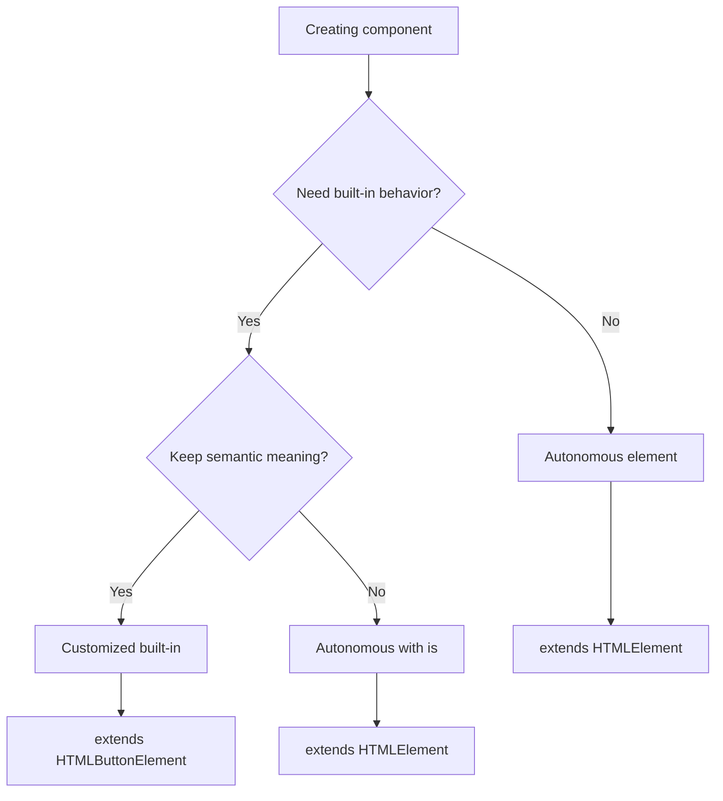
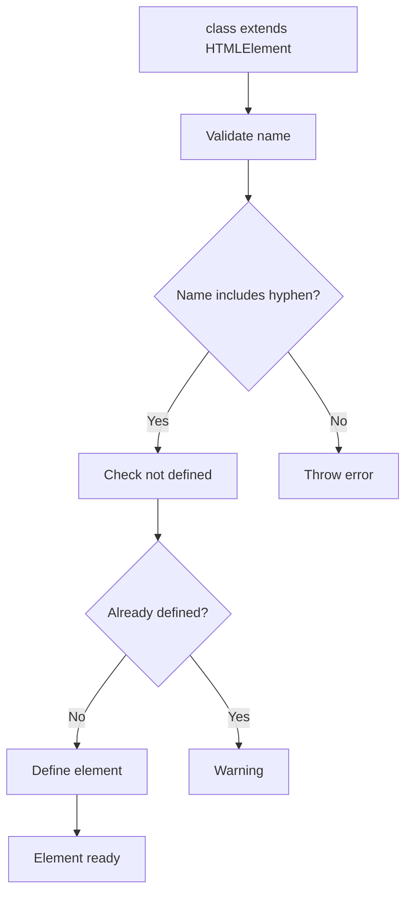

# Defining Custom Elements

## OVERVIEW

Defining custom elements properly is crucial for creating robust, maintainable components. This comprehensive guide covers all aspects of element definition, from basic registration to advanced patterns like custom element reactions, form-associated elements, and autonomous custom elements. Understanding these definition patterns enables you to create components that integrate seamlessly with the browser's element system.

The custom elements API provides multiple ways to define elements, each suited for different use cases. This guide explores the full range of options, including autonomous elements, customized built-in elements, and the specialized form-associated custom elements that integrate with HTML forms.

## TECHNICAL SPECIFICATIONS

### Element Definition Types

1. **Autonomous Custom Elements**
   - Standalone elements not based on existing HTML elements
   - Must extend HTMLElement
   - Tag names must contain a hyphen
   - Example: `<custom-button>`

2. **Customized Built-in Elements**
   - Extend existing HTML elements
   - Use `is` attribute to apply
   - Require the `extends` option in define()
   - Example: `<button is="fancy-button">`

3. **Form-Associated Custom Elements**
   - Extend form controls
   - Participate in form submission
   - Use static `formAssociated` property
   - Use attachInternals() API

### CustomElementRegistry API

| Method | Description |
|--------|-------------|
| define(name, constructor) | Register autonomous element |
| define(name, constructor, options) | Register with options |
| get(name) | Get constructor for registered element |
| whenDefined(name) | Promise resolving when element is defined |
| define('my-element', class); | Basic registration |
| customElements.define('my-element', class, { extends: 'button' }); | Extended element |

## IMPLEMENTATION DETAILS

### Basic Element Definition

```javascript
class SimpleElement extends HTMLElement {
  constructor() {
    super();
    this.attachShadow({ mode: 'open' });
  }
  
  connectedCallback() {
    this.render();
  }
  
  render() {
    this.shadowRoot.innerHTML = '<div>Simple Element</div>';
  }
}

// Basic registration - autonomous element
customElements.define('simple-element', SimpleElement);
```

### Customized Built-in Element

```javascript
class FancyButton extends HTMLButtonElement {
  constructor() {
    super();
    this.attachShadow({ mode: 'open' });
  }
  
  connectedCallback() {
    this.render();
    this.addEventListener('click', this._handleClick);
  }
  
  render() {
    const variant = this.getAttribute('variant') || 'primary';
    this.shadowRoot.innerHTML = `
      <style>
        button {
          padding: 8px 16px;
          border: none;
          border-radius: 4px;
          background: ${variant === 'primary' ? '#007bff' : '#6c757d'};
          color: white;
          cursor: pointer;
        }
      </style>
      <button part="button">
        <slot></slot>
      </button>
    `;
  }
  
  _handleClick = (event) => {
    this.dispatchEvent(new CustomEvent('fancy-click', {
      bubbles: true,
      composed: true,
      detail: { originalEvent: event }
    }));
  }
}

// Registration with extends option
customElements.define('fancy-button', FancyButton, { extends: 'button' });
```

```html
<!-- Usage -->
<button is="fancy-button" variant="primary">Click Me</button>
```

### Form-Associated Element

```javascript
class CustomInput extends HTMLElement {
  // REQUIRED: Enable form association
  static get formAssociated() { return true; }
  
  #internals = null;
  #input = null;
  #value = '';
  #validity = null;
  
  constructor() {
    super();
    this.attachShadow({ mode: 'open' });
  }
  
  connectedCallback() {
    // Initialize form internals
    this.#internals = this.attachInternals();
    
    this.render();
    this.setupListeners();
  }
  
  disconnectedCallback() {
    this.cleanupListeners();
  }
  
  render() {
    this.shadowRoot.innerHTML = `
      <style>
        :host { display: block; }
        input {
          padding: 8px;
          border: 1px solid #ccc;
          border-radius: 4px;
          width: 100%;
        }
        :host([invalid]) input {
          border-color: red;
        }
      </style>
      <input type="text" aria-label="Custom input" />
      <div class="error" aria-live="polite"></div>
    `;
    
    this.#input = this.shadowRoot.querySelector('input');
  }
  
  setupListeners() {
    this.#input?.addEventListener('input', this._handleInput);
    this.#input?.addEventListener('change', this._handleChange);
  }
  
  cleanupListeners() {
    this.#input?.removeEventListener('input', this._handleInput);
    this.#input?.removeEventListener('change', this._handleChange);
  }
  
  _handleInput = (event) => {
    this.#value = event.target.value;
    
    // Set form value
    this.#internals.setFormValue(this.#value);
    
    // Validate
    this.#validate();
    
    // Dispatch input event
    this.dispatchEvent(new Event('input', { bubbles: true }));
  }
  
  _handleChange = () => {
    this.dispatchEvent(new Event('change', { bubbles: true }));
  }
  
  #validate() {
    // Custom validation
    const isValid = this.#value.length >= 3;
    
    // Set validity state
    this.#internals.setValidity(
      { valueMissing: !this.#value, tooShort: !isValid },
      isValid ? '' : 'Value must be at least 3 characters',
      this.#input
    );
    
    // Update visual state
    this.toggleAttribute('invalid', !isValid);
  }
  
  // Public API
  get value() { return this.#value; }
  set value(val) { 
    this.#value = val;
    if (this.#input) this.#input.value = val;
    this.#internals?.setFormValue(val);
  }
  
  get validity() { return this.#internals?.validity; }
  
  checkValidity() {
    return this.#internals?.checkValidity() ?? false;
  }
  
  reportValidity() {
    return this.#internals?.reportValidity() ?? false;
  }
}
customElements.define('custom-input', CustomInput);
```

### Using whenDefined

```javascript
// Wait for element to be defined
customElements.whenDefined('my-element').then(() => {
  console.log('my-element is now available');
  const element = document.querySelector('my-element');
});

// Sequential definition with waiting
async function setupComponents() {
  await customElements.whenDefined('button-component');
  await customElements.whenDefined('input-component');
  await customElements.whenDefined('form-component');
  
  console.log('All components ready');
}
```

## CODE EXAMPLES

### Multiple Element Definition

```javascript
// Define multiple related elements
const Elements = {
  Card: class extends HTMLElement {
    static get is() { return 'ui-card'; }
    // ...
  },
  CardHeader: class extends HTMLElement {
    static get is() { return 'ui-card-header'; }
    // ...
  },
  CardBody: class extends HTMLElement {
    static get is() { return 'ui-card-body'; }
    // ...
  },
  CardFooter: class extends HTMLElement {
    static get is() { return 'ui-card-footer'; }
    // ...
  }
};

// Register all
Object.values(Elements).forEach(Element => {
  customElements.define(Element.is, Element);
});
```

### Definition with Validation

```javascript
class ValidatedElement extends HTMLElement {
  constructor() {
    super();
    this.attachShadow({ mode: 'open' });
  }
  
  // Validate name in constructor
  static get is() {
    const name = this.name;
    if (!name.includes('-')) {
      throw new Error(
        `Invalid custom element name "${name}". ` +
        `Custom element names must contain a hyphen.`
      );
    }
    return name.toLowerCase().replace(/\w+/g, 
      (word, index) => index === 0 ? word : '-' + word
    );
  }
  
  connectedCallback() {
    this.render();
  }
  
  render() {
    this.shadowRoot.innerHTML = '<div>Content</div>';
  }
}
customElements.define('validated-element', ValidatedElement);
```

### Lazy Definition Pattern

```javascript
class LazyDefinitionElement extends HTMLElement {
  static get is() { return 'lazy-element'; }
  
  // Not defined until needed
}

function defineElement(name, classDef) {
  // Only define if not already defined
  if (customElements.get(name)) {
    console.warn(`Element ${name} already defined`);
    return Promise.resolve(customElements.get(name));
  }
  
  return new Promise((resolve, reject) => {
    try {
      customElements.define(name, classDef);
      resolve(classDef);
    } catch (e) {
      reject(e);
    }
  });
}

// Use Intersection Observer to lazy define
const observer = new IntersectionObserver((entries) => {
  entries.forEach(entry => {
    if (entry.isIntersecting) {
      defineElement(LazyDefinitionElement.is, LazyDefinitionElement);
      observer.disconnect();
    }
  });
});

observer.observe(document.querySelector('lazy-element'));
```

### Error Handling in Definition

```javascript
function safeDefine(name, classDef) {
  // Validate name format
  if (!name.includes('-')) {
    throw new Error(`Invalid name: ${name} must contain a hyphen`);
  }
  
  // Check if already defined
  if (customElements.get(name)) {
    console.warn(`Element ${name} already defined. Skipping.`);
    return;
  }
  
  try {
    customElements.define(name, classDef);
    console.log(`Successfully defined: ${name}`);
  } catch (error) {
    console.error(`Failed to define ${name}:`, error);
    throw error;
  }
}

// Safe usage
try {
  safeDefine('my-element', MyElementClass);
  safeDefine('another-element', AnotherClass);
} catch (e) {
  console.error('Definition failed:', e);
}
```

### Element Name Generation

```javascript
// Dynamic element names
function createElementDefinition(name, ComponentClass) {
  // Validate name
  if (!name.match(/^[a-z][a-z0-9]*(-[a-z0-9]+)*$/)) {
    throw new Error('Invalid element name format');
  }
  
  customElements.define(name, ComponentClass);
  return ComponentClass;
}

// Factory pattern
function createComponent(name) {
  return class extends HTMLElement {
    static get is() { return name; }
    // ...
  };
}

const MyButton = createComponent('app-button');
const MyInput = createComponent('app-input');
const MyCard = createComponent('app-card');
```

## BEST PRACTICES

### Consistent Naming

```javascript
// GOOD: Consistent naming convention
// Prefix all components with org/project name
const PREFIX = 'myapp-';

class Button extends HTMLElement {
  static get is() { return PREFIX + 'button'; }
}
class Input extends HTMLElement {
  static get is() { return PREFIX + 'input'; }
}
class Card extends HTMLElement {
  static get is() { return PREFIX + 'card'; }
}

// Register with prefix
customElements.define('myapp-button', Button);
customElements.define('myapp-input', Input);
customElements.define('myapp-card', Card);
```

### Element Type Selection

```javascript
// Use autonomous elements for:
// - Complete custom functionality
// - No need for built-in element behavior
// - New UI components

class Notification extends HTMLElement {
  static get is() { return 'app-notification'; }
  // Full custom implementation
}

// Use customized built-in elements for:
// - Extending existing element behavior
// - Keeping semantic meaning
// - Accessibility benefits

class ValidatedInput extends HTMLInputElement {
  static get is() { return 'validated-input'; }
  // Enhanced input with validation
}
customElements.define('validated-input', ValidatedInput, { extends: 'input' });
```

### Definition Order

```javascript
// CORRECT: Define all elements before using
// main.js
import './components/button.js';
import './components/input.js';
import './components/card.js';

document.querySelector('.app').innerHTML = `
  <app-button>Click</app-button>
  <app-input></app-input>
  <app-card></app-card>
`;

// INCORRECT: Use before define
// Will fail - element undefined
document.querySelector('.app').innerHTML = '<my-element></my-element>';
import './my-element.js'; // Defined after use
```

## FLOW CHARTS

### Element Type Selection



### Definition Process



## EXTERNAL RESOURCES

- [Custom Elements Spec](https://html.spec.whatwg.org/multipage/custom-elements.html)
- [MDN CustomElementRegistry](https://developer.mozilla.org/en-US/docs/Web/API/CustomElementRegistry)

## NEXT STEPS

Proceed to:

1. **02_Custom-Elements/02_5_Shadow-DOM-Integration** - Shadow DOM
2. **02_Custom-Elements/02_6_Advanced-Custom-Element-Architectures** - Advanced patterns
3. **07_Forms/07_1_Form-Integration-Mastery** - Form integration