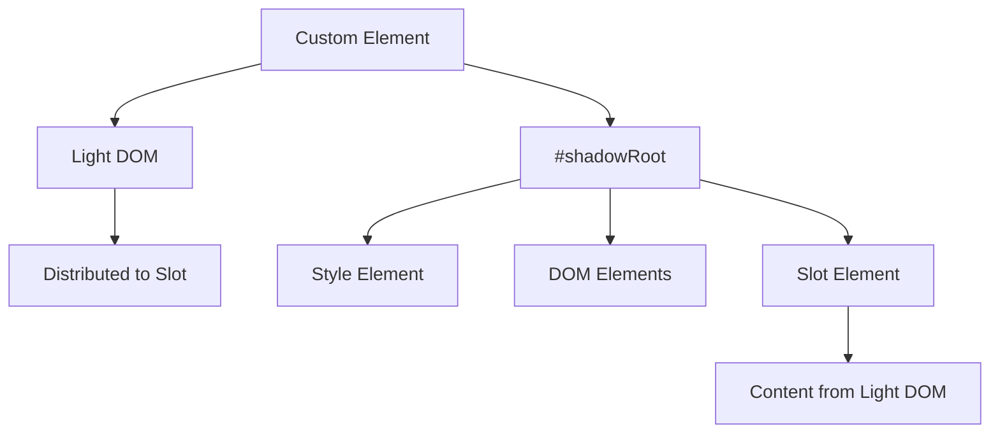
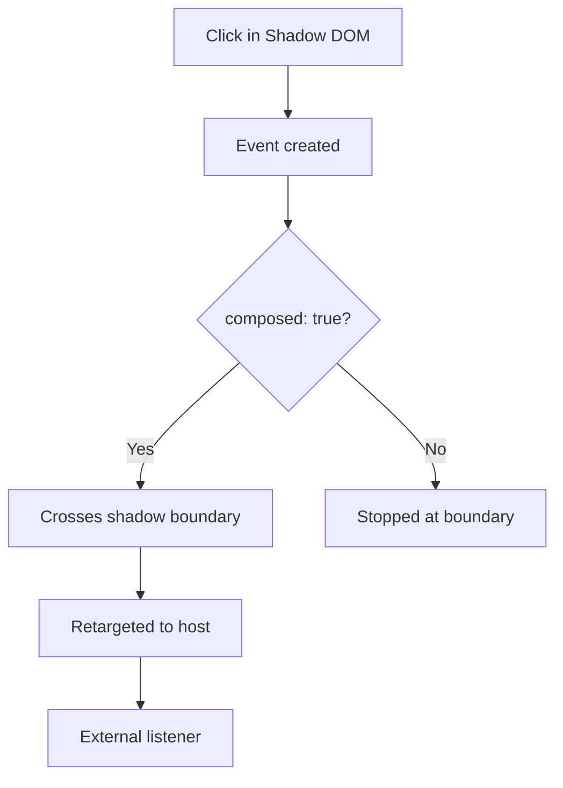

# Shadow DOM Integration Guide

## OVERVIEW

Shadow DOM is a critical technology for Web Components, providing encapsulation for JavaScript and CSS. This comprehensive guide covers Shadow DOM creation, manipulation, and integration patterns. Understanding Shadow DOM enables you to create components with complete style isolation while maintaining proper interaction with the document.

Shadow DOM creates a boundary between the component's internal implementation and the external page. This isolation prevents component styles from affecting the rest of the page and prevents external styles from accidentally affecting the component. However, proper configuration allows controlled exposure when needed.

## TECHNICAL SPECIFICATIONS

### Shadow Root Creation

```javascript
// Open mode - accessible externally
this.attachShadow({ mode: 'open' });
// shadowRoot property is accessible

// Closed mode - not accessible externally
this.attachShadow({ mode: 'closed' });
// shadowRoot returns null
```

### Shadow DOM Features

| Feature | Description |
|---------|-------------|
| Style Scoping | Styles only apply within shadow tree |
| DOM Isolation | Separate node tree from document |
| Slot Distribution | Light DOM content insertion |
| Event Retargeting | Events rewritten to appear from host |
| Encapsulation | No id conflicts, no style leakage |

## IMPLEMENTATION DETAILS

### Basic Shadow DOM

```javascript
class ShadowElement extends HTMLElement {
  constructor() {
    super();
    // Create shadow root in open mode
    this.attachShadow({ mode: 'open' });
  }
  
  connectedCallback() {
    this.render();
  }
  
  render() {
    // Access shadowRoot to add content
    this.shadowRoot.innerHTML = `
      <style>
        :host {
          display: block;
          padding: 16px;
        }
        :host([hidden]) {
          display: none;
        }
        .content {
          color: #333;
        }
      </style>
      <div class="content">
        <slot></slot>
      </div>
    `;
  }
}
customElements.define('shadow-element', ShadowElement);
```

### Dynamic Content in Shadow DOM

```javascript
class DynamicShadowElement extends HTMLElement {
  #items = [];
  
  constructor() {
    super();
    this.attachShadow({ mode: 'open' });
  }
  
  set items(value) {
    this.#items = value;
    this.render();
  }
  
  connectedCallback() {
    this.render();
  }
  
  render() {
    const fragment = document.createDocumentFragment();
    
    // Create style element
    const style = document.createElement('style');
    style.textContent = `
      :host { display: block; }
      ul { list-style: none; padding: 0; }
      li { padding: 8px; border-bottom: 1px solid #eee; }
    `;
    fragment.appendChild(style);
    
    // Create list
    const ul = document.createElement('ul');
    this.#items.forEach(item => {
      const li = document.createElement('li');
      li.textContent = item;
      ul.appendChild(li);
    });
    fragment.appendChild(ul);
    
    this.shadowRoot.innerHTML = '';
    this.shadowRoot.appendChild(fragment);
  }
}
```

### Shadow DOM with Templates

```javascript
// Template in HTML
<template id="my-template">
  <style>
    :host { display: block; }
    .container { padding: 16px; }
  </style>
  <div class="container">
    <slot></slot>
  </div>
</template>

class TemplateShadowElement extends HTMLElement {
  constructor() {
    super();
    this.attachShadow({ mode: 'open' });
  }
  
  connectedCallback() {
    this.render();
  }
  
  render() {
    const template = document.getElementById('my-template');
    const clone = template.content.cloneNode(true);
    this.shadowRoot.appendChild(clone);
  }
}
```

## CODE EXAMPLES

### Interactive Shadow DOM

```javascript
class InteractiveShadowElement extends HTMLElement {
  #count = 0;
  #decrementBtn = null;
  #incrementBtn = null;
  #countDisplay = null;
  
  constructor() {
    super();
    this.attachShadow({ mode: 'open' });
  }
  
  connectedCallback() {
    this.render();
    this.setupEventListeners();
  }
  
  render() {
    this.shadowRoot.innerHTML = `
      <style>
        :host { display: inline-block; }
        .counter {
          display: flex;
          align-items: center;
          gap: 8px;
        }
        button {
          padding: 4px 12px;
          cursor: pointer;
        }
        .count {
          font-size: 1.5em;
          min-width: 40px;
          text-align: center;
        }
      </style>
      <div class="counter">
        <button id="decrement">-</button>
        <span class="count" id="display">0</span>
        <button id="increment">+</button>
      </div>
    `;
  }
  
  setupEventListeners() {
    this.#decrementBtn = this.shadowRoot.getElementById('decrement');
    this.#incrementBtn = this.shadowRoot.getElementById('increment');
    this.#countDisplay = this.shadowRoot.getElementById('display');
    
    this.#decrementBtn.addEventListener('click', () => this.decrement());
    this.#incrementBtn.addEventListener('click', () => this.increment());
  }
  
  increment() {
    this.#count++;
    this.#countDisplay.textContent = this.#count;
    this.dispatchEvent(new CustomEvent('count-changed', {
      detail: { count: this.#count },
      bubbles: true,
      composed: true
    }));
  }
  
  decrement() {
    this.#count--;
    this.#countDisplay.textContent = this.#count;
    this.dispatchEvent(new CustomEvent('count-changed', {
      detail: { count: this.#count },
      bubbles: true,
      composed: true
    }));
  }
}
customElements.define('interactive-shadow', InteractiveShadowElement);
```

### Shadow DOM with Slots

```javascript
class SlottedComponent extends HTMLElement {
  constructor() {
    super();
    this.attachShadow({ mode: 'open' });
  }
  
  connectedCallback() {
    this.render();
  }
  
  render() {
    this.shadowRoot.innerHTML = `
      <style>
        :host {
          display: block;
          border: 1px solid #ccc;
          border-radius: 8px;
          overflow: hidden;
        }
        .header {
          background: #f5f5f5;
          padding: 12px 16px;
          font-weight: bold;
        }
        .body {
          padding: 16px;
        }
        .footer {
          background: #fafafa;
          padding: 12px 16px;
          border-top: 1px solid #eee;
        }
      </style>
      <div class="header">
        <slot name="header">Default Header</slot>
      </div>
      <div class="body">
        <slot></slot>
      </div>
      <div class="footer">
        <slot name="footer"></slot>
      </div>
    `;
  }
}
```

```html
<!-- Usage -->
<slotted-component>
  <span slot="header">My Header</span>
  <div>Main content goes here</div>
  <button slot="footer">Action</button>
</slotted-component>
```

### Shadow DOM Event Handling

```javascript
class EventShadowElement extends HTMLElement {
  constructor() {
    super();
    this.attachShadow({ mode: 'open' });
  }
  
  connectedCallback() {
    this.render();
    this.setupEvents();
  }
  
  render() {
    this.shadowRoot.innerHTML = `
      <style>
        :host { display: block; }
        button { padding: 8px 16px; cursor: pointer; }
      </style>
      <button id="trigger">Trigger Event</button>
    `;
  }
  
  setupEvents() {
    const button = this.shadowRoot.getElementById('trigger');
    button.addEventListener('click', this.#handleClick);
  }
  
  #handleClick = (event) => {
    // Event retargeting - external sees event from host
    console.log('Internal target:', event.target);
    
    // Compose the event for external world
    this.dispatchEvent(new CustomEvent('shadow-click', {
      bubbles: true,
      composed: true,  // Allow event to cross shadow boundary
      detail: { timestamp: Date.now() }
    }));
  }
}
```

### Shadow DOM Queries

```javascript
class QueryShadowElement extends HTMLElement {
  constructor() {
    super();
    this.attachShadow({ mode: 'open' });
  }
  
  // Query single element
  $(selector) {
    return this.shadowRoot.querySelector(selector);
  }
  
  // Query multiple elements
  $$(selector) {
    return this.shadowRoot.querySelectorAll(selector);
  }
  
  // Get element by ID
  getById(id) {
    return this.shadowRoot.getElementById(id);
  }
  
  connectedCallback() {
    this.render();
    
    // Example queries
    console.log(this.$('.container'));
    console.log(this.$$('li'));
    console.log(this.getById('my-id'));
  }
  
  render() {
    this.shadowRoot.innerHTML = `
      <div class="container">
        <ul>
          <li>Item 1</li>
          <li>Item 2</li>
        </ul>
        <span id="my-id">Special</span>
      </div>
    `;
  }
}
```

## BEST PRACTICES

### Style Encapsulation

```javascript
class EncapsulatedElement extends HTMLElement {
  constructor() {
    super();
    this.attachShadow({ mode: 'open' });
  }
  
  render() {
    this.shadowRoot.innerHTML = `
      <style>
        /* :host targets the custom element itself */
        :host {
          display: block;
        }
        
        /* :host() pseudo selector for host matching */
        :host([theme="dark"]) {
          background: #222;
          color: #fff;
        }
        
        /* :host-context() for ancestor matching */
        :host-context(.dark-mode) {
          background: #333;
        }
        
        /* ::slotted() for distributed content */
        ::slotted(*) {
          color: inherit;
        }
        
        /* part() for external styling */
        .internal::part(button) {
          background: blue;
        }
      </style>
      <div class="internal">
        <button part="button">Click</button>
      </div>
    `;
  }
}
```

### External Styling Control

```javascript
class ControllableElement extends HTMLElement {
  constructor() {
    super();
    this.attachShadow({ mode: 'open' });
  }
  
  // Expose parts for external styling
  // In render():
  // <button part="primary-action">Action</button>
  
  // Users can style like:
  // my-element::part(primary-action) { background: red; }
  
  connectedCallback() {
    this.render();
  }
  
  render() {
    this.shadowRoot.innerHTML = `
      <style>
        :host { display: block; }
        button {
          padding: 8px 16px;
          border: none;
          border-radius: 4px;
          background: var(--button-bg, #007bff);
          color: var(--button-color, white);
        }
      </style>
      <button part="primary-action">Action</button>
      <button part="secondary-action">Cancel</button>
    `;
  }
}

// User can style via CSS custom properties
// my-element { --button-bg: red; }
// my-element::part(primary-action) { background: green; }
```

### Performance Optimization

```javascript
class OptimizedShadowElement extends HTMLElement {
  #rendered = false;
  #container = null;
  
  constructor() {
    super();
    this.attachShadow({ mode: 'open' });
  }
  
  connectedCallback() {
    if (!this.#rendered) {
      this.createStructure();
      this.#rendered = true;
    }
    this.attachListeners();
  }
  
  disconnectedCallback() {
    this.removeListeners();
  }
  
  createStructure() {
    // Use DocumentFragment for efficient DOM building
    const fragment = document.createDocumentFragment();
    
    const style = document.createElement('style');
    style.textContent = this.getStyles();
    fragment.appendChild(style);
    
    this.#container = document.createElement('div');
    this.#container.className = 'container';
    fragment.appendChild(this.#container);
    
    this.shadowRoot.appendChild(fragment);
  }
  
  getStyles() {
    return `
      :host { display: block; }
      .container { padding: 16px; }
    `;
  }
  
  // Minimal update instead of full re-render
  updateContent(content) {
    if (this.#container) {
      this.#container.textContent = content;
    }
  }
}
```

## ACCESSIBILITY

### Shadow DOM and Accessibility

```javascript
class AccessibleShadowElement extends HTMLElement {
  constructor() {
    super();
    this.attachShadow({ mode: 'open' });
  }
  
  connectedCallback() {
    this.render();
    this.setupKeyboardNav();
  }
  
  render() {
    this.shadowRoot.innerHTML = `
      <style>
        :host { display: block; }
        [role="listbox"] {
          border: 1px solid #ccc;
        }
        [role="option"] {
          padding: 8px;
          cursor: pointer;
        }
        [role="option"][aria-selected="true"] {
          background: #007bff;
          color: white;
        }
        [role="option"]:hover {
          background: #f5f5f5;
        }
      </style>
      <div role="listbox" aria-label="Options" tabindex="0">
        <div role="option" aria-selected="false">Option 1</div>
        <div role="option" aria-selected="false">Option 2</div>
        <div role="option" aria-selected="false">Option 3</div>
      </div>
    `;
  }
  
  setupKeyboardNav() {
    const listbox = this.shadowRoot.querySelector('[role="listbox"]');
    listbox.addEventListener('keydown', this.#handleKeydown);
  }
  
  #handleKeydown = (event) => {
    const options = [...this.shadowRoot.querySelectorAll('[role="option"]')];
    const currentIndex = options.findIndex(opt => opt.getAttribute('aria-selected') === 'true');
    
    switch (event.key) {
      case 'ArrowDown':
        event.preventDefault();
        this.#selectOption(options, Math.min(currentIndex + 1, options.length - 1));
        break;
      case 'ArrowUp':
        event.preventDefault();
        this.#selectOption(options, Math.max(currentIndex - 1, 0));
        break;
    }
  }
  
  #selectOption(options, index) {
    options.forEach((opt, i) => opt.setAttribute('aria-selected', i === index));
    options[index].focus();
  }
}
```

## FLOW CHARTS

### Shadow DOM Structure



### Event Flow



## EXTERNAL RESOURCES

- [Shadow DOM Spec](https://www.w3.org/TR/shadow-dom/)
- [MDN Shadow DOM](https://developer.mozilla.org/en-US/docs/Web/Web_Components/Using_shadow_DOM)

## NEXT STEPS

Proceed to:

1. **04_Shadow-DOM/04_2_Style-Encapsulation-Methods** - Style isolation
2. **04_Shadow-DOM/04_3_Slot-Content-Distribution-Mastery** - Slots
3. **04_Shadow-DOM/04_4_Event-Bubbling-and-Targeting** - Events