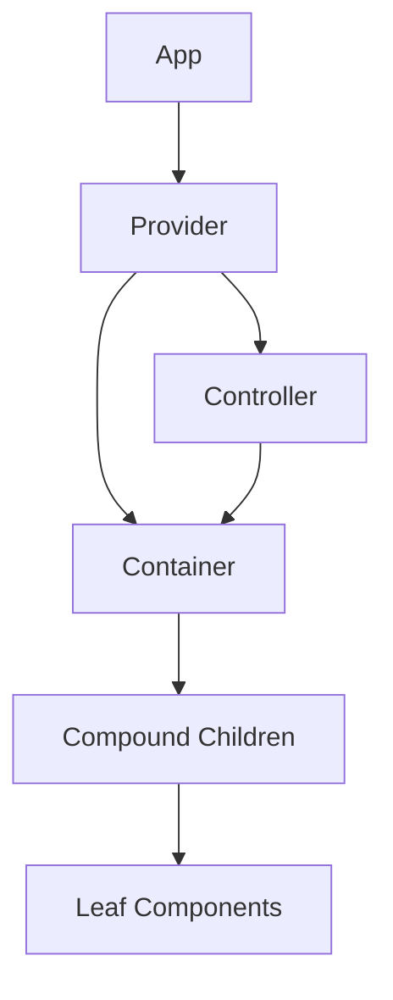
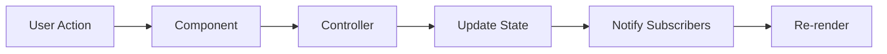

# Advanced Custom Element Architectures

## OVERVIEW

Building enterprise-grade Web Components requires advanced architectural patterns. This guide explores sophisticated component designs including compound components, render props, slots composition, controller patterns, and cross-component communication. These patterns enable complex, maintainable component libraries that scale from small projects to large applications.

Advanced architectures address common challenges like component composition, state sharing, complex interactions, and framework-like features without requiring a framework. Understanding these patterns enables you to build components that rival the functionality of React, Vue, or Angular while remaining framework-agnostic.

## TECHNICAL SPECIFICATIONS

### Architecture Patterns Overview

| Pattern | Use Case | Complexity |
|---------|----------|------------|
| Compound Components | Multi-part UI | Medium |
| Render Props | Flexible rendering | Medium |
| Slots Composition | Content projection | Low |
| Controller | Shared behavior | High |
| State Container | Global state | High |
| Provider/Consumer | Context passing | Medium |

## IMPLEMENTATION DETAILS

### Compound Components

```javascript
// Compound component - parent manages state
class CompoundList extends HTMLElement {
  #selectedIndex = -1;
  #items = [];
  
  constructor() {
    super();
    this.attachShadow({ mode: 'open' });
  }
  
  connectedCallback() {
    this.render();
    this.setupListeners();
  }
  
  static get observedAttributes() {
    return ['selected'];
  }
  
  attributeChangedCallback(name, oldValue, newValue) {
    if (name === 'selected') {
      this.#updateSelection(parseInt(newValue));
    }
  }
  
  get selectedIndex() { return this.#selectedIndex; }
  set selectedIndex(index) { this.#selectItem(index); }
  
  get selectedItem() { return this.#items[this.#selectedIndex]; }
  
  // Public API for child components
  registerItem(element) {
    this.#items.push(element);
    element.setAttribute('data-index', this.#items.length - 1);
  }
  
  #selectItem(index) {
    this.#selectedIndex = index;
    this.#updateSelection(index);
    this.setAttribute('selected', index);
  }
  
  #updateSelection(index) {
    this.#items.forEach((item, i) => {
      if (i === index) {
        item.setAttribute('selected', '');
        item.setAttribute('aria-selected', 'true');
      } else {
        item.removeAttribute('selected');
        item.setAttribute('aria-selected', 'false');
      }
    });
  }
  
  setupListeners() {
    this.addEventListener('item-select', (e) => {
      this.#selectItem(e.detail.index);
    });
  }
  
  render() {
    this.shadowRoot.innerHTML = `
      <style>
        :host { display: block; }
        .list { 
          list-style: none; 
          padding: 0; 
          margin: 0; 
        }
        ::slotted(compound-list-item[selected]) {
          background: #e3f2fd;
        }
      </style>
      <ul class="list" role="listbox" aria-label="Selectable list">
        <slot></slot>
      </ul>
    `;
  }
}
customElements.define('compound-list', CompoundList);

// Item component - child with access to parent
class CompoundListItem extends HTMLElement {
  #index = -1;
  #parent = null;
  
  constructor() {
    super();
    this.attachShadow({ mode: 'open' });
  }
  
  connectedCallback() {
    this.#parent = this.closest('compound-list');
    this.#index = parseInt(this.getAttribute('data-index') || '-1');
    
    this.render();
    this.setupListeners();
  }
  
  setupListeners() {
    this.addEventListener('click', this.#handleClick);
  }
  
  #handleClick = () => {
    this.dispatchEvent(new CustomEvent('item-select', {
      bubbles: true,
      composed: true,
      detail: { index: this.#index }
    }));
  }
  
  render() {
    this.shadowRoot.innerHTML = `
      <style>
        :host {
          display: list-item;
          padding: 8px 16px;
          cursor: pointer;
        }
        :host([selected]) {
          background: #e3f2fd;
        }
        :host(:hover) {
          background: #f5f5f5;
        }
      </style>
      <li role="option" aria-selected="false">
        <slot></slot>
      </li>
    `;
  }
}
customElements.define('compound-list-item', CompoundListItem);
```

### Render Props Pattern

```javascript
class RenderPropElement extends HTMLElement {
  #state = { items: [], loading: false };
  
  constructor() {
    super();
    this.attachShadow({ mode: 'open' });
  }
  
  connectedCallback() {
    this.render();
  }
  
  // Method that calls render prop function with state
  renderContent(renderFn) {
    if (!renderFn) return;
    
    const result = renderFn(this.#state);
    if (typeof result === 'string') {
      this.shadowRoot.innerHTML = result;
    } else if (result instanceof Node) {
      this.shadowRoot.innerHTML = '';
      this.shadowRoot.appendChild(result);
    }
  }
  
  setData(items) {
    this.#state.items = items;
    this.#state.loading = false;
    this.render();
  }
  
  setLoading(loading) {
    this.#state.loading = loading;
    this.render();
  }
  
  render() {
    // Get render prop from attribute or use default
    const renderProp = this.getAttribute('render');
    
    if (renderProp) {
      try {
        const fn = new Function('state', renderProp);
        this.shadowRoot.innerHTML = fn(this.#state);
      } catch (e) {
        console.error('Render prop error:', e);
        this.renderDefault();
      }
    } else {
      this.renderDefault();
    }
  }
  
  renderDefault() {
    this.shadowRoot.innerHTML = `
      <style>
        :host { display: block; }
        .loading { color: #999; }
        .item { padding: 8px; border-bottom: 1px solid #eee; }
      </style>
      ${this.#state.loading 
        ? '<div class="loading">Loading...</div>'
        : `<div>${this.#state.items.map(i => `<div class="item">${i}</div>`).join('')}</div>`
      }
    `;
  }
}
```

### Controller Pattern

```javascript
// Controller for shared behavior
class ListController {
  #items = [];
  #listeners = new Set();
  
  constructor() {}
  
  get items() { return [...this.#items]; }
  
  setItems(items) {
    this.#items = items;
    this.notify();
  }
  
  addItem(item) {
    this.#items.push(item);
    this.notify();
  }
  
  removeItem(index) {
    this.#items.splice(index, 1);
    this.notify();
  }
  
  subscribe(listener) {
    this.#listeners.add(listener);
    return () => this.#listeners.delete(listener);
  }
  
  notify() {
    this.#listeners.forEach(l => l(this.#items));
  }
}

// Component using controller
class ControlledList extends HTMLElement {
  #controller = new ListController();
  #unsubscribe = null;
  
  constructor() {
    super();
    this.attachShadow({ mode: 'open' });
  }
  
  connectedCallback() {
    this.#unsubscribe = this.#controller.subscribe(items => this.render(items));
    this.render([]);
  }
  
  disconnectedCallback() {
    this.#unsubscribe?.();
  }
  
  addItem(item) {
    this.#controller.addItem(item);
  }
  
  render(items) {
    this.shadowRoot.innerHTML = `
      <ul>
        ${items.map((item, i) => `<li>${item} <button data-index="${i}">X</button></li>`).join('')}
      </ul>
    `;
    
    this.shadowRoot.querySelectorAll('button').forEach(btn => {
      btn.addEventListener('click', () => {
        this.#controller.removeItem(parseInt(btn.dataset.index));
      });
    });
  }
}
```

### Provider/Consumer Pattern

```javascript
// Context for sharing state
class ComponentContext {
  #value = {};
  #subscribers = new Set();
  
  constructor(defaultValue = {}) {
    this.#value = defaultValue;
  }
  
  get value() { return this.#value; }
  
  set value(newValue) {
    this.#value = { ...this.#value, ...newValue };
    this.#notify();
  }
  
  subscribe(callback) {
    this.#subscribers.add(callback);
    return () => this.#subscribers.delete(callback);
  }
  
  #notify() {
    this.#subscribers.forEach(cb => cb(this.#value));
  }
}

// Registry for contexts
const contextRegistry = new Map();

export function getContext(name, defaultValue) {
  if (!contextRegistry.has(name)) {
    contextRegistry.set(name, new ComponentContext(defaultValue));
  }
  return contextRegistry.get(name);
}

// Provider component
class ContextProvider extends HTMLElement {
  #context = null;
  
  static get observedAttributes() {
    return ['context-name', 'value'];
  }
  
  constructor() {
    super();
    this.attachShadow({ mode: 'open' });
  }
  
  connectedCallback() {
    const name = this.getAttribute('context-name') || 'default';
    this.#context = getContext(name);
    
    const valueAttr = this.getAttribute('value');
    if (valueAttr) {
      try {
        const value = JSON.parse(valueAttr);
        this.#context.value = value;
      } catch (e) {}
    }
    
    this.render();
  }
  
  attributeChangedCallback(name, newValue) {
    if (name === 'value' && this.#context) {
      try {
        this.#context.value = JSON.parse(newValue);
      } catch (e) {}
    }
  }
  
  render() {
    this.shadowRoot.innerHTML = '<slot></slot>';
  }
}
customElements.define('context-provider', ContextProvider);

// Consumer component
class ContextConsumer extends HTMLElement {
  #context = null;
  #unsubscribe = null;
  #contextName = '';
  
  static get observedAttributes() {
    return ['context-name', 'prop'];
  }
  
  constructor() {
    super();
    this.attachShadow({ mode: 'open' });
  }
  
  connectedCallback() {
    this.#contextName = this.getAttribute('context-name') || 'default';
    this.#context = getContext(this.#contextName);
    
    this.#unsubscribe = this.#context.subscribe(value => this.update(value));
    this.update(this.#context.value);
  }
  
  disconnectedCallback() {
    this.#unsubscribe?.();
  }
  
  attributeChangedCallback(name, newValue) {
    if (name === 'context-name') {
      this.#unsubscribe?.();
      this.#contextName = newValue;
      this.#context = getContext(this.#contextName);
      this.#unsubscribe = this.#context.subscribe(value => this.update(value));
    }
  }
  
  update(value) {
    const prop = this.getAttribute('prop');
    if (prop && value[prop] !== undefined) {
      // Update element based on context value
      this.render(value[prop]);
    }
  }
  
  render(value) {
    this.shadowRoot.innerHTML = `<div>${value}</div>`;
  }
}
```

## CODE EXAMPLES

### Full-Featured Component Library

```javascript
// Base component with common functionality
class BaseComponent extends HTMLElement {
  static get is() { return 'base-component'; }
  
  constructor() {
    super();
    this.attachShadow({ mode: 'open' });
    this.#bound = this.#bound || this.#autoBind();
  }
  
  #bound = {};
  
  #autoBind() {
    const methods = Object.getOwnPropertyNames(Object.getPrototypeOf(this));
    const bound = {};
    for (const method of methods) {
      if (method.startsWith('_') && typeof this[method] === 'function') {
        bound[method] = this[method].bind(this);
      }
    }
    return bound;
  }
  
  $(selector) { return this.shadowRoot.querySelector(selector); }
  $$(selector) { return this.shadowRoot.querySelectorAll(selector); }
  
  dispatch(name, detail = {}) {
    this.dispatchEvent(new CustomEvent(name, {
      bubbles: true,
      composed: true,
      detail
    }));
  }
}

// State mixin
function StateMixin(Base) {
  return class extends Base {
    #state = {};
    
    setState(updates) {
      this.#state = { ...this.#state, ...updates };
      this.render();
    }
    
    getState() { return { ...this.#state }; }
  };
}

// Event mixin
function EventsMixin(Base) {
  return class extends Base {
    #listeners = new Map();
    
    on(event, handler) {
      if (!this.#listeners.has(event)) {
        this.#listeners.set(event, []);
      }
      this.#listeners.get(event).push(handler);
      this.addEventListener(event, handler);
      return () => this.off(event, handler);
    }
    
    off(event, handler) {
      const listeners = this.#listeners.get(event);
      if (listeners) {
        const index = listeners.indexOf(handler);
        if (index > -1) listeners.splice(index, 1);
      }
      this.removeEventListener(event, handler);
    }
    
    once(event, handler) {
      const wrapper = (e) => {
        handler(e);
        this.off(event, wrapper);
      };
      this.on(event, wrapper);
    }
  };
}

// Build enhanced component
class EnhancedComponent extends StateMixin(EventsMixin(BaseComponent)) {
  static get is() { return 'enhanced-component'; }
  
  static get observedAttributes() {
    return ['title', 'open'];
  }
  
  attributeChangedCallback(name, oldValue, newValue) {
    if (oldValue !== newValue) {
      this.setState({ [name]: newValue });
    }
  }
  
  connectedCallback() {
    this.render();
  }
  
  render() {
    const { title = '', open = false } = this.getState();
    this.shadowRoot.innerHTML = `
      <style>
        :host { display: block; }
        .card { border: 1px solid #ccc; padding: 16px; }
        .card.collapsed .content { display: none; }
      </style>
      <div class="card ${open ? '' : 'collapsed'}">
        <h2>${title}</h2>
        <div class="content"><slot></slot></div>
      </div>
    `;
  }
}
```

### Complex Cross-Component Communication

```javascript
// Event bus for component communication
class EventBus {
  static #instance = null;
  #handlers = new Map();
  
  static get instance() {
    if (!EventBus.#instance) {
      EventBus.#instance = new EventBus();
    }
    return EventBus.#instance;
  }
  
  on(event, handler) {
    if (!this.#handlers.has(event)) {
      this.#handlers.set(event, new Set());
    }
    this.#handlers.get(event).add(handler);
    
    return () => this.off(event, handler);
  }
  
  off(event, handler) {
    this.#handlers.get(event)?.delete(handler);
  }
  
  emit(event, detail = {}) {
    this.#handlers.get(event)?.forEach(handler => handler(detail));
  }
  
  once(event, handler) {
    const wrapper = (detail) => {
      handler(detail);
      this.off(event, wrapper);
    };
    this.on(event, wrapper);
  }
}

// Component using event bus
class EventBusComponent extends HTMLElement {
  #bus = EventBus.instance;
  #unsubscribe = null;
  
  constructor() {
    super();
    this.attachShadow({ mode: 'open' });
  }
  
  connectedCallback() {
    this.render();
    this.#unsubscribe = this.#bus.on('data-update', this.#handleUpdate);
  }
  
  disconnectedCallback() {
    this.#unsubscribe?.();
  }
  
  #handleUpdate = (data) => {
    console.log('Received:', data);
    this.render();
  }
  
  sendUpdate(data) {
    this.#bus.emit('data-update', data);
  }
  
  render() {
    this.shadowRoot.innerHTML = '<div>Component</div>';
  }
}
```

## FLOW CHARTS

### Component Architecture



### State Flow



## EXTERNAL RESOURCES

- [Web Components Community](https://www.webcomponents.org/)
- [Lit Component Library](https://lit.dev/)

## NEXT STEPS

Proceed to:

1. **03_Templates/03_1_HTML-Template-Tag-Deep-Dive** - Templates
2. **05_Data-Binding/05_1_Property-Reflection-Strategies** - Data binding
3. **08_Interoperability/08_1_Framework-Neutral-Patterns** - Framework integration