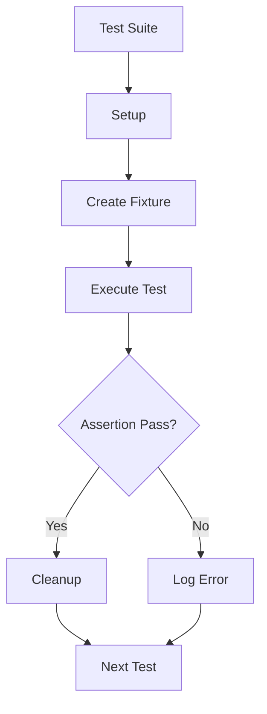

# Custom Element Testing

## OVERVIEW

Testing Web Components requires special considerations due to Shadow DOM encapsulation, custom element lifecycle, and event handling. This comprehensive guide covers unit testing, integration testing, and E2E testing strategies for custom elements.

## TECHNICAL SPECIFICATIONS

### Testing Framework Options

| Framework | Pros | Cons |
|-----------|------|------|
| @open-wc/testing | Web Component native | Requires setup |
| Karma + Jasmine | Widely used | Legacy patterns |
| Jest + JSDOM | Fast execution | Limited Shadow DOM |
| Playwright | Full browser | Slower |
| Vitest | Fast, modern | Newer |

### Test Environment Requirements

- Browser environment (real or simulated)
- Custom Elements polyfill support
- Shadow DOM support
- ES Modules support

## IMPLEMENTATION DETAILS

### Basic Test Setup

```javascript
// test-setup.js
import { fixture } from '@open-wc/testing-helpers';
import { html } from 'lit';

export async function createElement(tagName, props = {}) {
  const el = document.createElement(tagName);
  
  Object.entries(props).forEach(([key, value]) => {
    el[key] = value;
  });
  
  document.body.appendChild(el);
  await el.updateComplete;
  
  return el;
}
```

### Unit Testing Custom Elements

```javascript
import { expect, fixture, html } from '@open-wc/testing';

describe('MyElement', () => {
  it('creates element correctly', async () => {
    const el = await fixture(html`<my-element></my-element>`);
    
    expect(el).to.exist;
    expect(el.shadowRoot).to.exist;
  });
  
  it('renders content', async () => {
    const el = await fixture(html`
      <my-element>
        <span slot="content">Test</span>
      </my-element>
    `);
    
    const slot = el.shadowRoot.querySelector('slot[name="content"]');
    expect(slot).to.exist;
  });
  
  it('responds to attributes', async () => {
    const el = await fixture(html`
      <my-element title="Test Title"></my-element>
    `);
    
    const title = el.shadowRoot.querySelector('.title');
    expect(title.textContent).to.equal('Test Title');
  });
});
```

### Lifecycle Testing

```javascript
describe('Lifecycle Callbacks', () => {
  let connectedCalls = [];
  let disconnectedCalls = [];
  
  class TestElement extends HTMLElement {
    connectedCallback() {
      connectedCalls.push('connected');
    }
    
    disconnectedCallback() {
      disconnectedCalls.push('disconnected');
    }
  }
  
  before(() => {
    customElements.define('lifecycle-test', TestElement);
  });
  
  beforeEach(() => {
    connectedCalls = [];
    disconnectedCalls = [];
  });
  
  it('calls connectedCallback when added', async () => {
    const el = document.createElement('lifecycle-test');
    document.body.appendChild(el);
    
    expect(connectedCalls).to.include('connected');
  });
  
  it('calls disconnectedCallback when removed', async () => {
    const el = document.createElement('lifecycle-test');
    document.body.appendChild(el);
    document.body.removeChild(el);
    
    expect(disconnectedCalls).to.include('disconnected');
  });
});
```

## CODE EXAMPLES

### Standard Example: Component Testing

```javascript
import { expect, fixture, oneEvent } from '@open-wc/testing';
import { html } from 'lit';

describe('Button Component Tests', () => {
  it('renders with default props', async () => {
    const el = await fixture(html`
      <test-button>Click Me</test-button>
    `);
    
    expect(el.shadowRoot.querySelector('button')).to.exist;
    expect(el.shadowRoot.querySelector('button').textContent).to.contain('Click Me');
  });
  
  it('handles variant attribute', async () => {
    const el = await fixture(html`
      <test-button variant="primary">Primary</test-button>
    `);
    
    const button = el.shadowRoot.querySelector('button');
    expect(button.classList.contains('primary')).to.be.true;
  });
  
  it('dispatches click event', async () => {
    const el = await fixture(html`
      <test-button>Click</test-button>
    `);
    
    setTimeout(() => {
      el.shadowRoot.querySelector('button').click();
    });
    
    const { detail } = await oneEvent(el, 'button-click');
    expect(detail).to.exist;
  });
  
  it('handles disabled state', async () => {
    const el = await fixture(html`
      <test-button disabled>Disabled</test-button>
    `);
    
    const button = el.shadowRoot.querySelector('button');
    expect(button.hasAttribute('disabled')).to.be.true;
  });
  
  it('handles loading state', async () => {
    const el = await fixture(html`
      <test-button loading>Loading</test-button>
    `);
    
    const spinner = el.shadowRoot.querySelector('.spinner');
    expect(spinner).to.exist;
  });
});
```

### Real-World Example: Form Integration Testing

```javascript
import { expect, fixture, aTimeout } from '@open-wc/testing';

describe('Form Input Integration Tests', () => {
  let form;
  
  beforeEach(async () => {
    form = await fixture(html`
      <form>
        <test-input 
          name="username" 
          label="Username" 
          required
        ></test-input>
        <test-input 
          name="email" 
          label="Email" 
          type="email"
        ></test-input>
        <button type="submit">Submit</button>
      </form>
    `);
  });
  
  it('integrates with form submission', async () => {
    const input = form.querySelector('test-input[name="username"]');
    input.value = 'testuser';
    
    const submitEvent = new Event('submit', { 
      bubbles: true, 
      cancelable: true 
    });
    form.dispatchEvent(submitEvent);
    
    expect(submitEvent.defaultPrevented).to.be.false;
  });
  
  it('validates required fields', async () => {
    const input = form.querySelector('test-input[name="username"]');
    
    const isValid = input.checkValidity();
    expect(isValid).to.be.false;
  });
  
  it('reports validation errors', async () => {
    const input = form.querySelector('test-input[name="username"]');
    
    const reported = input.reportValidity();
    expect(reported).to.be.false;
    
    const error = input.shadowRoot.querySelector('.error');
    expect(error).to.exist;
  });
  
  it('resets form state', async () => {
    const input = form.querySelector('test-input[name="username"]');
    input.value = 'testuser';
    
    form.reset();
    
    expect(input.value).to.equal('');
  });
});
```

### Testing Shadow DOM Content

```javascript
describe('Shadow DOM Testing', () => {
  it('accesses shadow root content', async () => {
    const el = await fixture(html`
      <shadow-component></shadow-component>
    `);
    
    // Access shadow DOM directly
    const shadowContent = el.shadowRoot.querySelector('.inner');
    expect(shadowContent).to.exist;
    expect(shadowContent.textContent).to.equal('Inner Content');
  });
  
  it('tests styles in shadow DOM', async () => {
    const el = await fixture(html`
      <styled-component variant="primary"></styled-component>
    `);
    
    const styles = getComputedStyle(el.shadowRoot.querySelector('.element'));
    expect(styles.backgroundColor).to.equal('rgb(0, 123, 255)');
  });
  
  it('tests event handlers in shadow DOM', async () => {
    const el = await fixture(html`
      <event-component></event-component>
    `);
    
    const button = el.shadowRoot.querySelector('button');
    
    let clicked = false;
    el.addEventListener('custom-click', () => { clicked = true; });
    
    button.click();
    
    expect(clicked).to.be.true;
  });
  
  it('tests slot distribution', async () => {
    const el = await fixture(html`
      <slotted-component>
        <span slot="header">Header Content</span>
        <div>Main Content</div>
      </slotted-component>
    `);
    
    const slot = el.shadowRoot.querySelector('slot[name="header"]');
    const assigned = slot.assignedNodes();
    
    expect(assigned.length).to.be.greaterThan(0);
    expect(assigned[0].textContent).to.equal('Header Content');
  });
});
```

## BEST PRACTICES

### Test Organization

```javascript
// Group tests by component behavior
describe('Component Name', () => {
  describe('Rendering', () => {
    // Tests for rendering behavior
  });
  
  describe('Properties', () => {
    // Tests for property getters/setters
  });
  
  describe('Events', () => {
    // Tests for event dispatching
  });
  
  describe('Accessibility', () => {
    // Tests for ARIA, keyboard, etc.
  });
});
```

### Mocking Dependencies

```javascript
// Mock fetch for API calls
beforeEach(() => {
  sinon.stub(window, 'fetch').resolves({
    json: () => Promise.resolve({ data: 'mocked' })
  });
});

afterEach(() => {
  window.fetch.restore();
});

// Mock custom elements
class MockElement extends HTMLElement {
  constructor() {
    super();
    this.attachShadow({ mode: 'open' });
  }
  connectedCallback() {
    this.shadowRoot.innerHTML = '<div>Mock</div>';
  }
}
customElements.define('mock-element', MockElement);
```

## PERFORMANCE CONSIDERATIONS

| Practice | Benefit |
|----------|---------|
| Run tests in parallel | Faster execution |
| Use shallow rendering | Less setup time |
| Mock heavy dependencies | More stable tests |
| Snapshot static templates | Avoid re-parsing |

## ACCESSIBILITY TESTING

```javascript
import { runAxe } from '@axe-core/web-components';

describe('Accessibility Tests', () => {
  it('has no accessibility violations', async () => {
    const el = await fixture(html`
      <accessible-button>Click me</accessible-button>
    `);
    
    const results = await runAxe(el);
    expect(results.violations.length).to.equal(0);
  });
  
  it('is keyboard accessible', async () => {
    const el = await fixture(html`
      <keyboard-element></keyboard-element>
    `);
    
    el.focus();
    expect(document.activeElement).to.equal(el);
    
    el.dispatchEvent(new KeyboardEvent('keydown', { key: 'Enter' }));
    // Verify action occurred
  });
});
```

## FLOW CHARTS



## NEXT STEPS

- Explore `12_Tooling/12_2_Testing-Framework-Setup` for detailed setup
- Check `09_Performance/09_2_Runtime-Performance-Techniques` for perf testing