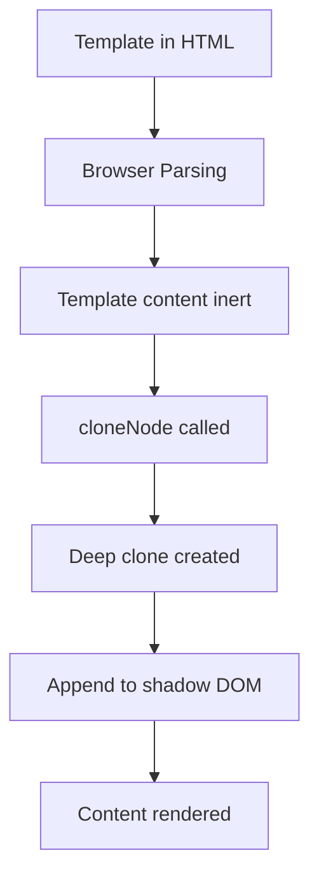
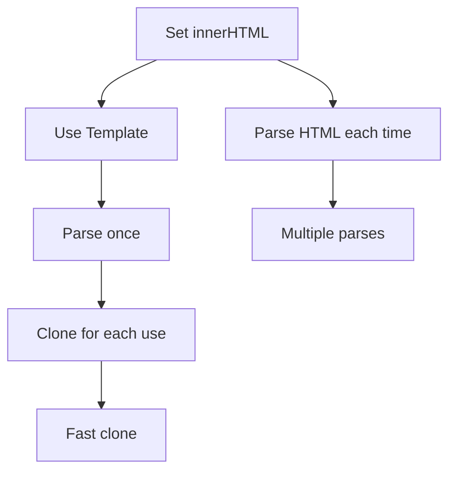

# HTML Template Tag Deep Dive

## OVERVIEW

The HTML `<template>` element is a fundamental building block for Web Components. It provides a mechanism for declaring reusable HTML fragments that are not rendered initially but can be instantiated at runtime. This comprehensive guide explores all aspects of HTML templates, from basic usage to advanced patterns for efficient component development.

Templates are essential for performance because they allow browsers to parse HTML structure once and reuse it multiple times. Unlike innerHTML which parses content every time it's set, templates are parsed once and their content can be cloned efficiently.

## TECHNICAL SPECIFICATIONS

### Template Element Features

| Feature | Description |
|---------|-------------|
| Inert Content | Content not rendered until cloned |
| DocumentFragment | Templates provide DocumentFragment |
| Clone Efficiency | content.cloneNode(true) is fast |
| Multiple Use | Same template can create many instances |
| Style Handling | Styles in templates are scoped to clone |

### Template Structure

```html
<template id="my-template">
  <style>
    /* Styles apply to cloned content */
    :host { display: block; }
  </style>
  <div class="container">
    <slot></slot>
  </div>
</template>
```

### Template Content Access

```javascript
const template = document.getElementById('my-template');
// template.content is a DocumentFragment
// template.content.children gives HTMLCollection
// template.content.cloneNode(true) creates deep copy
```

## IMPLEMENTATION DETAILS

### Basic Template Usage

```javascript
class TemplateElement extends HTMLElement {
  constructor() {
    super();
    this.attachShadow({ mode: 'open' });
  }
  
  connectedCallback() {
    this.render();
  }
  
  render() {
    const template = document.getElementById('component-template');
    const clone = template.content.cloneNode(true);
    this.shadowRoot.appendChild(clone);
  }
}
```

```html
<template id="component-template">
  <style>
    :host { display: block; padding: 16px; }
    .content { color: #333; }
  </style>
  <div class="content">
    <slot></slot>
  </div>
</template>

<template-element>Hello Template</template-element>
```

### Inline Template in JavaScript

```javascript
class InlineTemplateElement extends HTMLElement {
  #template = null;
  
  constructor() {
    super();
    this.attachShadow({ mode: 'open' });
    this.#template = this.createTemplate();
  }
  
  createTemplate() {
    const template = document.createElement('template');
    template.innerHTML = `
      <style>
        :host { display: block; }
        button { padding: 8px 16px; }
      </style>
      <button>Click Me</button>
    `;
    return template;
  }
  
  connectedCallback() {
    const clone = this.#template.content.cloneNode(true);
    this.shadowRoot.appendChild(clone);
  }
}
```

### Dynamic Template Generation

```javascript
class DynamicTemplateElement extends HTMLElement {
  #items = [];
  
  constructor() {
    super();
    this.attachShadow({ mode: 'open' });
  }
  
  set items(value) {
    this.#items = value;
    this.render();
  }
  
  render() {
    const template = this.getTemplate();
    const clone = template.content.cloneNode(true);
    
    // Populate template with dynamic data
    const list = clone.querySelector('.list');
    this.#items.forEach(item => {
      const li = document.createElement('li');
      li.textContent = item;
      list.appendChild(li);
    });
    
    this.shadowRoot.innerHTML = '';
    this.shadowRoot.appendChild(clone);
  }
  
  getTemplate() {
    const template = document.createElement('template');
    template.innerHTML = `
      <style>
        :host { display: block; }
        ul { list-style: none; padding: 0; }
        li { padding: 8px; border-bottom: 1px solid #eee; }
      </style>
      <ul class="list"></ul>
    `;
    return template;
  }
}
```

## CODE EXAMPLES

### Template with Slots

```javascript
class SlottedTemplateElement extends HTMLElement {
  constructor() {
    super();
    this.attachShadow({ mode: 'open' });
  }
  
  connectedCallback() {
    const template = this.getTemplate();
    const clone = template.content.cloneNode(true);
    this.shadowRoot.appendChild(clone);
  }
  
  getTemplate() {
    const template = document.createElement('template');
    template.innerHTML = `
      <style>
        :host {
          display: block;
          border: 1px solid #ccc;
          border-radius: 8px;
        }
        .header {
          background: #f5f5f5;
          padding: 12px 16px;
          font-weight: bold;
        }
        .body {
          padding: 16px;
        }
        .footer {
          padding: 12px 16px;
          border-top: 1px solid #eee;
          background: #fafafa;
        }
      </style>
      <div class="header">
        <slot name="header">Default Header</slot>
      </div>
      <div class="body">
        <slot></slot>
      </div>
      <div class="footer">
        <slot name="footer"></slot>
      </div>
    `;
    return template;
  }
}
```

### Template Caching System

```javascript
class CachedTemplateElement extends HTMLElement {
  static #templateCache = new Map();
  
  constructor() {
    super();
    this.attachShadow({ mode: 'open' });
  }
  
  static getTemplate(id) {
    if (CachedTemplateElement.#templateCache.has(id)) {
      return CachedTemplateElement.#templateCache.get(id);
    }
    
    const element = document.getElementById(id);
    if (!element || element.tagName !== 'TEMPLATE') {
      throw new Error(`Template #${id} not found`);
    }
    
    CachedTemplateElement.#templateCache.set(id, element);
    return element;
  }
  
  connectedCallback() {
    const template = CachedTemplateElement.getTemplate('cached-template');
    const clone = template.content.cloneNode(true);
    this.shadowRoot.appendChild(clone);
  }
}
```

### Template with Event Binding

```javascript
class EventTemplateElement extends HTMLElement {
  #boundHandlers = new Map();
  
  constructor() {
    super();
    this.attachShadow({ mode: 'open' });
  }
  
  connectedCallback() {
    const template = this.getTemplate();
    const clone = template.content.cloneNode(true);
    this.shadowRoot.appendChild(clone);
    this.setupEvents();
  }
  
  disconnectedCallback() {
    this.cleanupEvents();
  }
  
  getTemplate() {
    const template = document.createElement('template');
    template.innerHTML = `
      <style>
        :host { display: block; }
        button { padding: 8px 16px; cursor: pointer; }
        .count { font-size: 1.5em; margin: 8px 0; }
      </style>
      <button id="increment">+</button>
      <div class="count" id="display">0</div>
      <button id="decrement">-</button>
    `;
    return template;
  }
  
  setupEvents() {
    const increment = this.shadowRoot.getElementById('increment');
    const decrement = this.shadowRoot.getElementById('decrement');
    
    const incrementHandler = () => this.updateCount(1);
    const decrementHandler = () => this.updateCount(-1);
    
    increment.addEventListener('click', incrementHandler);
    decrement.addEventListener('click', decrementHandler);
    
    this.#boundHandlers.set('increment', incrementHandler);
    this.#boundHandlers.set('decrement', decrementHandler);
  }
  
  cleanupEvents() {
    const increment = this.shadowRoot.getElementById('increment');
    const decrement = this.shadowRoot.getElementById('decrement');
    
    const incrementHandler = this.#boundHandlers.get('increment');
    const decrementHandler = this.#boundHandlers.get('decrement');
    
    increment?.removeEventListener('click', incrementHandler);
    decrement?.removeEventListener('click', decrementHandler);
    
    this.#boundHandlers.clear();
  }
  
  #count = 0;
  
  updateCount(delta) {
    this.#count += delta;
    this.shadowRoot.getElementById('display').textContent = this.#count;
  }
}
```

### Template Registry Pattern

```javascript
const TemplateRegistry = (() => {
  const templates = new Map();
  
  function register(name, templateString) {
    const template = document.createElement('template');
    template.innerHTML = templateString;
    templates.set(name, template);
  }
  
  function get(name) {
    if (!templates.has(name)) {
      throw new Error(`Template "${name}" not registered`);
    }
    return templates.get(name).content.cloneNode(true);
  }
  
  function has(name) {
    return templates.has(name);
  }
  
  function clear() {
    templates.clear();
  }
  
  return { register, get, has, clear };
})();

// Register templates
TemplateRegistry.register('button', `
  <style>
    button {
      padding: 8px 16px;
      border: none;
      border-radius: 4px;
      cursor: pointer;
    }
  </style>
  <button><slot></slot></button>
`);

TemplateRegistry.register('card', `
  <style>
    :host { display: block; }
    .card {
      border: 1px solid #ccc;
      border-radius: 8px;
      padding: 16px;
    }
  </style>
  <div class="card"><slot></slot></div>
`);
```

## BEST PRACTICES

### Performance Optimization

```javascript
// GOOD: Create template once, clone many times
class OptimizedElement extends HTMLElement {
  static #template = null;
  
  static get template() {
    if (!OptimizedElement.#template) {
      const t = document.createElement('template');
      t.innerHTML = '<div>Content</div>';
      OptimizedElement.#template = t;
    }
    return OptimizedElement.#template;
  }
  
  connectedCallback() {
    const clone = OptimizedElement.template.content.cloneNode(true);
    this.shadowRoot.appendChild(clone);
  }
}

// GOOD: Use DocumentFragment for complex content
class FragmentElement extends HTMLElement {
  connectedCallback() {
    const fragment = document.createDocumentFragment();
    
    // Build complex structure in fragment
    for (let i = 0; i < 10; i++) {
      const div = document.createElement('div');
      div.textContent = `Item ${i}`;
      fragment.appendChild(div);
    }
    
    this.shadowRoot.appendChild(fragment);
  }
}
```

### Style Scoping in Templates

```javascript
class ScopedTemplate extends HTMLElement {
  get template() {
    const t = document.createElement('template');
    t.innerHTML = `
      <style>
        /* :host targets the custom element */
        :host {
          display: block;
        }
        
        /* :host() for conditional styling */
        :host([disabled]) {
          opacity: 0.5;
        }
        
        /* :host-context() for ancestor matching */
        :host-context(.dark-mode) {
          background: #222;
        }
        
        /* ::slotted() for distributed content */
        ::slotted(*) {
          color: inherit;
        }
        
        /* Internal styles */
        .inner {
          padding: 16px;
        }
      </style>
      <div class="inner"><slot></slot></div>
    `;
    return t;
  }
  
  constructor() {
    super();
    this.attachShadow({ mode: 'open' });
  }
  
  connectedCallback() {
    const clone = this.template.content.cloneNode(true);
    this.shadowRoot.appendChild(clone);
  }
}
```

## FLOW CHARTS

### Template Lifecycle



### Template vs InnerHTML



## NEXT STEPS

Proceed to:

1. **03_Templates/03_2_Template-Cloning-and-Instantiation** - Cloning
2. **03_Templates/03_5_Template-Caching-Strategies** - Caching
3. **02_Custom-Elements/02_1_Creating-Your-First-Custom-Element** - First element