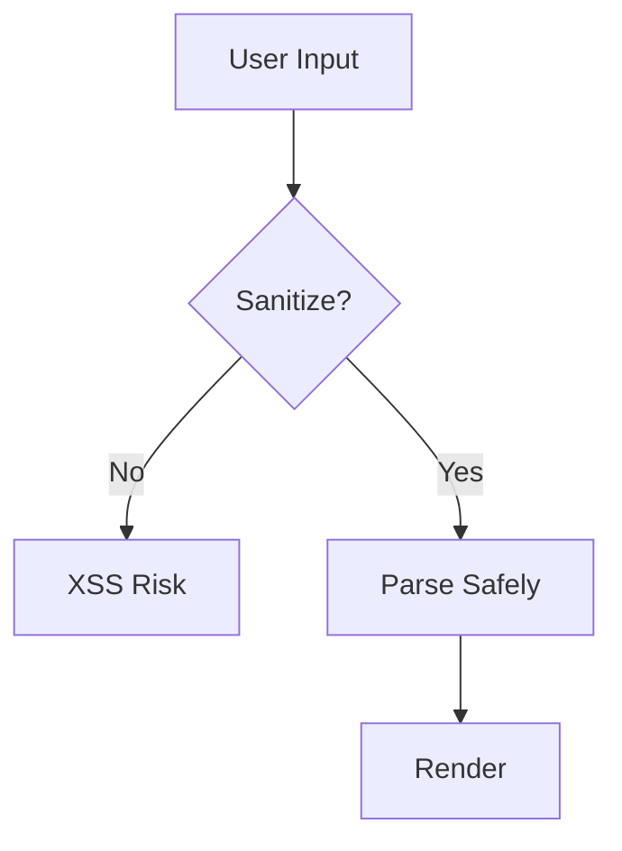

# Safe HTML Parsing Methods

## OVERVIEW

Security is paramount when handling HTML content in Web Components. This guide covers safe HTML parsing methods, XSS prevention, content sanitization, and secure patterns for handling user-generated content. Understanding these security practices is essential for building production-ready components.

Cross-site scripting (XSS) attacks are a major concern when components render HTML content. Proper sanitization and secure parsing patterns protect your applications from malicious input.

## TECHNICAL SPECIFICATIONS

### XSS Attack Vectors

| Vector | Description | Prevention |
|--------|-------------|------------|
| Script Injection | `<script>alert(1)</script>` | Sanitization |
| Event Handlers | `` | Strip dangerous attributes |
| Data URIs | `data:text/html,<script>` | Block dangerous schemes |
| JavaScript URLs | `javascript:alert(1)` | Validate URL schemes |

### DOMPurify Integration

```javascript
import DOMPurify from 'dompurify';

class SanitizedElement extends HTMLElement {
  #sanitizer = DOMPurify;
  
  connectedCallback() {
    const dirty = this.getAttribute('content') || '';
    const clean = this.#sanitizer.sanitize(dirty);
    this.shadowRoot.innerHTML = clean;
  }
}
```

## IMPLEMENTATION DETAILS

### Safe InnerHTML Usage

```javascript
class SafeElement extends HTMLElement {
  constructor() {
    super();
    this.attachShadow({ mode: 'open' });
  }
  
  #sanitize(html) {
    const temp = document.createElement('div');
    temp.textContent = html;  // Escape by default
    return temp.innerHTML;
  }
  
  setContent(html) {
    // For trusted content (from developers)
    this.shadowRoot.innerHTML = html;
  }
  
  setUserContent(html) {
    // For user-generated content - ALWAYS sanitize
    this.shadowRoot.innerHTML = this.#sanitize(html);
  }
}
```

### Template Safety

```javascript
class SafeTemplateElement extends HTMLElement {
  #config = {
    ALLOWED_TAGS: ['b', 'i', 'em', 'strong', 'p', 'br'],
    ALLOWED_ATTR: []
  };
  
  #sanitize(input) {
    // Simple sanitization - use library in production
    const div = document.createElement('div');
    div.textContent = input;
    return div.innerHTML;
  }
  
  connectedCallback() {
    const raw = this.innerHTML;
    const clean = this.#sanitize(raw);
    this.shadowRoot.innerHTML = `<div>${clean}</div>`;
  }
}
```

## BEST PRACTICES

1. Always sanitize user input
2. Use trusted libraries (DOMPurify, sanitize-html)
3. Implement Content Security Policy
4. Avoid innerHTML with user data when possible
5. Use textContent for plain text

## FLOW CHARTS



## NEXT STEPS

Proceed to **03_Templates/03_4_Dynamic-Template-Generation** for generating templates programmatically.