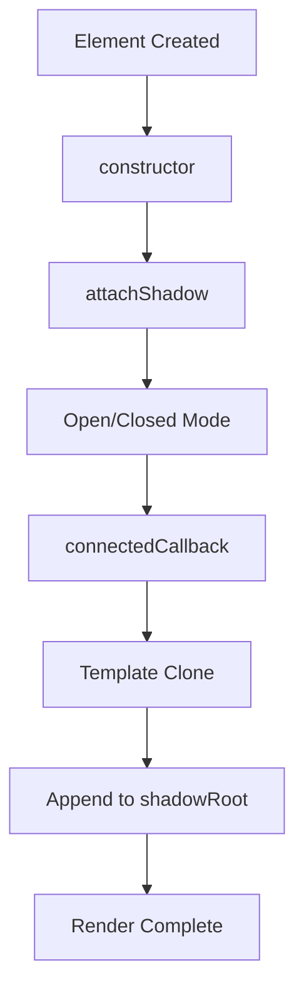
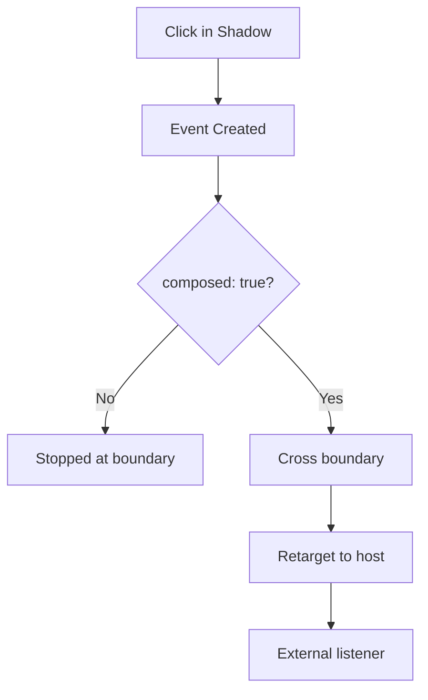

# Shadow DOM Complete Reference Guide

## OVERVIEW

Shadow DOM provides encapsulation for Web Components, creating isolated DOM trees with separate styling and behavior. This comprehensive guide covers all Shadow DOM features including creation, styling, slots, events, and accessibility integration.

## TECHNICAL SPECIFICATIONS

### Shadow Root Modes

| Mode | shadowRoot Property | External Access |
|------|---------------------|------------------|
| open | Accessible | Yes |
| closed | Returns null | No |

### Shadow DOM Features

- Style encapsulation
- DOM tree isolation
- Event retargeting
- Slot-based content distribution

## IMPLEMENTATION DETAILS

### Creating Shadow DOM

```javascript
class ShadowElement extends HTMLElement {
  constructor() {
    super();
    // Open mode - accessible via this.shadowRoot
    this.attachShadow({ mode: 'open' });
    // OR closed mode - this.shadowRoot returns null
    // this.attachShadow({ mode: 'closed' });
  }
  
  connectedCallback() {
    this.shadowRoot.innerHTML = `
      <style>
        :host { display: block; }
        :host([hidden]) { display: none; }
      </style>
      <div class="content"><slot></slot></div>
    `;
  }
}
```

### Styling with :host

```javascript
class StyledHostElement extends HTMLElement {
  get template() {
    const t = document.createElement('template');
    t.innerHTML = `
      <style>
        /* Target the custom element itself */
        :host {
          display: block;
          padding: 16px;
        }
        
        /* Conditional styling based on attributes */
        :host([variant="primary"]) {
          background: #007bff;
        }
        
        :host([variant="secondary"]) {
          background: #6c757d;
        }
        
        /* Size variants */
        :host([size="small"]) { font-size: 12px; }
        :host([size="large"]) { font-size: 18px; }
        
        /* Disabled state */
        :host([disabled]) {
          opacity: 0.5;
          pointer-events: none;
        }
        
        /* Ancestor-based styling */
        :host-context(.dark-mode) {
          background: #222;
          color: #fff;
        }
      </style>
      <div class="content"><slot></slot></div>
    `;
  }
  
  constructor() {
    super();
    this.attachShadow({ mode: 'open' });
  }
  
  connectedCallback() {
    const clone = this.template.content.cloneNode(true);
    this.shadowRoot.appendChild(clone);
  }
}
```

### Slot Distribution

```javascript
class SlottedComponent extends HTMLElement {
  get template() {
    const t = document.createElement('template');
    t.innerHTML = `
      <style>
        :host { display: block; border: 1px solid #ccc; }
        .header { background: #f5f5f5; padding: 12px; }
        .body { padding: 16px; }
        .footer { background: #fafafa; padding: 12px; border-top: 1px solid #eee; }
      </style>
      <div class="header"><slot name="header">Default Header</slot></div>
      <div class="body"><slot></slot></div>
      <div class="footer"><slot name="footer"></slot></div>
    `;
  }
  
  constructor() {
    super();
    this.attachShadow({ mode: 'open' });
  }
  
  connectedCallback() {
    const clone = this.template.content.cloneNode(true);
    this.shadowRoot.appendChild(clone);
  }
}
```

```html
<!-- Usage -->
<slotted-component>
  <span slot="header">My Header</span>
  <div>Main content</div>
  <button slot="footer">Action</button>
</slotted-component>
```

### Event Handling

```javascript
class EventElement extends HTMLElement {
  get template() {
    const t = document.createElement('template');
    t.innerHTML = `
      <style>button { padding: 8px 16px; }</style>
      <button id="btn">Click Me</button>
    `;
    return t;
  }
  
  constructor() {
    super();
    this.attachShadow({ mode: 'open' });
  }
  
  connectedCallback() {
    const clone = this.template.content.cloneNode(true);
    this.shadowRoot.appendChild(clone);
    
    const btn = this.shadowRoot.getElementById('btn');
    btn.addEventListener('click', this.#handleClick);
  }
  
  #handleClick = (event) => {
    // By default, event is retargeting - appears from host
    // Use composed: true to cross shadow boundary
    this.dispatchEvent(new CustomEvent('custom-click', {
      bubbles: true,
      composed: true,
      detail: { timestamp: Date.now() }
    }));
  }
}
```

## CODE EXAMPLES

### Shadow DOM with form elements

```javascript
class FormShadowElement extends HTMLElement {
  static get formAssociated() { return true; }
  
  #internals = null;
  
  get template() {
    const t = document.createElement('template');
    t.innerHTML = `
      <style>
        :host { display: block; }
        input { padding: 8px; width: 100%; }
      </style>
      <input type="text" id="input" />
    `;
    return t;
  }
  
  constructor() {
    super();
    this.attachShadow({ mode: 'open' });
  }
  
  connectedCallback() {
    this.#internals = this.attachInternals();
    const clone = this.template.content.cloneNode(true);
    this.shadowRoot.appendChild(clone);
    
    const input = this.shadowRoot.getElementById('input');
    input.addEventListener('input', (e) => {
      this.#internals.setFormValue(e.target.value);
    });
  }
  
  get value() {
    return this.shadowRoot.getElementById('input').value;
  }
  
  set value(val) {
    this.shadowRoot.getElementById('input').value = val;
    this.#internals?.setFormValue(val);
  }
}
```

### Accessing distributed content

```javascript
class ContentInspector extends HTMLElement {
  #slots = null;
  
  get template() {
    const t = document.createElement('template');
    t.innerHTML = `
      <style>:host { display: block; }</style>
      <slot></slot>
      <slot name="extra"></slot>
    `;
    return t;
  }
  
  constructor() {
    super();
    this.attachShadow({ mode: 'open' });
  }
  
  connectedCallback() {
    const clone = this.template.content.cloneNode(true);
    this.shadowRoot.appendChild(clone);
    
    this.#slots = this.shadowRoot.querySelectorAll('slot');
    
    // Listen for slot changes
    this.#slots.forEach(slot => {
      slot.addEventListener('slotchange', () => this.#onSlotChange(slot));
    });
  }
  
  #onSlotChange(slot) {
    const assigned = slot.assignedNodes();
    console.log('Slot changed:', slot.name, assigned.length, 'nodes');
  }
}
```

## BEST PRACTICES

### Style encapsulation patterns

```javascript
class EncapsulatedElement extends HTMLElement {
  // Expose parts for external styling
  get template() {
    const t = document.createElement('template');
    t.innerHTML = `
      <style>
        :host { display: block; }
        button::part(base) {
          padding: 8px 16px;
          border-radius: 4px;
        }
      </style>
      <button part="base"><slot></slot></button>
    `;
    return t;
  }
}

// External styling:
// my-element::part(base) { background: red; }
```

### Performance optimization

```javascript
class PerfOptimizedElement extends HTMLElement {
  // Create template once as static property
  static #template = null;
  
  static get template() {
    if (!PerfOptimizedElement.#template) {
      const t = document.createElement('template');
      t.innerHTML = '<div>Content</div>';
      PerfOptimizedElement.#template = t;
    }
    return PerfOptimizedElement.#template;
  }
  
  connectedCallback() {
    // Clone is fast because template is already parsed
    const clone = PerfOptimizedElement.template.content.cloneNode(true);
    this.shadowRoot.appendChild(clone);
  }
}
```

## FLOW CHARTS

### Shadow DOM Rendering



### Event Flow with Retargeting



## NEXT STEPS

Proceed to **04_Shadow-DOM/04_2_Style-Encapsulation-Methods** for styling details.