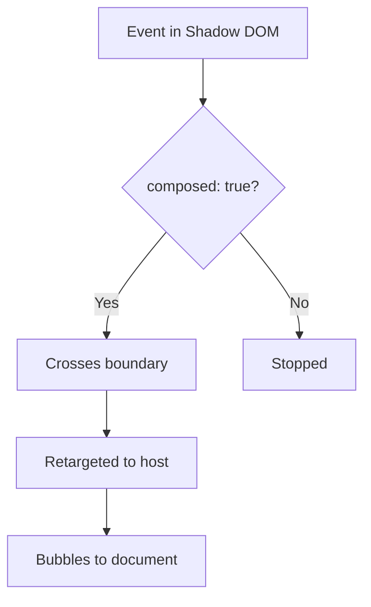

# Event Bubbling and Targeting

## OVERVIEW

Understanding event behavior in Shadow DOM is critical for building interactive components. This guide covers event retargeting, composition, custom event dispatch, and best practices for event handling.

## TECHNICAL SPECIFICATIONS

### Event Behavior in Shadow DOM

| Property | Behavior |
|----------|-----------|
| bubbles | Events bubble by default |
| composed | If true, crosses shadow boundary |
| composedPath() | Returns full event path |

### Event Retargeting

When an event bubbles from within Shadow DOM, the target is retargeted to appear as if it originated from the host element, not from the internal element.

## IMPLEMENTATION DETAILS

### Basic Event Handling

```javascript
class EventElement extends HTMLElement {
  constructor() {
    super();
    this.attachShadow({ mode: 'open' });
  }
  
  connectedCallback() {
    this.shadowRoot.innerHTML = `
      <style>button { padding: 8px 16px; }</style>
      <button id="btn">Click Me</button>
    `;
    
    const btn = this.shadowRoot.getElementById('btn');
    btn.addEventListener('click', this.#handleClick);
  }
  
  #handleClick = (event) => {
    // Event appears to come from this element
    console.log('Clicked at:', event.target);
    console.log('Current target:', event.currentTarget);
    
    this.dispatchEvent(new CustomEvent('element-click', {
      bubbles: true,
      composed: true,
      detail: { originalEvent: event }
    }));
  }
}
```

### Crossing Shadow Boundary

```javascript
class ComposedEventElement extends HTMLElement {
  constructor() {
    super();
    this.attachShadow({ mode: 'open' });
  }
  
  connectedCallback() {
    this.shadowRoot.innerHTML = `
      <div class="inner">
        <button id="trigger">Trigger</button>
      </div>
    `;
    
    const btn = this.shadowRoot.getElementById('trigger');
    btn.addEventListener('click', this.#handleClick);
  }
  
  #handleClick = (event) => {
    // composed: true allows event to cross shadow boundary
    this.dispatchEvent(new CustomEvent('inner-click', {
      bubbles: true,
      composed: true,  // Important for crossing boundary
      detail: { timestamp: Date.now() }
    }));
  }
}
```

### Listening to Internal Events

```javascript
class InternalListener extends HTMLElement {
  constructor() {
    super();
    this.attachShadow({ mode: 'open' });
  }
  
  connectedCallback() {
    this.shadowRoot.innerHTML = '<input type="text" id="input" />';
    
    const input = this.shadowRoot.getElementById('input');
    input.addEventListener('input', this.#handleInput);
  }
  
  #handleInput = (event) => {
    // Access composedPath to see actual target
    console.log('Path:', event.composedPath());
    // Path includes internal elements
    
    this.dispatchEvent(new Event('value-change', {
      bubbles: true,
      composed: true
    }));
  }
}
```

## CODE EXAMPLES

### Event Delegation in Shadow DOM

```javascript
class DelegateElement extends HTMLElement {
  constructor() {
    super();
    this.attachShadow({ mode: 'open' });
  }
  
  connectedCallback() {
    this.shadowRoot.innerHTML = `
      <div class="list">
        ${Array(10).fill(0).map((_, i) => 
          `<div class="item" data-index="${i}">Item ${i}</div>`
        ).join('')}
      </div>
    `;
    
    // Delegate click handling
    this.shadowRoot.addEventListener('click', this.#handleClick);
  }
  
  #handleClick = (event) => {
    const item = event.target.closest('.item');
    if (!item) return;
    
    this.dispatchEvent(new CustomEvent('item-click', {
      bubbles: true,
      composed: true,
      detail: { index: parseInt(item.dataset.index) }
    }));
  }
}
```

### Custom Event Factory

```javascript
class EventFactoryElement extends HTMLElement {
  #createEvent(type, detail = {}, options = {}) {
    return new CustomEvent(type, {
      bubbles: true,
      composed: true,
      ...options,
      detail
    });
  }
  
  dispatchAction(action, data = {}) {
    this.dispatchEvent(this.#createEvent(`action-${action}`, data));
  }
  
  dispatchStateChange(state) {
    this.dispatchEvent(this.#createEvent('state-change', { state }));
  }
}
```

## FLOW CHARTS



## NEXT STEPS

Proceed to **04_Shadow-DOM/04_5_Accessibility-in-Shadow-DOM** for accessibility.