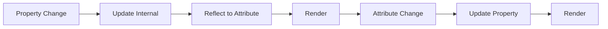

# Property Reflection Strategies

## OVERVIEW

Property reflection creates a two-way binding between HTML attributes and JavaScript properties. This guide covers implementing property reflection, handling complex types, and creating reactive components.

## TECHNICAL SPECIFICATIONS

### Property vs Attribute

| Aspect | Properties | Attributes |
|--------|-----------|------------|
| Type | JavaScript values | String values |
| Access | element.prop | element.getAttribute() |
| Direction | JS → DOM | HTML → JS |

### Reflection Pattern

When property changes, reflect to attribute (and vice versa).

## IMPLEMENTATION DETAILS

### Basic Property Reflection

```javascript
class ReflectiveElement extends HTMLElement {
  // Properties to reflect
  #value = '';
  #disabled = false;
  
  // Property getters/setters with reflection
  get value() { return this.#value; }
  set value(val) {
    this.#value = val;
    this.#reflectToAttribute('value', val);
    this.#requestRender();
  }
  
  get disabled() { return this.#disabled; }
  set disabled(val) {
    this.#disabled = Boolean(val);
    this.#reflectToAttribute('disabled', val ? '' : null);
    this.#requestRender();
  }
  
  #reflectToAttribute(name, value) {
    if (value === null || value === false) {
      this.removeAttribute(name);
    } else {
      this.setAttribute(name, String(value));
    }
  }
  
  // Observe attributes for external changes
  static get observedAttributes() {
    return ['value', 'disabled'];
  }
  
  attributeChangedCallback(name, oldValue, newValue) {
    if (oldValue === newValue) return;
    
    if (name === 'value') {
      this.#value = newValue;
    } else if (name === 'disabled') {
      this.#disabled = newValue !== null;
    }
  }
}
```

### Complex Type Reflection

```javascript
class ComplexReflective extends HTMLElement {
  #items = [];
  #config = {};
  
  get items() { return [...this.#items]; }
  set items(val) {
    if (!Array.isArray(val)) return;
    this.#items = [...val];
    this.setAttribute('items', JSON.stringify(val));
    this.render();
  }
  
  get config() { return { ...this.#config }; }
  set config(val) {
    if (typeof val !== 'object') return;
    this.#config = { ...val };
    this.setAttribute('config', btoa(JSON.stringify(val)));
    this.render();
  }
  
  static get observedAttributes() {
    return ['items', 'config'];
  }
  
  attributeChangedCallback(name, oldValue, newValue) {
    if (name === 'items') {
      try {
        this.#items = JSON.parse(newValue) || [];
      } catch (e) { this.#items = []; }
    } else if (name === 'config') {
      try {
        this.#config = JSON.parse(atob(newValue)) || {};
      } catch (e) { this.#config = {}; }
    }
    this.render();
  }
  
  render() { /* ... */ }
}
```

## CODE EXAMPLES

### Boolean Property Reflection

```javascript
class BooleanReflective extends HTMLElement {
  #checked = false;
  
  get checked() { return this.#checked; }
  set checked(val) {
    this.#checked = Boolean(val);
    // Boolean attributes reflect as empty string when true
    this.toggleAttribute('checked', this.#checked);
  }
  
  static get observedAttributes() { return ['checked']; }
  
  attributeChangedCallback(name, oldVal, newVal) {
    if (name === 'checked') {
      this.#checked = newVal !== null;
    }
  }
}
```

### Reactive Reflection Pattern

```javascript
class ReactiveReflective extends HTMLElement {
  #state = {};
  #pendingRender = false;
  
  setState(updates) {
    this.#state = { ...this.#state, ...updates };
    
    // Reflect to attributes
    for (const [key, value] of Object.entries(updates)) {
      if (typeof value === 'boolean') {
        this.toggleAttribute(key, value);
      } else if (value !== null && value !== undefined) {
        this.setAttribute(key, String(value));
      } else {
        this.removeAttribute(key);
      }
    }
    
    this.#scheduleRender();
  }
  
  #scheduleRender() {
    if (this.#pendingRender) return;
    this.#pendingRender = true;
    requestAnimationFrame(() => {
      this.render();
      this.#pendingRender = false;
    });
  }
  
  static get observedAttributes() { return ['title', 'loading', 'variant']; }
  
  attributeChangedCallback(name, oldVal, newVal) {
    this.#state[name] = newVal;
  }
  
  render() { /* ... */ }
}
```

## FLOW CHARTS



## NEXT STEPS

Proceed to **05_Data-Binding/05_2_Attribute-Change-Detection** for attribute changes.