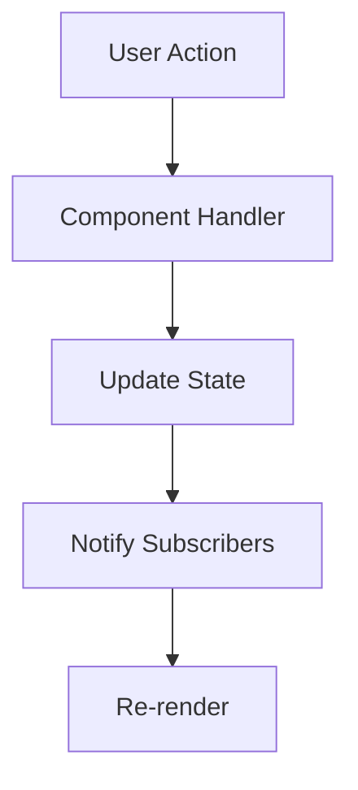

# Data Flow Architecture

## OVERVIEW

Data flow architecture defines how data moves through and between components. This guide covers unidirectional data flow, two-way binding patterns, and state management integration.

## IMPLEMENTATION DETAILS

### Unidirectional Data Flow

```javascript
class UnidirectionalElement extends HTMLElement {
  #state = { value: '', items: [] };
  #dispatch = null;
  
  setData(data, dispatchFn) {
    this.#state = { ...this.#state, ...data };
    this.#dispatch = dispatchFn;
    this.render();
  }
  
  #updateValue(value) {
    this.#state.value = value;
    this.#dispatch?.('value-changed', value);
    this.render();
  }
  
  render() {
    this.shadowRoot.innerHTML = `
      <input 
        value="${this.#state.value}"
        oninput="this.getRootNode().host.#updateValue(this.value)"
      />
    `;
  }
}
```

### State Container Pattern

```javascript
class StateContainer {
  #state = {};
  #listeners = new Set();
  
  getState() { return { ...this.#state }; }
  
  setState(updates) {
    this.#state = { ...this.#state, ...updates };
    this.#notify();
  }
  
  subscribe(listener) {
    this.#listeners.add(listener);
    return () => this.#listeners.delete(listener);
  }
  
  #notify() {
    this.#listeners.forEach(fn => fn(this.#state));
  }
}

// Usage in component
class ContainerElement extends HTMLElement {
  #container = new StateContainer();
  #unsubscribe = null;
  
  connectedCallback() {
    this.#unsubscribe = this.#container.subscribe(state => this.render(state));
    this.render(this.#container.getState());
  }
  
  disconnectedCallback() {
    this.#unsubscribe?.();
  }
}
```

## FLOW CHARTS



## NEXT STEPS

Proceed to **05_Data-Binding/05_4_Reactive-Programming-Patterns**.