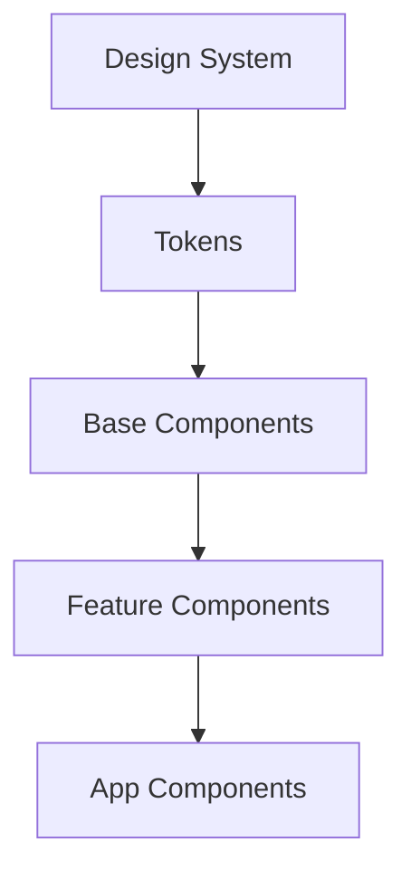

# Enterprise Architecture Patterns

## OVERVIEW

Enterprise architecture patterns address scalability, maintainability, and team collaboration. This guide covers design systems, component registries, and enterprise integration patterns.

## IMPLEMENTATION DETAILS

### Design System Pattern

```javascript
// Design tokens
const tokens = {
  colors: {
    primary: '#007bff',
    secondary: '#6c757d'
  },
  spacing: {
    small: '8px',
    medium: '16px',
    large: '24px'
  },
  typography: {
    fontFamily: 'system-ui, sans-serif',
    fontSize: '14px'
  }
};

// Base component using tokens
class DesignSystemElement extends HTMLElement {
  get styles() {
    return `
      <style>
        :host {
          --color-primary: ${tokens.colors.primary};
          --spacing: ${tokens.spacing.medium};
          font-family: ${tokens.typography.fontFamily};
        }
      </style>
    `;
  }
}
```

### Component Registry

```javascript
class ComponentRegistry {
  #components = new Map();
  #versions = new Map();
  
  register(name, ComponentClass, version = '1.0.0') {
    if (this.#versions.has(name)) {
      const existing = this.#versions.get(name);
      if (this.#compareVersions(version, existing) <= 0) {
        console.warn(`Ignoring older version ${version} of ${name}`);
        return;
      }
    }
    
    this.#components.set(name, ComponentClass);
    this.#versions.set(name, version);
  }
  
  get(name) {
    return this.#components.get(name);
  }
  
  #compareVersions(a, b) {
    // Simple semver comparison
    return a.localeCompare(b, undefined, { numeric: true });
  }
}

export const registry = new ComponentRegistry();
```

### Module Federation Pattern

```javascript
// Remote component loader
class FederatedLoader extends HTMLElement {
  #remotes = {};
  
  addRemote(name, url) {
    this.#remotes[name] = url;
  }
  
  async loadComponent(name) {
    const url = this.#remotes[name];
    if (!url) throw new Error(`Remote ${name} not configured`);
    
    const module = await import(url);
    return module.default || module;
  }
}
```

## FLOW CHARTS



## NEXT STEPS

Proceed to **11_Real-World-Applications/11_1_E-Commerce-Component-Suite**.