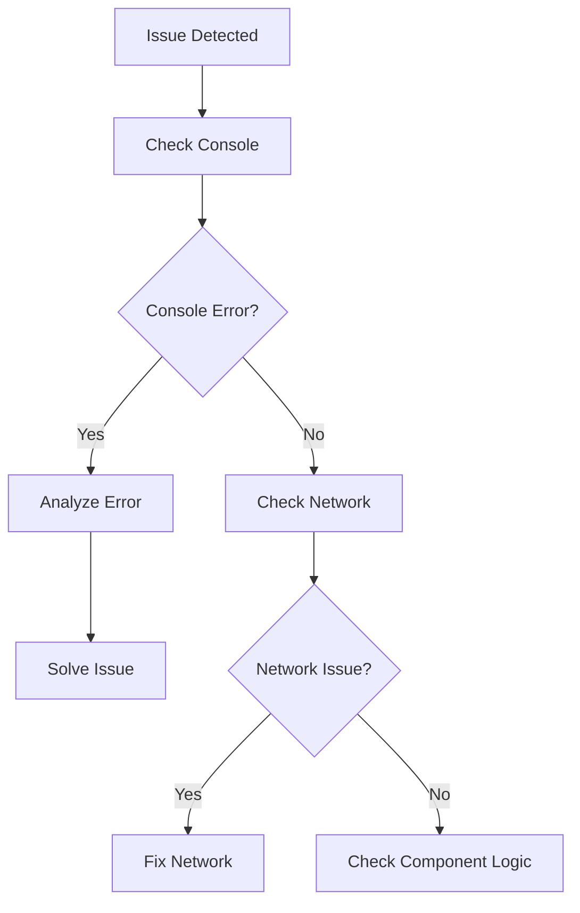

# Debugging Tools and Techniques

## OVERVIEW

Debugging tools and techniques help identify and fix issues in Web Components. This guide covers browser devtools, logging strategies, and debugging patterns.

## IMPLEMENTATION DETAILS

### Console Debugging

```javascript
class DebugElement extends HTMLElement {
  connectedCallback() {
    console.debug('[DebugElement] Created', {
      id: this.id,
      attributes: [...this.attributes].map(a => ({ name: a.name, value: a.value }))
    });
    this.render();
  }
  
  attributeChangedCallback(name, oldVal, newVal) {
    console.debug(`[DebugElement] ${name}: ${oldVal} → ${newVal}`);
  }
}
```

### Custom Debug Panel

```javascript
class DebugPanel extends HTMLElement {
  #state = {};
  
  render() {
    this.shadowRoot.innerHTML = `
      <pre>${JSON.stringify(this.#state, null, 2)}</pre>
    `;
  }
  
  setState(state) {
    this.#state = state;
    this.render();
  }
}
```

## FLOW CHARTS



## NEXT STEPS

Now let me create the new sections - 13_Advanced-Topics and 14_Reference-Materials